# LEC08 功能部件
## 一.定点补码加法器设计 

### 1.先行进位加法器
+ 一位全加器
    - 三个输入: A,B,Cin
    - 两个输出: S(本位和),Cout(进位)
    - S=^A*^B* Cin+^A* B*^Cin+A*^B*^Cin+A* B* Cin
    - Cout=A* B+A* Cin+B * Cin
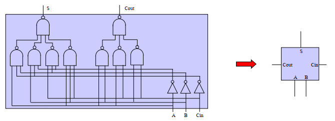

+ 串行进位加法器
    - 以16位加法器为例，
    - 进位从低位到高位传送，形成c16需要32级门延迟，
    - 延迟随位数增长线性增长
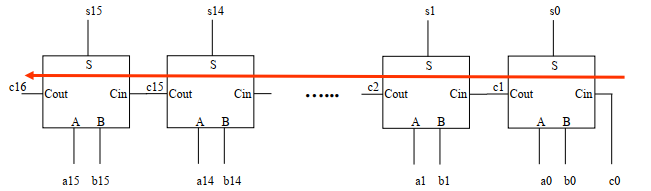  

+ 进位的传递   
    
    $c_{i+1}= a_i * b_i+a_i * c_i+b_i * c_i$ 
    &nbsp;&nbsp;&nbsp;&nbsp;&nbsp;&nbsp;&nbsp;$= a_i*b_i+(a_i+b_i)*c_i$ 
    &nbsp;&nbsp;&nbsp;&nbsp;&nbsp;&nbsp;&nbsp;$= g_i+p_i*c_i$
    
    $g_i=a_i*b_i称为进位生成因子,只要g_i为1，就有进位$ 
    $p_i=a_i+b_i称为进位传递因子,只要p_i为1，就能把低位进位向前传递$

+ 4位并行进位逻辑

    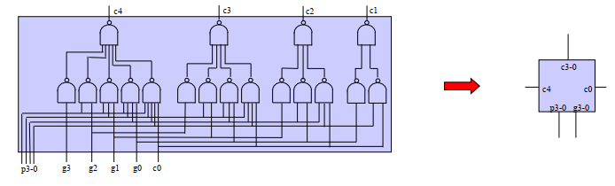  

    + 以16位加法器为例
        - $输入位p_i、g_i,输出为c_i$
        - 每次产生4位进位，从$p_i、g_i$产生c16只要4级传递，8级门延迟(产生运算结果还需要一个异或)。原来从$a_i、b_i$产生c16需要16级传递，32级门延迟
        - 分块,块内并行,块间串行
        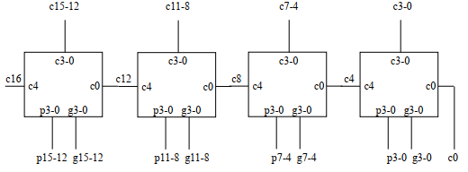

+ 块内并行，块间并行
    - 老办法:产生每块的进位传递因子和进位产生因子
    - 进位传递因子:每一位的传递因子都为1时才能传递 
      $P=p_0*p_1*p_2*p_3$
    - 进位产生因子:块内产生进位，不考虑进位输入 
      $G=g_3+(p_3*g_2)+(p_3*p_2*g_1)+(p_3*p_2*p_1*g_0)$ 
      $c_4=g_3+(p_3*g_2)+(p_3*p_2*g_1)+(p_3*p_2*p_1*g_0)+(p_3*p_2*p_1*p_0*c_0)$ 
      &nbsp;&nbsp;&nbsp;&nbsp;$=G+(P*c_0)$
      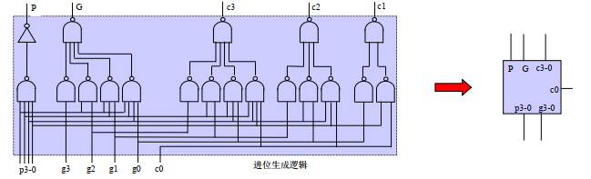

+ 块间并行加法器
    - 自下而上形成$p_i、g_i$,自上而下形成$c_i$
    - 共6级门延迟：
        - 第一层pg,第二层c,第一层c
    
     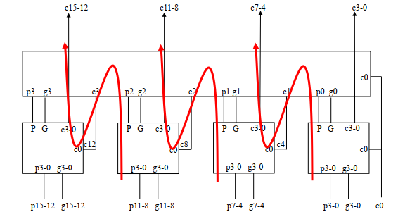

+ 32/64位加法器
    - 自下而上形成$p_i、g_i$，自上而下形成$c_i$
    - 共10级门延迟:
        - 第一层pg,第二层pg,第三层c,第二层c,第一层c

    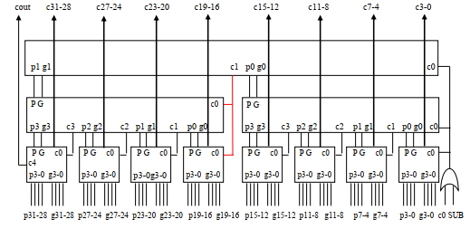

+ 补码减法算法
    - $[A]_补-[B]_补=[A-B]_补=[A]_补+[-B]_补$
        - $[-B]_补的计算: [B]_补  "取反加1"$
    - 只要在B的输入端对B进行取反并置进位位1

    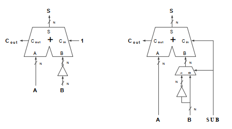

+ 溢出判断
    - 加法：正数相加的负，负数相加得正
    - 减法: 正数减负数结果为负数，或负数减正数结果为正数
    - 判断条件为：
        $ov=ADD*(s_{31}*!a_{31}*!b_{31}+!s_{31}*a_{31}*b_{31})+SUB*(s_{31}*!a_{31}*b_{31}+!s_{31}*a_{31}*!b_{31})$

## 二.定点ALU设计

+ ALU的实现
    - ALU表示算术逻辑单元
        - 实现加减法器
        - 实现逻辑运算（a&b、a|b、a xor b）
        - 实现比较器 (相等、大小)
        - 实现移位器
    - 最后，根据操作类型，从多个结果中选择

+ 判断相等
    - 判断多个bit的A信号和B信号是否相等: $A_{0-n}==B_{0-n}$
        - 使用异或逻辑逐bit的判断 ($A_0 xor B_0,A_1xorB_1，...$)
        - 每个bit结果，有任何一个为1，则输出为0
            - 多输入或非门，位数多时需要多级逻辑
    
    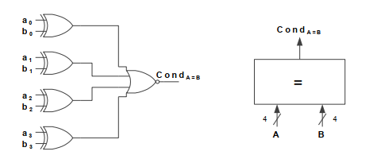

+ 判断大小
    - 使用A-B来判断大小
        - A-B>0 (结果符合位为0)则代表A大于B
    - 小心溢出

+ 移位操作
    - 移位操作: 同时也是乘以/除以2的幂次的运算
        - 逻辑左移(低位补0)
        - 逻辑右移(高位补0)
        - 算术右移(高位补符号位)
        - 循环右移(高位补右侧挤掉的数据)
    - 对于移N位数的移位操作，使用N选1来实现
        - 根据要移动的位数，从N个输入中选一个
        - 每个输入将输入移动特定位数，不需要延迟和逻辑
    - 每种移动结果在根据移位操作类型选择

    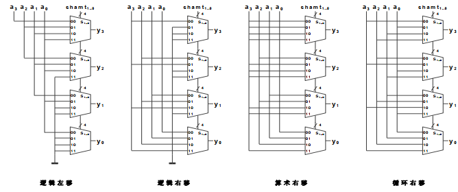

## 补码乘法器设计

+ $[X]_补+[Y]_补=[X+Y]_补,但[X]_补*[Y]_补!=[X*Y]_补$
+ $问题: 已知[X]_补和[Y]_补,求[X*Y]_补$
    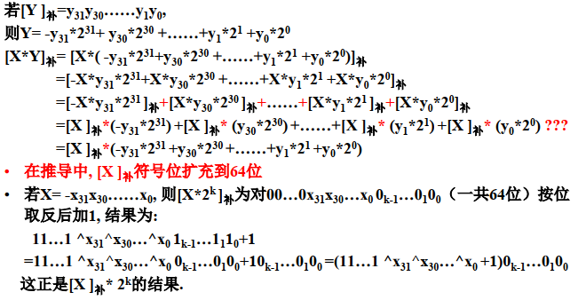

+ 补码乘法算法
    - $[X*Y]_补=[X]_补*(-y_{31}*2^{31}+y_{30}*2^{30}+...+y_1*2^1+y_0*2^0)$
    - 与普通乘法类似,只是符号位乘法要变加为减
    - 符号位的特殊性增加了电路复杂度

    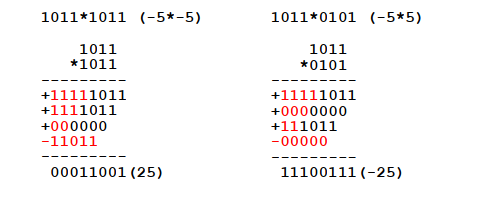

+ Booth算法
    - 对$(-y_{31}*2^{31}+y_{30}*2^{30}+...+y_1*2^1+y_0*2^0)进行变换$ 
    $=(y_{30}-y_{31})*2^{31}+(y_{29}-y_{30})*2^{30}+..+(y_0-y_1)*2^1+(y_{-1}-y_0)*2^0$
    - 每项都一样，每次看两位

    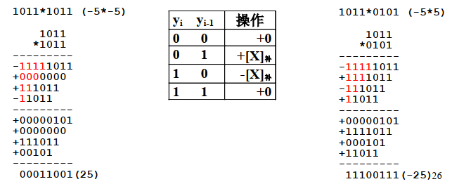

+ Booth二位一乘算法
    - 对$(-y_{31}*2^{31}+y_{30}*2^{30}+...+y_1*2^1+y_0*2^0)进行变换$ 
    $=(y_{29}+y_{30}-2*y_{31})*2^{30}+(y_{27}+y_{28}-2*y_{29})*2^{28}+..+(y_1+y_2-2*y_3)*2^2+(y_{-1}+y_0-2*y_1)*2^0$
    - 每一项都一样，每次看三位，只要16项相加

    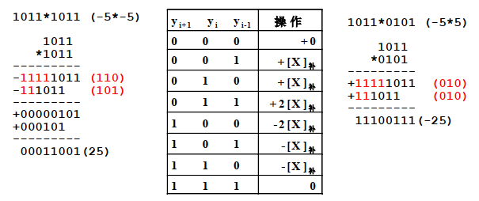

+ Wallace加法树
    - 串行把16个数相加，需要15次加法时间
    - 用15个加法器组织成树状，需要4次加法时间，又浪费硬件
    - Wallace树基本思想
        - n个全加器每次把三个n位的数相加转换成2m/3个数相加，再用一层全加器转换成4m/9个数相加，直到转换成2个数；再用加法器把最后两个数相加