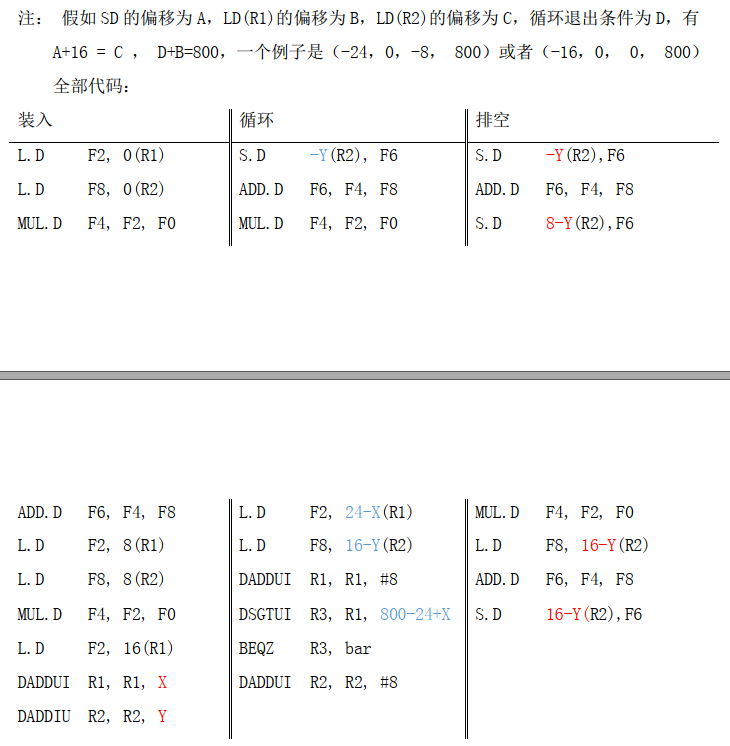

## 第2章 计算机系统结构基础

5. 对某处理器进行功耗测试，得到如下数据：

   时钟不翻转，电压1.05V时，电流为500mA;

   时钟频率为1GHz，电压1.1V时,电流为2500mA.

   请计算在1.1V下，此处理器的静态功耗以及500MHz下的总功耗。

   > 晶体管功耗：
   >
   >  1. 开关功耗
   >
   >     主要时电容充放电。
   >
   >     $P_{switch}=C_{cout}V_{dd}^2f_{clk}/2$
   >
   >  2. 短路功耗
   >
   >     就是P管和N管短路时产生的功耗
   >
   >  3. 漏电功耗	
   >
   >     是在MOS管不能严格关闭时发生的漏电产生的功耗
   >
   > 总功耗=静态功耗+动态功耗

   1.1V下静态功耗：$P=U^2/R$=1.1*1.1/(1.05/0.5)=0.576W

   1.1V下时动态功耗为：1.1*2.5-0.576=2.174W

   1.1V下0.5GHz动态功耗为：2.174*0.5/1=1.087W

   1.1V下0.5GHz总功耗为：0.576+1.087=1.663W

## 第3章 二进制与逻辑电路

> 原码：
>
> 反码： 正数的反码是其本身 ， 负数的反码是在其原码的基础上, 符号位不变，其余各个位取反。
>
> 补码：正数的补码是其本身，负数的补码是各位取反末位加1，符号位不变。
>
> 

1. 定点数的表示

   1. 分别给出64位定点原码和补码表示的数的范围

      原码=$[-2^{63}-1,2^{63}-1]$（-127，127）

      补码=$[-2^{63},2^{63}]$（-128，127）

   2. 在32位定点补码表示中，0x80000000表示什么数

      ​	$-2^{31}$

   <hr/>
   4.计算一个FO4的延迟，假设反相器的输入电容为0.0036pF,平均每个负载连线电容

   为0.0044pF,翻转延迟为0.023ns,每个pF延迟为4.5ns.

   ​	F04=本征延迟+负载延迟=0.023+4.5*((0.0036+0.0044)*4)=0.167ns

## 第5章 静态流水线

3. 对于浮点向量运算X(i)=a*X(i)+Y(i),假设X和Y的首地址分别存放在定点寄存器R1和R2中，a的值存在浮点寄存器F0中。

   1. 试写出对应的MIPS汇编代码

      

   2. 假设处理器为单发射5级流水线结构，功能部件足够，Load、Store操作和整数操作都花费1个时钟周期，浮点操作为3个周期，浮点乘法操作为4个周期。给出第一个循环所有指令的流水线时空图。

      

      

4. 假设某RISC处理器为标准的单发射5级流水结构。下面的代码在该处理器中执行。

   ```c
   Loop: 	LD		R1,0(R2)	;从地址0+R2处读入R1
       	DADDI	R1,R1,#4	;R1=R1+4
           SD		0(R2),R1	;将R1存入地址0+R2处
           DADDI	R2,R2,#5	;R2=R2+4
           DSUB	R4,R3,R2	;R4=R3-R2
           BNEZ	R4,Loop		;R4不等于0时跳转到Loop
           NOP
   ；已知R3的初始值为R2+400
   ```

   1. 不使用旁路硬件，但在同一个周期内寄存器的读和写能进行旁路，分支预测采用not taken策略，如果猜错则在转移指令执行EX后刷新流水线上的错误指令，计算执行一个循环需要多少个时钟周期。

      

   2. 使用旁路硬件，采用taken策略进行分支预测，如果猜测错误则在转移指令执行EX后刷新流水线上的错误指令，计算执行一个循环需要多少个时钟周期。

      

   3. 使用旁路硬件，分支指令具有单拍的分支延迟，可以重拍指令序列并对包括延迟槽在内的指令进行调度，计算执行一个循环需要的时钟周期数。

      

## 第6章 动态流水线

> 指令调度的基本思想：为了提高指令级并行的效率，通过寄存器重命名和指令重排来避免由于指令之间的数据相关和名字相关而引起的冲突。
>
> 动态调度的基本思想是前面指令阻塞不影响后面的指令继续前进。
>
> 保留站把指令从有序变成乱序的机构。
>
> WAW和WAR相关并不是真正的数据传递，而是一种假相关或名字相关，可通过寄存器重命名彻底消除。

> Tomasulo算法：
>
> 在Tomasulo算法中，译码后的指令被存放在操作队列中。
>
> 在发射阶段，根据操作类型把操作队列的指令送到相应的保留站，发射过程中**读寄存器的值**和**结果状态域**；如果寄存器处于可用状态则读出寄存器的值，如果寄存器的值处于不可用状态则读出状态域中记录的写该寄存器的保留站号。
>
> 在执行阶段，每个功能部件都要检查保留站中的指令，如果其中某条指令所需要的操作数都准备好了，则执行该指令；保留站中操作数没有准备好的指令侦听结果总线并接收结果总线的值。
>
> 指令执行完后写回时不仅要写回指令运算的结果，而且要写回该指令的保留站号，保留站和寄存器侦听结果总线并根据结果总线的内容修改自己的状态，指令写回后释放保留站。

> 精确例外；
>
> ROB （重排序缓存）：经乱序指令重新拍回有序。在提交阶段再把ROB的内容写回到寄存器或者存储器。

1. 以下循环时高斯消元法中的核心操作，称为DAXPY循环（双精度的a乘以X在加上Y），以下代码实现了对长度为100的向量进行DAXPY操作：Y=a*X+Y.

   ```c
   bar:
   	LDC1	F2,	0(R1)	;取数X(i)
       MUL.D	F4,	F2,	F0	;乘法操作a*X(i)
       LDC1	F6,	0(R2)	;取数Y(i)
       ADD.D	F6,	F4,	F6	;加法操作a*X(i)+Y(i)
       SDC1	F6,	0(R2)	;存数Y(i)
       DADDIU	R1,	R1,	#8	;X的下标加1
       DADDIU	R2,	R2,	#8	;Y的下标加1
       DSGTUI	R3,	R1,	#800;测试循环是否结束
      	BEQZ	R3,	bar		;如果循环没有结束，转移到bar
       NOP
           
   ```

   在单发射静态流水线上，假定浮点流水线的延迟如表所示（延迟为N表示第T拍数据准备好开始运算，第T+N-1拍可以生成结果），分支指令在译码阶段计算结果，采用了分支延迟槽技术，整数操作在一拍内发射和完成，并且结果时完全旁路的。

   | 产生结果的指令 | 使用结果的指令    | 延迟（时钟周期） |
   | -------------- | ----------------- | ---------------- |
   | FP ALU op      | Another FP ALU op | 4                |
   | FP ALU op      | Store double      | 3                |
   | Load double    | FP ALU op         | 2                |
   | Load double    | Store double      | 1                |

   1. 把这个循环展开足够的次数，要求消除所有停顿周期和循环开销指令。循环将会被展开多少次？写出调度后的代码，每产生一个结果需要多少执行时间？

      

   2. 写出DAXPY循环在软件流水后的代码，可以省略软件流水的装入代码和排空代码，每产生一个结果需要多少执行时间？

      

      

6. 假设有一个如图所示支持精确例外处理的浮点流水线。流水线分为发射、执行并写回以及提交3个阶段，其中浮点加法部件延迟为2拍（即假设第T拍操作数准备好开始计算，第T+1拍可以写回结果），浮点乘除法部件延迟为3拍，浮点操作队列中已有图中所示的指令，且寄存器的初始值如图所示，请给出6拍内每一拍的寄存器以及结果总线值得变化。

   

   

   

## 第7章 多发射数据通路

> 保留站组织：
>
> 1. 独立保留站
>
>    每一个功能部件有一个保留站。（Tomasulo）
>
> 2. 分组保留站
>
>    把功能部件分组，同一组的功能部件公用一个保留站。
>
> 3. 全局保留站
>
>    所有功能部件共用一个保留站。

> 保留站和寄存器关系：
>
> 从流水线中指令什么时候读取寄存器的值的角度，保留站和寄存器的关系有两种情况：
>
> 1. 指令在进入保留站之前读寄存器
> 2. 指令在进入保留站之后读寄存器

> 寄存器重命名技术在乱序执行的流水线中有两个作用：
>
> 1. 消除指令之间的寄存器WAR、WAW相关；
> 2. 当指令执行发生例外或转移指令猜测错误而取消后面的指令时可以保证现场的精确
>
> 重命名寄存器的组织：
>
> 1. 把重命名寄存器和结构寄存器分开
> 2. 不把重命名寄存器和结构寄存器分开
>
> 

4. 假设流水线延迟如下表

   | 产生结果的指令 | 使用结果的指令    | 延迟（时钟周期） |
   | -------------- | ----------------- | ---------------- |
   | FP ALU op      | Another FP ALU op | 4                |
   | FP ALU op      | Store double      | 3                |
   | Load double    | FP ALU op         | 2                |
   | Load double    | Store double      | 1                |

   下面循环计算Y[i]=a*X[i]+Y[i]高斯消元法中的关键一步。

   ```c
   L:	LDC1	F4,	0(R2)	;读Y[i]
       LDC1	F0,	0(R1)	;读X[i]
       MUL.D	F0,	F0,	F2	;求a*X[i]
       ADD.D	F0,	F0,	F4	;求a*X[i]+Y[i]
       SDC1	F0,	0(R2)	;保持Y[i]
       DADDIU	R2,	R2,	-8	
   	DADDIU	R1,	R1,	-8	
       BNEZ	R1,	L
       NOP
   ```

   1. 假设目标机器的流水线是单发射的，将次循环展开足够的次数，使得代码执行没有不必要的延迟，写出调度后的代码并计算一个元素的执行时间。

      

   2. 假设目标机器的流水线是双发射的，将次循环咱开足够的次数，使得代码执行没有不必要的延迟，写出调度后的代码并计算一个元素的执行时间。

      

   3. 自己写一段与题中类似的C代码，用gcc不同优化编译选项编译后，查看汇编代码，对不用优化选项进行比较，描述gcc做的优化。

      

5. 一个n发射的处理器，流水线情况如下：取指，译码，重命名到物理寄存器后送入发射队列，发射队列乱序发射，功能部件乱序执行，乱序回到物理寄存器，最后顺序提交并释放到物理寄存器。已知该处理器有m个逻辑寄存器，i个功能部件（i>n），每条指令从重命名到写回需要t1拍，从重命名到提交需要t2拍。为了能让流水线满负荷工作，最少需要多少个物理寄存器？

   n*t2+m

## 第8章 转移预测

> 转移预测：不等转移指令执行，就在指令流水线的取址或译码阶段根据转移指令的地址和内容预测转移方向和转移目标，并根据预测的结果继续取指令。	
>
> 分支的可预测性包括单条转移指令的重复性、不同转移指令之间的相关性以及函数调用的递归性等。

> 软件解决控制相关：（编译优化技术）
>
> ​	循环展开和软流水、全局代码调度、函数内联调用、通过条件指令或谓词把控制相关转换为数据相关、软件预测执行等。

> 硬件转移预测技术：
>
> 1. 在取指或译码阶段预测转移是否成功以及转移目标地址并进行后续指令的取指，以减少指令流水线由于控制相关而堵塞。
> 2. 在转移指令执行后，根据确定的转移条件或转移目标对预测结果进行修正，如果发现前面的转移预测错误，需要取消预测后的指令执行。
>
> 转移预测分类：
>
> 1. 静态预测
>
>    总是预测成功或是总是预测不成功
>
> 2. 动态预测
>
>    根据转移指令执行历史进行预测，较精确却比较复杂。
>
> 转移预测机制的性能：预测精度、正确预测的延迟、转移取消的延迟

> 根据单条转移指令的历史进行基本转移预测：
>
> PHT(转移历史模式表)：记录每条转移指令的历史记录，每次转移预测时根据表的内容判断转移方向。使用PC的低位进行索引。
>
> PHT表的每项都是两位饱和计数器，相应得转移指令每次转移成功就加1，转移不成功就减1；如果PHT高位为1就预测跳转，高位为0就预测不跳转。
>
> 
>
> BTB(Branch target buffer,转移目标缓冲器)：表每项保存转移指令得PC、转移指令得目标地址以及预测转移指令是否跳转得两位饱和计数器。BTB使用CAM结构。

> BHR(branch history register,转移历史寄存器)：是一个移位寄存器，处理器执行转移指令，就把BHR左移1位，左移时最高位丢掉，最低位如果转移成功就填1，否则填0.也可以为每条转移指令单独记录BHR。
>
> BHR组织方式：
>
> 1. GA :所有转移指令共用一个BHR
> 2. SA：用PC低地址索引BHR
> 3. PA：每条转移指令都有自己得BHR，用PC索引。
>
> PHT表组织方式：
>
> 1. g：只用BHR索引PHT表
> 2. p：用PC和BHR一起索引PHT表
> 3. s：使用部分PC和历史记录一起索引PHT表

1. 下表是转移猜测的Yeh和Patt分类中根据转移历史表BHT和模式历史表PHT的不同组合形成的转移猜测种类。PC中用来索引BHT的表的位数是低6位，索引PHT表的位数是低8位，BHT表每项9位，请画出SAs转移猜测的结构图，说明其基本原理，并计算该结构使用的存储单元位数。

   |                 | Global PHT | pER ADDRESS PHT | PER SET PHT |
   | --------------- | ---------- | --------------- | ----------- |
   | Global BHR      | GAg        | Gap             | GAs         |
   | Per-address BHR | PAg        | PAp             | PAs         |
   | Per-set BHR     | SAg        | SAp             | SAs         |

   


6. 假设流水线延迟如下表，分支延迟1个周期，有延迟槽。

   | 产生结果的指令 | 使用结果的指令    | 延迟周期数 |
   | -------------- | ----------------- | ---------- |
   | FP ALU op      | Another FP ALU op | 4          |
   | FP ALU op      | Store double      | 3          |
   | Load double    | FP ALU op         | 2          |
   | Load double    | Store double      | 1          |

   1. 下面程序段实现对数组元素增值，R1和R2的初始值满足R1=8n+R2,n为循环次数。

      ```c
      L1:	LDC1	F0,	0(R1)
          ADD.D	F2,	F0,	F1
          SDC1	F2,	0(R1)
          ADDIU	R1,	R1,	-8
          BNE		R1,	R2,	L1
          NOP
      ```

      写出完整的软件流水循环代码，包括装入代码和排空代码，并计算软件流水循环完成所有操作需要的总时钟周期数表达式。

      

   2. 分析比较软件流水和循环展开两种方案的区别。

      软流水无法降低分支频率，循环展开可以；

      软流水代码量增加少，循环咱开会带来代码膨胀。

## 第9章 功能部件

5. 用Verilog写一个16位得先行进位加法器

   

   

6. 

7. 图中是包括块间进位生成因子的4位进位逻辑模块，用该逻辑模块组建64位先行进位逻辑，并证明其正确性。

   

## 第10章 高速缓存

> 访问cache时，访问地址可分为3个部分：偏移量Offset、索引Index、标签Tag
>
> cache写策略：
>
> 1. 写命中策略
>
>    写穿透：处理器在写cache时同时写内存
>
>    写回：处理器只写cache不写回内存
>
> 2. 写失效策略
>
>    写分配 : 处理器写cache失效时，先把这一块读到cache，再在cache中写
>
>    写不分配:处理器写cache失效时，直接写进内存

> 全相连：Index=0
>
> 直接相连：Index记录位置
>
> 组相联：Index记录每一组的位置

1. 一个处理器的页大小位4KB，一级数据cache大小为64KB,cache块大小为32B，指出在直接相连、二路组相连、以及4路组相连的情况下需要页着色的地址位数。

   页大小为4KB=$2^{12}$B,页内地址为[11:0]位。

   cache容量64KB=$2^{16}$B,地址范围[15:0];cache块大小为32B=$2^5$B,地址范围[4:0]

   1. 直接相连

      cache索引位数为地址的[15:5],需要页着色的是地址[15:12]共4位；

   2. 二路组相连

      cache索引位数为地址的[14:5],需要页着色的是地址[14:12]共3位；

   3. 四路组相连

      cache索引位数位地址的[13:5],需要页着色的是地址[13:12]共2位；

## 第11章 存储管理

> MIPS体系，TLB例外：
>
> 1. TLB refill例外
> 2. TLB invalid Load例外/TLB invalid Store例外
> 3. TLB modify例外

1. 在一台运行Linux操作系统(页大小为4KB)的MIPS计算机上执行如下C语言程序。在该程序执行过程中共发生了多少次例外？说明其过程。

   ```c
   void cycle(double *a){
       int i;
       double b[65536];
       for(int i=0;i<3;i++){
           memcpy(a,b,sizeof(b));
       }
   }
   ```

   假设：操作系统页大小为4KB，同时系统物理内存足够大。

   a、b两数组各自均需要512KB/4KB=128个页表项

   处罚refill例外: 128/2+128/2=128次

## 第12章 多处理器系统

6. 假设一个双CPU多处理器系统中，两个CPU用单总线连接，并且采用监听一致性协议MSI，cache的初始状态均为无效，然后两个CPU对内存中同一数据块进行如下操作；CPU A读，CPU A写，CPU B写，CPU A读，写出每次访问后两个CPU各自的cache状态变化。

   

7. 在下面程序段中，A、B、C、D为进程P1、P2、P3的共享变量，且初始值均为0。该程序的正确运行解结果为D=2000。

   | P1     | P2           | P3           |
   | ------ | ------------ | ------------ |
   | A=2000 | while(B!=1); | while(C!=1); |
   | B=1    | C=1;         | D=A;         |

   

   1.  在一个用可伸缩网络连接、采用基于目录的cache一致性协议的分布式共享存储系统中运行上述程序得到结果是D=0，请解释产生尚需结果的原因。

      P1对A的写由于网络阻塞一直未传到P2和P3；

   2. 在实现顺序一致性协议的分布式共享存储系统中，对上述程序施加什么限制可以保证执行结果的正确性。

      无需施加限制；

   3. 在实现弱一致性协议的分布式存储系统中，采用barrier进行同步，请问上述程序如何插入barrier操作才能保证执行的正确性。

      | P1       | P2           | P3           |
      | -------- | ------------ | ------------ |
      | A=2000   | while(B!=1); | barrier1     |
      | B=1      | C=1          | barrier2     |
      | barrier1 | barrier2     | while(C!=1); |
      | barrier2 |              | D=A          |

      