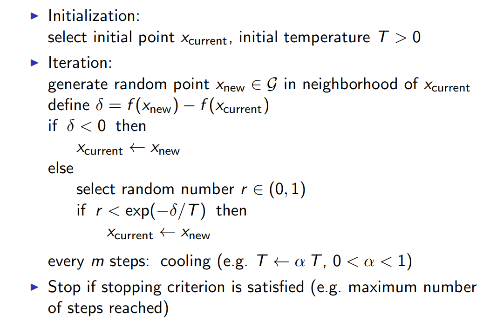

## 一. 目录结构

1. 简介
2. 线性规划
3. 二次规划
4. 非线性优化
5. 有约束非线性优化
6. 凸优化
7. 全局优化
8. 总结
9. Matlab优化工具箱
10. 多目标优化
11. 整数优化

## 二. 线性规划

### 1单纯型法

> $min\quad c^TX\\ s.t. \quad Ax=b\\ \qquad \quad x\geq 0$
>
> $Bx_B+Nx_N=b \Rightarrow x_B=B^{-1}(b-Nx_N)$
>
> $c^Tx=c_B^Tx_B+c_N^Tx_N=c_B^TB^{-1}b+(c_N^T-c_B^TB^{-1}N)x_N\\=z_0+p^Tx_N$
>
> switch j column of B with i column of N
>
> $i=argmin\{p_i,p_i<0\}$
>
> $\begin{cases} Bx_B=b\\By=N_i\end{cases}\Rightarrow B(x_B-\epsilon y)+\epsilon N_i=b$
>
> $(x_N)_i=\epsilon >0\\(x_B-\epsilon y)_j=0$
>
> $\Rightarrow j=argmin\{\frac{(x_B)_j}{y_j} |y_j>0\}$

## 三 . 二次规划

$$
标准形：\\ min\, f(x)=min \frac{1}{2}x^THx+c^Tx \\
Ax= b\\
x\geq 0
$$

## 四. 无约束非线性

$$
标准型:\\min \, f(x)
$$

> 1. 牛顿和拟牛顿法
>
>    $x_{k+1}=x_k-\nabla^2 f(x_k)^{-1 }\nabla f(x_k) $
>
> 2. 一维线性搜索
>
>    1. 黄金分割
>    2. 斐波那契法
>
> 3. Nelder-Mead method

> ​	Nelder-Mead method
> $$
> 初始化三个点(x_0,x_1,x_2)\\
>  如果 f(x_0)>f(x_1) 并且 f(x_0)>f(x_2)\\
>  x_3=x_1+x_2-x_0
> $$

## 五. 有约束非线性

> 线性约束：
>
> ​	梯度投影法	
>
> ​	1.投影矩阵： $P=I-A^T(AA^T)^{-1}A$
>
> 	2. 新的搜索方向：$d_k=-P\nabla f(x_k)$
>  	3. 新的迭代: $min \, f(x_k+d_ks)\\s.t. \quad A(x_k+d_ks)-b\leq 0$
>
> 非线性约束：
>
> ​	障碍函数、惩罚函数、SQP
>
> ​    增广拉格朗日乘子法

> ​	增广拉格朗日乘子法：
>
>  $A(x,\lambda,\rho)=f(x)-\sum_{i=1}^{m}\lambda_i g_i(x)+\frac{1}{2}\sum_{i=1}^{m}[g_i(x)]^2$

## 六. 多目标优化

> Pareto optimal points 帕累托解
>
> 求解策略：
>
> + Weight-sum strategy
> + $\epsilon$-constraint method
> + Goal attainment method

## 七. 整数优化

> 分枝定界
>
> 1. 求最优解，选择一个变量做分枝
> 2. 依次对不同变量进行限界求最优解。

## 八. 全局优化

> ​	模拟退火、遗传算法

​	