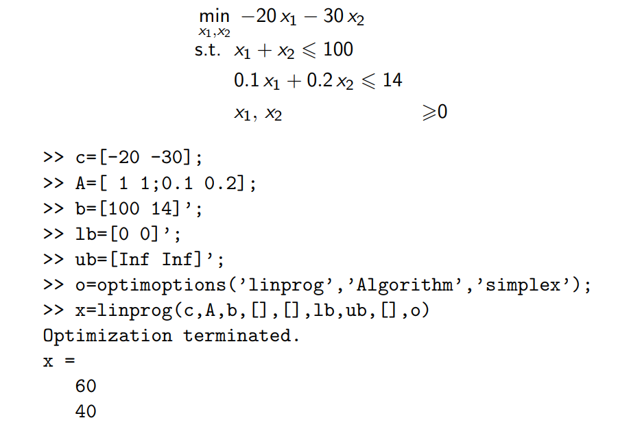
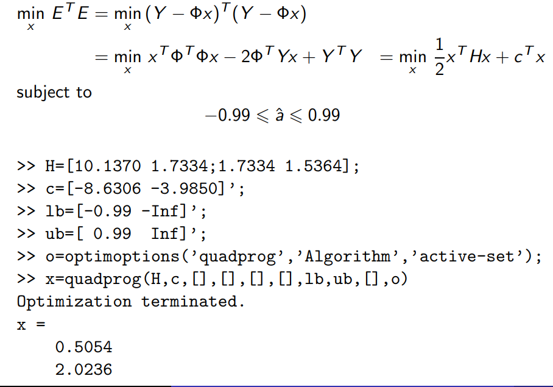
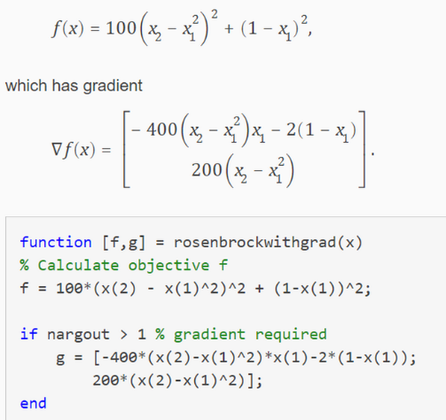
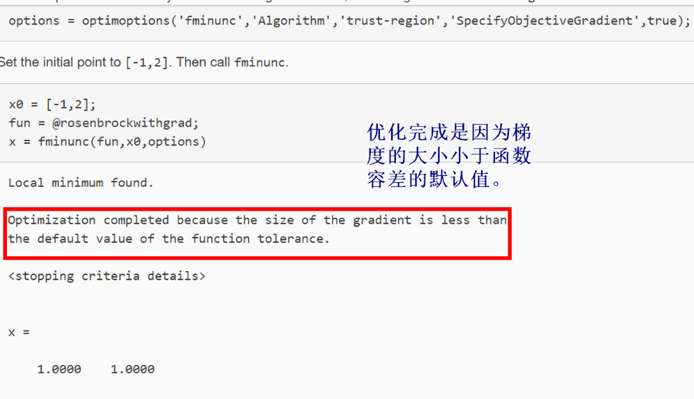
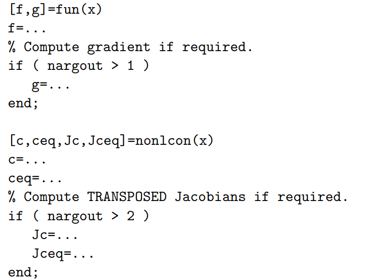

[TOC]


## 一. 基本概念和基本理论

### 1. 凸集
>$$设S\subset R^n,如果x^{(1)},x^{(2)}\in S,\lambda \in [0,1],均有 \lambda x^{(1)}+(1-\lambda)x^{(2)} \in S,则称S为凸集$$
有定义知，凸集的特征是集合中任两点连成的线段必属于这个集合。

### 2. 凸函数
>$设S\subset R^n,非空，凸集，函数f:S\rightarrow R,如果对于\forall x^{(1)},x^{(2)}\in S,\forall \lambda\in [0,1],\\恒有f(\lambda x^{(1)}+(1-\lambda)x^{(2)})\leq \lambda f(x^{(1)})+(1-\lambda)f(x^{(2)}),则称f为S上的凸函数。$
凸函数的几何意义是对于S上的任意两点，这两点连成的线段在函数图像上。

### 3. 凸规划
>$设S\subset R^n,非空，凸，f:S\rightarrow R是凸函数。x^*为问题(fS)的l.opt,则x^*为g.opt；又如果f是严格凸函数，那么x^*是问题(fS)的唯一g.opt.$

## 二. 线性规划
### 1. 线性规划问题的提出
>例：某工厂拥有A,B,C三种类型的设备，生成甲、乙两种产品。每件产品在生成中需要占用的设备机时数、每件产品可以获得的利润以及三种设备可利用的时数见下表。问：工厂应如何安排生产可获得最大的总利润？<br/>

||产品甲/h|产品乙/h|设备能力/h|
|-|:-:|:-:|:-:|
|设备A|3|2|65|
|设备B|2|1|40|
|设备C|0|3|75|
|利润(元/件)|1500|2500||
>$解: 设变量x_i为第i种(甲、乙)产品的生产件数(i=1,2)$<br/>
目标函数：max  $z=1500x_1+2500x_2$ <br/>
约束条件：s.t. $\begin{cases} 3x_1+2x_2\leq 65\\ 2x_1+x_2\leq40\\3x_2\leq75 \end{cases}$<br/>
>这是一个典型的利润最大化的生产计划问题

### 2. 线性规划问题的标准形式
>一般形式:

$$
\begin{cases} 
    max \quad z=c_1x_1+c_2x_2+c_3x_3+...+c_nx_n \\ 
    s.t. \quad \quad a_{11}x_1+a_{12}x_2+...+a_{1n}x_n=b_1 \\
    \quad \quad \quad a_{21}x_1+a_{22}x_2+...+a_{2n}x_n=b_2 \\
    \quad \quad \quad \quad\quad \quad . . .\\
    \quad \quad \quad a_{m1}x_1+a_{m2}x_2+...+a_{mn}x_n=b_m \\
    \quad \quad \quad \quad\quad \quad x_1,x_2,...,x_n \geq 0
\end{cases}
$$
>矩阵形式

$$
\begin{cases} 
    max \quad z=\overrightarrow{c}^T\overrightarrow{x} \\ 
    s.t. \quad \quad A\overrightarrow{x}=\overrightarrow{b} \\
    \quad \quad \quad  \overrightarrow{x} \geq 0
\end{cases}
$$

### 3. 线性规划的图解法

>略

### 4. 线性规划的单纯形法
>`基本思想:`从线性规划问题的某一个基本可行解(即可行域的某一个顶点)出发，经过最优性判定，若当前的基本可行解已经是最优解，则停止；否则经过基变换得到另一个目标函数值改善的基本可行解。如此反复，直到找到最优解(即目标函数值取得最优的基本可行解)，或判定问题为无界解或无最优解。<br/>
>由此可见，单纯形法需要解决的三个关键问题是: 
> 1. 初始基本可行解的确定;
> 2. 解的最优性判定;
> 3. 基的转换.

>`迭代步骤:`</br>
> `步骤1` 列出初始单纯形表,要求$(B^{-1}b)_i \geq 0$ <br/>
> `步骤2` 进行最优性判断。若所有的$\sigma _j=(c^T-c_B^TB^{-1}A)_j \leq0$,则当前表中的基本可行解即为最优解，计算结束。否则转到`步骤3`<br/>
> `步骤3` 确定换入变量。若存在$\sigma _j >0,那么计算max_j\quad\{\sigma_j|\sigma_j>0\}=\sigma_s$,将对应的变量$x_s$作为换入变量<br/>
> `步骤4` 确定换出变量。检查换入变量$x_s所在的第s列，若所有的a_{is}\leq0,则线性规划问题有无界解；若存在a_{is}>0,那么计算\theta=min_i\{\frac{b_i}{a_{is}}|a_{is}>0\}=\frac{b_r}{a_{rs}}$,将对应的列变量$x_s$作为换入变量。<br/>
> `步骤5` 重复步骤2~步骤4，直到计算结束。

>`例` 用单纯形法求解线性规划问题<br/>$max\quad z=40x_1+50x_2 \\ s.t. \begin{cases} x_1+2x_2 \leq30 \\ 3x_1+2x_2 \leq60\\2x_2\leq24\\ x_1,x2\geq0   \end{cases}$<br/>
>`标准化`<br>$max\quad z=40x_1+50x_2+0x_3+0x_4+0x_5$<br/>
$\begin{cases}x_1+2x_2+x_3=30\\3x_1+2x_2+x_4=60\\2x_2+x_5=24\\x_1,x_2,x_3,x_4,x_5\geq0\end{cases}$<br/>

>1. 基变量为x3,x4,x5
<table>
    <tr><td colspan='3'>cj</td><td>40</td><td>50</td><td>0</td><td>0</td><td>0</td></tr>
    <tr><td>CB</td><td>XB</td><td>b</td><td>x1</td><td>x2</td><td>x3</td><td>x4</td><td>x5</td></tr>
    <tr><td>0</td><td>x3</td><td>30</td><td>1</td><td>2</td><td>1</td><td>0</td><td>0</td><td>30/2=15</td></tr>
    <tr><td>0</td><td>x4</td><td>60</td><td>3</td><td>2</td><td>0</td><td>1</td><td>0</td><td>60/2=30</td></tr>
    <tr><td>0</td><td>x5</td><td>24</td><td>0</td><td>2</td><td>0</td><td>0</td><td>1</td><td>24/2=12</td></tr>
    <tr><td colspan='3'>sigma_j</td><td>40</td><td>50</td><td>0</td><td>0</td><td>0</td></tr>
<table>

>2. x2入基，x5出基
<table>
    <tr><td colspan='3'>cj</td><td>40</td><td>50</td><td>0</td><td>0</td><td>0</td></tr>
    <tr><td>CB</td><td>XB</td><td>b</td><td>x1</td><td>x2</td><td>x3</td><td>x4</td><td>x5</td></tr>
    <tr><td>0</td><td>x3</td><td>6</td><td>1</td><td>0</td><td>1</td><td>0</td><td>-1</td><td>6/1=6</td></tr>
    <tr><td>0</td><td>x4</td><td>36</td><td>3</td><td>0</td><td>0</td><td>1</td><td>-1</td><td>36/3=12</td></tr>
    <tr><td>50</td><td>x2</td><td>12</td><td>0</td><td>1</td><td>0</td><td>0</td><td>1/2</td><td></td></tr>
    <tr><td colspan='3'>sigma_j</td><td>40</td><td>0</td><td>0</td><td>0</td><td>-25</td></tr>
<table>

>3. x1入基，x3出基
<table>
    <tr><td colspan='3'>cj</td><td>40</td><td>50</td><td>0</td><td>0</td><td>0</td></tr>
    <tr><td>CB</td><td>XB</td><td>b</td><td>x1</td><td>x2</td><td>x3</td><td>x4</td><td>x5</td></tr>
    <tr><td>40</td><td>x1</td><td>6</td><td>1</td><td>0</td><td>1</td><td>0</td><td>-1</td><td></td></tr>
    <tr><td>0</td><td>x4</td><td>18</td><td>0</td><td>0</td><td>-3</td><td>1</td><td>2</td><td>18/2=9</td></tr>
    <tr><td>50</td><td>x2</td><td>12</td><td>0</td><td>1</td><td>0</td><td>0</td><td>1/2</td><td>12/(1/2)=24</td></tr>
    <tr><td colspan='3'>sigma_j</td><td>0</td><td>0</td><td>-40</td><td>0</td><td>15</td></tr>
<table>

>4. x5入基，x4出基
<table>
    <tr><td colspan='3'>cj</td><td>40</td><td>50</td><td>0</td><td>0</td><td>0</td></tr>
    <tr><td>CB</td><td>XB</td><td>b</td><td>x1</td><td>x2</td><td>x3</td><td>x4</td><td>x5</td></tr>
    <tr><td>40</td><td>x1</td><td>15</td><td>1</td><td>0</td><td>-1/2</td><td>1</td><td>0</td><td></td></tr>
    <tr><td>0</td><td>x5</td><td>9</td><td>0</td><td>0</td><td>-3/2</td><td>1</td><td>1</td><td></td></tr>
    <tr><td>50</td><td>x2</td><td>15/2</td><td>0</td><td>1</td><td>3/4</td><td>-1/4</td><td>0</td><td></td></tr>
    <tr><td colspan='3'>sigma_j</td><td>0</td><td>0</td><td>-35/2</td><td>-15/2</td><td>0</td></tr>
<table>

### 5. 线性规划MATLIB求解
>`优化形式:` 单纯形法标准形式,（最小值、小于等于)

>x=linprog(f,A,b)<br/>
输入: f:目标函数系数向量,A:不等式约束系数矩阵，b:不等式约束常数向量

>x=linprog(f,A,b,Aeq,beq)<br/>
输入：Aeq：等式约束系数矩阵，beq：等式约束常量矩阵

>x=linprog(f,A,b,Aeq,beq,lb,ub)<br/>
输入：lb：可行域下界，ub:可行域上界
```matlab
clear all;
f=[-40 -50];
A=[1 2;3 2;0 2];
b=[30 60 24];
x=linprog(f,A,b);
```

## 三. 非线性规划
### 1.非线性规划数学模型
$min\quad f(x) \\ s.t. \begin{cases}g_i(x)\geq0,i=1,2,...,l\\h_j(x)=0,j=1,2,...,m\end{cases}$
### 2.下降迭代算法
>从前面的`无约束优化问题`极值点存在条件中可以看出,对于可微函数，为求其极值点，可首先由一阶必要条件令其梯度等于零，求得驻点；然后，再利用二阶充分条件进行判别。事实上，很多实际问题往往很难求出或根本无法求出目标函数对各自变量的偏导数，从而一阶必要条件难以应用。因此，一般情况下，对非线性规划问题的求解常采用所谓的下降迭代算法。

>`下降迭代算法的基本思想`：从一个初始估计点$x_0$出发，按照一定的规则，找到一个比$x_0$更好的点$x_1$,再从点$x_1$出发，找到一个比$x_1$更好的点
$x_2$，如此继续，得到一个解点序列$\{x_k\}$.若该点列有一极限点$x^*,即\lim_{k\rightarrow\infty}||x_k-x^*||=0$,就称该点列收敛于$x^*$。若$x^*$是问题$\min_{x\in \Omega}f(x)$的最优解，则称该算法是有效的下降迭代算法。

>`下降迭代算法的基本步骤:`<br/>
>`步骤1`  选取某一点初始点$x_0$，令k:=0。<br/>
>`步骤2`  确定搜索方向。若已得出某一迭代点$x_k$,且$x_k$不是极小点，那么就要根据一定得规则，从$x_k$点出发确定一个搜索方向$d_k$,沿该方向应能找到使目标函数值下降得可行点。</br>
>`步骤3`  确定步长。沿方向$d_k$前进一个步长，得到新点$x_{k+1}$，通过选择合适得步长$\alpha_k$,使得下一个迭代点$x_{k+1}=x_k+\alpha_kd_k$满足$f(x_{k+1})=f(x_k+\alpha_kd_k)<f(x_k)$<br/>
>`步骤4`  最优性检验。检验新得到的点是否使极小值点或达到近似极小值点的要求。如满足，则迭代停止；否则，令k:=k+1,返回上面的`步骤2`继续迭代。
><br/>
><br/>`迭代终止条件:`<br/>
>1) 按绝对误差：<br/>$||x_{k+1}-x_k||<\varepsilon和|f(x_{k+1})-f(x_k)|<\varepsilon$<br/>
>2) 按相对误差: <br/>$\frac{||x_{k+1}-x_k||}{||x_k||}<\varepsilon和\frac{|f(x_{k+1}-f(x_k))|}{f(x_k)}<\varepsilon$<br/>
>3) 按目标函数梯度的模:<br/>$||\nabla f(x_k)||<\varepsilon$

### 3.一维搜索
>一维搜索就是单变量函数在某个区间上求极值点的问题。<br/>
>一维搜索的方法，常用的有:<br/>
>1) 试探法（黄金分割法、斐波那契法等）<br/>
>2) 微积分中的求根法(切线法、二分法等)<br/>
>3) 函数逼近法，也称插值法(抛物线插值法、三次插值法)

#### 3.1 黄金分割法
>`基本思想:`通过尽可能少地选取试验点获得尽可能大的区间缩短率.在搜索区间中“对称”取点，等比例地缩小区间。除第一次需要选取两个试验点外，之后每次都只需要计算一次函数值，可使包含极小点的区间缩小相同的比例。

>假设区间缩短率为$\alpha$，在初始单峰区间$[a_0,b_0]$中，对称取两点分别为,<br/>$t_1=a_0+(1-\alpha)(b_0-a_0),t_1\prime=a_0+\alpha(b_0-a_0)$<br/>
>若$f(t_1)<f(t_1\prime)$,则得到新区间$[a_1,b_1]，其中a_1=a_0,b_1=t_1\prime$，再在此区间对称取两点$t_2,t_2\prime,得到$<br/>
>$t_2=a_1+(1-\alpha)(b_1-a_1),t_2\prime=a_1+\alpha(b_1-a_1)$<br/>
>由于在新区间[a_1,b_1]中，已经包含了一个已知函数值的试验点$t_1$,因此，如能使$t_1与t_2\prime$重合，则可以节省计算函数值的次数。要满足该条件，可推得区间缩短率$\alpha$得取值。<br/>
>要使$t_1=t_2\prime,则有a_0+(1-\alpha)(b_0-a_0)=a_1+\alpha(b_1-a_1)，代入a_1=a_0,b_1-a_1=\alpha(b_0-a_0),得$<br/>
>$a_0+(1-\alpha)(b_0-a_0)=a_0+\alpha^2(b_0-a_0),整理得,\alpha^2+\alpha-1=0,解得,\alpha=\frac{\sqrt{5}-1}{2}\approx0.618$

>`例:` 用黄金分割法求函数$f(x)=4x^2-6x-3$在区间[0,1]上的近似极小点，要求缩短后的区间长度不大于原区间长度的10%。<br/>
>已知$a_0=0,b_0=1,用黄金分割法得到第一次的试验点:$<br/>
$x_1=0.382(1-0)=0.382,x_1\prime=0.618(1-0)=0.618,f(x_1)=-4.71,f(x_1\prime)=-5.11,$<br/>
$因，f(x_1)<f(x_1\prime)，a_1=x_1=0.382,b_1=b_0=1,x_2=x_1\prime=0.618$<br/>
$x_2\prime=0.382+0.618(1-0.382)=0.764,f(x_2)=-5.11,f(x_2\prime)=-5.249$<br/>
$因，f(x_2\prime)<f(x_2),a_2=x_2=0.618,b_2=b_1=1,x_3=x_2\prime=0.764$<br/>
$x_3\prime=0.618+0.618(1-0.618)=0.854,f(x_3)=-5.249,f(x_3\prime)=-5.21$<br/>
>SO ON

#### 3.2斐波那契法
>斐波那契数列：
>
>| F1   | F2   | F3   | F4   | F5   | F6   | F7   | F8   |
>| ---- | ---- | ---- | ---- | ---- | ---- | ---- | ---- |
>| 1    | 2    | 3    | 5    | 8    | 13   | 21   | 34   |
>
>$\rho_1 =1-\frac{F_N}{F_{N+1}},\\\rho_2 =1-\frac{F_{N-1}}{F_N},\\...,\\ \rho_N=1-\frac{F_1}{F_2}$
>
>总压缩比：$(1-\rho_1)(1-\rho_2)...(1-\rho_N)=\frac{F_N}{F_{N+1}}\frac{F_{N-1}}{F_N}...\frac{F_1}{F_2}=\frac{1}{F_{N+1}}$

> 例：目标函数$f(x)=x^4-14x^3+60x^2-70x$在区间[0,2]上的极小值点，要求将极小点f所在区间的长度压缩到0.3之内。
>
> 计算迭代次数: $\frac{1+2\epsilon}{F_{N+1}}\leq \frac{最终区间长度}{初始区间长度}=\frac{0.3}{2}=0.15,F_{N+1}\geq \frac{1+2\epsilon}{0.15}$
>
> 第一次迭代：
>
> ​	确定压缩比：$1-\rho_1=\frac{F_4}{F_5}=5/8$
>
> ​	计算：$a_1=a_0+\rho_1(b_0-a_0)=3/4\\b_1=a_0+(1-\rho_1)(b_0-a_0)=5/4$
>
> ​				$f(a_1)=-24.34,f(b_1)=-18.65,f(a_1)<f(b_1),区间变为[a_0,b_1]=[0,5/4]$
>
> 第二次迭代：
>
> ​	确定压缩比：$1-\rho_2=\frac{F_3}{F_4}=3/5$
>
> ​	计算：$a_2=a_0+\rho_2(b_1-a_0)=1/2,\\b_2=a_1=3/4$
>
> ​	$f(a_2)=-21.69,f(b_2)=f(a_1)=-24.34,f(a_2)>f(b_2),区间压缩为[a_2,b_1]=[1/2,5/4]$
>
> ...
>
> 

#### 3.3牛顿法
>`基本思想:`在一个迭代点附近用切线近似代替曲线，以切线方程的零点作为新的迭代点，逐步逼近最优点.

>设$x_k使f\prime (x)=0得一个近似根，在点(x_k,f\prime(x_k))处做曲线f\prime(x)的切线.该切线的方程即f\prime(x)在点x_k的一阶Taylor展开式:$<br/>
>$f\prime(x)\approx f\prime(x_k)+f\prime\prime(x_k)(x-x_k)$<br/>
>$于是，方程f\prime(x_k)=0可近似表示为: f\prime(x_k)+f\prime\prime(x_k)(x-x_k)=0,这是一个线性方程，记其根为x_{k+1},则x_{k+1}的计算公式就是牛顿迭代公式。$<br/>
>$x_{k+1}=x_k-\frac{f\prime(x_K)}{f\prime\prime(x_k)}$

>牛顿法需要计算目标函数的二阶导数，如果迭代序列收敛，则其收敛速度是比较快的。但是，牛顿法的收敛性依赖于初始值$x_0$的选取。如果$x_0$偏离所求的真解$x^*$比较远，则牛顿法可能发散。

#### 3.4函数逼近法(插值法)
>`函数逼近法(又称插值法)`是在极小点附近以插值多项式来逼近目标函数的一种方法。

>$用抛物线插值，对f(x)取三个点x_1<x_2<x_3,且满足f(x_1)>f(x_2),f(x_2)<f(x_3)。$<br/>
>$\phi(x)=ax^2+bx+c,根据插值条件要求$<br/>
>$\phi(x_1)=ax_1^2+bx+c=f(x_1) \\\phi(x_2)=ax_2^2+bx_2+c=f(x_2)\\\phi(x_3)=ax_3^2+bx_3+c=f(x_3)$<br/>
>由上述三个等式可求得系数a,b,c,从而得到$f(x)$的拟合抛物线$\phi(x)$。接下来，用抛物线$\phi(x)$的极小点来近似$f(x)$的极小点。利用一阶条件$\phi\prime(x)=2ax+b=0得到\phi(x)的极小点：\hat x=-b/2a$<br/>
>我们用该极小点$\hat x来近似f(x)的极小点x_k,然后从x_1,x_2,x_3,x_k$这四个点中再选出3个点。选择的原则是以目标函数值最小的点作为新的$x_2$,其左右两个相邻的点作为新的$x_1和x_3$。依照上述方法继续用新的抛物线函数来逼近$f(x)$,一直下去，就可以得到一个点列$\{x_k\}$。在一定条件下，这个点列收敛于原问题的最优解。

### 4.无约束极值问题的求解方法
>对于一个复杂的非线性函数，用求驻点即求解方程$\nabla f(x^*)=0$的方法得到其极值点往往是很困难的，特别是对于多变量问题。因此，在实际计算中通常还是要使用迭代的方法。迭代法一般分为两类:一类需要用到函数的导数值，称为`解析法`;另一类则仅用到各点的函数值，称为`直接法`.
#### 4.1 梯度法(最速下降法)
>`步骤1` $给定初始点x_0和误差容限\epsilon>0,令k:=0$<br/>
>`步骤2` $计算负梯度方向d_k=-\nabla f(x_k)$<br/>
>`步骤3` $检验是否满足收敛性准则||\nabla f(x_k)||<\epsilon。若满足则停止迭代，得到x^*:=x_k;否则，进入$`步骤4`<br/>
>`步骤4` $进行一维线性搜索,即求解单变量极值问题，得到步长\alpha_k$<br/>
>`步骤5` $令x_{k+1}=x_k+\alpha_kd_k,且k:=k+1,转到$`步骤2`

>例：用梯度法求解下面的二次函数极值问题:<br/>
$min\quad f(x)=\frac{1}{2}x^TQx-c^Tx$<br/>
$其中, Q=\begin{pmatrix} 1 & 0 & 0 \\ 0 & 5 & 0 \\0 & 0 & 25 \end{pmatrix},c=\begin{pmatrix} -1 \\-1 \\-1 \end{pmatrix}$<br/>
>解:<br/>
>这里目标函数的负梯度方向是 $d_k=-\nabla f(x_k)=-(Qx_k-c)$<br/>
>做精确一维搜索$\alpha_k=-\frac{\nabla f(x_k)^Td_k}{d_k^TQd_k}$<br/>
>设初始点为$x_0=(0,0,0)^T,那么f(x_0)=0,\nabla f(x_0)=\begin{pmatrix} 1 \\1 \\1 \end{pmatrix},||\nabla f(x_0)||=1.7321$<br/>
>由此得步长$\alpha_0=0.0968,新的迭代点x_1=\begin{pmatrix} -0.0968\\-0.0968\\-0.0968 \end{pmatrix}$<br/>
>$在点x_1处，f(x_1)=-0.1452,\nabla f(x_1)=\begin{pmatrix}0.9032\\0.5161\\-1.4194\end{pmatrix},||\nabla f(x_1)||=1.7598$<br/>
>$由此得步长\alpha_1=0.0590,新得迭代点x_2=\begin{pmatrix}-0.1500\\-0.1272\\-0.0131\end{pmatrix}$<br/>
>$在点x_2处,f(x_2)=-0.2365,\nabla f(x_2)=\begin{pmatrix}0.8500\\0.3639\\0.6732\end{pmatrix},||\nabla f(x_2)||=1.1437$<br/>
>如此迭代下去，经过216步，梯度得范数小于$10^{-8},x^*=(-1.000,-0.2000,-0.0400)^T。$

#### 4.2 牛顿法
>牛顿法在搜索方向上比梯度法有所改进。它不但利用了目标函数在搜索方向上得梯度，还利用了目标函数得二阶导数。<br/>

>算法:<br/>
>`步骤1` $给定初始点x_0和误差容限\epsilon >0,令k:=0$<br/>
>`步骤2` $检验是否满足收敛性准则||\nabla f(x_k)||<\epsilon,若满足则停止迭代,得到x^*:=x_k;否则,进入$`步骤3`<br/>
>`步骤3` $计算牛顿方向: d_k=-[\nabla^2f(x_k)]^{-1}\nabla f(x_k)。$<br/>
>`步骤4` $令x_{k+1}=x_k+d_k,且k:=k+1,转到$`步骤2`<br/>

>`例:` 用牛顿法求解下面的无约束极值问题：$min\quad (x_1+1)^4+(x_2-2)^2$<br/>
>`解` 目标函数的梯度和Hessian矩阵分别为 $\nabla f(x)=\begin{pmatrix}4(x_1-1)^3\\2(x_2-2)\end{pmatrix},\nabla^2f(x)=\begin{pmatrix}12(x_1-1)^2 & 0 \\0 & 2\end{pmatrix}$<br/>
>取初始点$x_0=(0,0)^T,于是$<br/>
>第一次迭代: $\nabla f(x_0)=\begin{pmatrix}-4\\-4\end{pmatrix},\nabla^2f(x_0)=\begin{pmatrix}12&0\\0&2\end{pmatrix}$<br/>
>$`x_1=x_0-[\nabla^2f(x_0)]^{-1}\nabla f(x_0)=\begin{pmatrix}0\\0\end{pmatrix}-\begin{pmatrix}12&0\\0&2\end{pmatrix}^{-1}\begin{pmatrix}-4\\-4\end{pmatrix}=\begin{pmatrix}1/3\\2\end{pmatrix}`$<br/>
>第二次迭代: $\nabla f(x_1)=\begin{pmatrix}-32/27\\0\end{pmatrix},\nabla^2f(x_1)=\begin{pmatrix}16/3&0\\0&2\end{pmatrix}$<br/>
>$x_2=x_1-[\nabla^2f(x_1)]^{-1}\nabla f(x_1)=\begin{pmatrix}1/3\\2\end{pmatrix}-\begin{pmatrix}16/3&0\\0&2\end{pmatrix}^{-1}\begin{pmatrix}-32/27\\0\end{pmatrix}=\begin{pmatrix}5/9\\2\end{pmatrix}$<br/>
>继续迭代下去.....

#### 4.3 拟牛顿法
>牛顿法的优点是收敛速度快，缺点是计算复杂，每步迭代都需要计算目标函数的二阶偏导数(Hessian矩阵)和矩阵的逆。这显然会带来一些问题，例如计算量大、Hessian矩阵可能是非正定的，从而导致牛顿方向不是一个下降方向等。为了克服牛顿法的缺点，人们提出了`拟牛顿法`。其基本思想是用目标函数$f$以及一阶导数$\nabla f$构造Hessian矩阵的近似矩阵，由此获得一个搜索方向，生成新的迭代点。

> 拟牛顿条件：
>
> 假设在第k次迭代后得到点$x_{k_1}$.将目标函数$f(x)$在点$x_{k+1}$处做Taylor多项式展开，取其二阶近似式，得
>
> $f(x)\approx f(x_{k+1})+\nabla f(x_{k+1})(x-x_{k+1})+\frac{1}{2}(x-x_{k+1})^T\nabla^2f(x_{k+1})(x-x_{k+1}) \quad(5-30)$
>
> 式(5-30)两边关于x求导可得：
>
> $\nabla f(x)\approx \nabla f(x_{k+1})+\nabla^2f(x_{k+1})(x-x_{k+1})$
>
> 令$x=x_k$,则 $\nabla f(x_k)\approx\nabla f(x_{k+1})+\nabla^2f(x_{k+1})(x-x_{k+1})$
>
> $记s_k=x_{k+1}-x_k,y_k=\nabla f(x_{k+1})-\nabla f(x_k),则Hession矩阵\nabla^2f(x_{k+1})满足:$
>
> $$\nabla^2f(x_{k+1})s_k\approx y_k\quad (5-31)$$
>
> $又设Hession矩阵\nabla^2f(x_{k+1})可逆，则:$
>
> $s_k\approx [\nabla^2f(x_{k+1})]^{-1}y_k\quad(5-32)$
>
> 对于二次函数，式(5-31)和式(5-32)精确成立。对于一般函数，我们希望Hession矩阵的近似矩阵满足以下条件:
>
> $B_{k+1}s_k\approx y_k\quad (5-33)或s_k\approx H_{k+1}y_k\quad (5-34)$
>
> $其中，B_{k+1}\approx \nabla^2f(x_{k+1}),H_{k+1}\approx \nabla^2f(x_k+1)^{-1}$
>
> 式(5-33)和式(5-34)被称为`拟牛顿条件`，或`拟牛顿方程`，或`割线方程`
>
> 
>
> `秩1校正`
>
> 假设$H_k$是第k次迭代中Hessioon矩阵的逆矩阵的近似，在构造满足拟牛顿条件式(3-34)的矩阵$H_{k+1}$时，令$H_{k+1}=H_k+\Delta H_k$其中$\Delta H_k$为`校正矩阵`。
>
> 秩1校正是令校正矩阵$\Delta H_k=\alpha u_ku_k^T$,其中$\alpha$是一个常数，$u_k$是n维列向量。这样定义的$\Delta H_k$是秩为1的对称矩阵。选择适当的$u_k$使拟牛顿条件(5-34)成立，即$H_{k+1}y_k=H_ky_k+\alpha u_ku_k^Ty_k=s_k$
>
> 假如令$\alpha u_k^Ty_k=1,即\alpha=1/u_k^Ty_k,那么u_k=s_k-H_ky_k$
>
> 带入校正公式，可得
> $$
> H_{k+1}=H_k+\frac{u_ku_k^T}{u_k^Ty_k}=H_k+\frac{(s_k-H_ky_k)(s_k-H_ky_k)^T}{(s_k-H_ky_k)^Ty_k}
> $$
> `秩2校正`
>
>  若校正矩阵是秩为2的对称矩阵。例如，令$\Delta H_k=\alpha u_ku_k^T+\beta v_kv_k^T$
>
> 其中$\alpha ,\beta$是常数，$u_k,y_k$是n维列向量，则称该校正公式为`秩2校正公式`。著名的DFP方法就属于秩2校正。
> $$
> H_{k+1}=H_k+\frac{s_ks_k^T}{s_k^Ty_k}-\frac{H_ky_ky_k^TH_k}{y_k^TH_ky_k}
> $$

> `算法 5.3（拟牛顿法）`
>
> `步骤1` $给定初始点x_0,初始矩阵B_0(或H_0)和容差上限\epsilon > 0,令k:=0。$
>
> `步骤2` $计算梯度g_k=\nabla f(x_k),检验是否满足收敛性准则：||\nabla f(x_k)||< \epsilon,\\若满足则停止迭代，得到x^*:=x_k;否则，进入步骤3$
>
> `步骤3` $解B_kd_k=-g_k得到拟牛顿方向d_k(或计算d_k=-H_kg_k)$
>
> `步骤4` $进行一维线性搜索，即求解单变量极值问题式，得到步长\alpha_k,并令x_{k+1}=x_k+\alpha_kd_k$
>
> `步骤5` $校正B_k产生B_{k+1}(或校正H_k产生H_{k+1}),使得拟牛顿条件式成立。$
>
> `步骤6 `令k:=k+1,转到步骤2

### 5. 约束极值的最优性条件
#### 5.1 库恩-塔克条件
>$min\quad f(x)\\s.t. \quad g_i(x)\geq0 , i=1,2,...,l$

>`定理` <br/>
$设x^*是约束优化问题的局部极小值点，f(x)和g_i(x)在点x^*处有一阶连续偏导数，\\并且x^*是约束条件的一个正则点，则存在向量\mu=(\mu_1,\mu_2,...,\mu_l^*)^T,使得下述条件成立:$<br/>
$\begin{cases}\nabla f(x^*)-\sum_{i=1}^{l}\mu_i^*\nabla g_i(x^*)=0\\ \mu_i^*g_i(x^*)=0,\qquad i=1,2,...,l\\\mu_i^*\geq0,\qquad i=1,2,...,l \end{cases}$<br/>
>这就是 `K-T条件`,满足K-T条件的点称为K-T点。

>$min \quad f(x)$<br/>
>$s.t. \quad \begin{cases}g_i(x)\geq0,i=1,2,...,l\\h_j(x)=0,j=1,2,...,m\end{cases}$<br/>

>`定理`<br/>
>$设x^*是约束优化问题的局部极小点，f(x),g_i(x)和h_j(x)在点x^*处有一阶连续偏导数,\\并且x^*是约束条件的一个正则点，则存在向量\mu=(\mu_1^*,\mu_2^*,...,\mu_l^*)^T和\lambda=(\lambda_1^*,\lambda_2^*,...,\lambda_m^*)^T使得下述条件成立：$<br/>
>$\begin{cases}\nabla f(x^*)-\sum_{i=1}^{l}\mu_i^*\nabla g_i(x^*)-\sum_{j=1}^{m}\lambda_j^*\nabla h_j(x^*)=0\\\mu_i^*g_i(x^*)=0,\qquad i=1,2,...,l\\\mu_i^*\geq0,\qquad i=1,2,...,l\end{cases}$<br/>

>`K-T条件`是确定某点为最优点得必要条件，只要是最优点，且此处起作用约束得梯度线性无关，就会满足这个条件。但一般来说，它不是充分条件，即满足`K-T条件`的点不一定是最优点。特别地，对于凸规划问题，`K-T条件`既是最优点的必要条件，同时也是充分条件。

### 6. 约束极值问题的求解算法
>借助罚函数把约束问题转化为无约束问题来进行求解的约束极值问题。<br/>
>外点法和内点法都是通过构造某种罚函数，将有约束的优化问题转换为一系列无约束的优化问题来进行求解，因此称为`序列无约束极小化技术`。极限意义下，无约束优化问题的解将是最终收敛到有约束优化问题的解。
#### 6.1 外点法(罚函数法)
>考虑下面的非线性规划问题:<br/>
$\quad min \quad f(x)\\\quad s.t.\quad x\in S$<br/>
其中,$f是R^n上的连续函数，S是约束集。罚函数法的基本思路是用如下的约束优化问题:$<br/>
>$min \quad \pi(x,\rho)=f(x)+\rho\phi(x)$<br/>
>$这里，\rho是一个正常数，\phi(x)是R^n上的一个连续函数，构造如下:$<br/>
>$\phi(x)=\begin{cases}0\qquad,如果x\in S\\>0\quad,其他\end{cases}$<br/>
>$\rho称为罚因子,\phi(x)称为罚函数$

>最常见的罚函数是:<br/>
>$\phi(x)=\frac{1}{2}\sum_{i=1}^{m}g_i(x)^2=\frac{1}{2}g(x)^Tg(x)$<br/>
>$\phi(x)=\frac{1}{\gamma}\sum_{i=1}^{m}|g_i(x)|^{\gamma}(\gamma\geq1)$
>
>$\phi(x)=(max\{0,-g(x)\})^2$

>`例:` 请用外点罚函数法求解下面的约束优化问题:<br/>
>$minf(x)=-x_1x_2\\ s.t.\quad g(x)=x_1+2x_2-4=0$<br/>
>`解` 以二次损失函数为罚函数，得下面得无约束优化问题:<br/>
>$min \quad \pi(x,\rho)=-x_1x_2+\frac{1}{2}\rho(x_1+2x_2=4)^2$<br/>
>对给定得$\rho$，由无约束优化问题的一阶最优性条件，得$\begin{cases}-x_2+\rho(x_1+2x_2-4)=0\\-x_1+2\rho(x_1+2x_2-4)=0\end{cases}$,求解这个方程组,得<br/>
>$x_1(\rho)=\frac{8\rho}{4\rho-1},x_2(\rho)=\frac{4\rho}{4\rho-1}$<br/>
>$将x(\rho)带入约束函数g(x),得：g(x(\rho))=x_1+2x_2-4=\frac{16\rho}{4\rho-1}-4=\frac{4}{4\rho-1}$<br/>
>$等式约束得拉个朗日乘子\lambda(\rho)为：\lambda(\rho)=-\rho g(x(\rho))=\frac{-4\rho}{4\rho-1}$<br/>
>$可以看出，当\rho\rightarrow\infin时，g(x(\rho))\rightarrow0,并且$<br/>
$\lim_{\rho\rightarrow\infin}x_1(\rho)=\lim_{\rho\rightarrow\infin}\frac{2}{1-1/4\rho}=2$<br/>
$\lim_{\rho\rightarrow\infin}x_2(\rho)=\lim_{\rho\rightarrow\infin}\frac{1}{1-1/4\rho}=1$<br/>
$\lim_{\rho\rightarrow\infin}\lambda(\rho)=\lim_{\rho\rightarrow\infin}\frac{-1}{1-1/4\rho}=-1$<br/>
>因此，该问题的最优解为$x^*=(2,1)^T$，最优解的拉格朗日乘子为$\lambda^*=-1$。

#### 6.2 内点法(障碍函数法)
>`主要思想:` 在可行域的边界上筑起一道很高的“围墙”，当迭代点从可行域内部靠近边界时，目标函数突然增大以示惩罚，阻止迭代点穿越边界，因此搜索过程始终在可行域内，每一个迭代点都是严格可行的。显然，内地法要求问题的可行域内部非空，因而其不适用于等式约束的优化问题。

>考虑不等式约束优化问题: <br/>
>$min\quad f(x) \\ s.t.\quad x\in S$<br/>
>$其中，S=\{x|g_i(x)\geq0,i=1,2,...,m\},并且至少存在某个x_0,使得g_i(x_0)>0,i=1,..,m。\\内点法的障碍函数时定义于S内部的一个连续函数\phi(x),它必须满足\phi(x)\geq0,并且\phi(x)\rightarrow\infin随着g_i(x)\rightarrow0_{+}(即x趋于S的边界时)。$<br/>
>通过障碍函数可将不等式优化问题转换为如下的无约束优化问题:$\min\beta(x,\mu)=f(x)+\mu\phi(x)$其中，$\mu$称为`障碍参数`。

>常见的障碍函数:<br/>
>`对数障碍函数:`$\phi(x)=-\sum_{i=1}^{m}ln(g_i(x))$<br/>
>`倒数障碍函数:`$\phi(x)=\sum_{i=1}^{m}\frac{1}{g_i(x)}$

>`例:` 请用内点法求解下面的约束优化问题：<br/>
>$minf(x)=x_1-2x_2  \\s.t.\begin{cases}g_1(x)=1+x_1-x_2^2\geq0\\g_2(x)=x_2\geq0\end{cases}$<br/>
>`解` 以对数函数为障碍函数，得到下面的无约束优化问题:<br/>
$min\beta(x,\mu)=x_1-2x_2-\mu ln(1+x_1-x_2^2)-\mu ln(x_2),对给定的\mu,由无约束优化问题的一阶最优性条件，得：$<br/>
>$\begin{cases}1-\frac{\mu}{1+x_1-x_2^2}=0\\-2+\frac{2\mu x_2}{1+x_1-x_2^2}-\frac{\mu}{x_2}=0\end{cases},求解这个方程组得$<br/>
>$x_1(\mu)=\frac{\sqrt{1+2\mu}+3\mu-1}{2},x_2(\mu)=\frac{1+\sqrt{1+2\mu}}{2}$<br/>
>令障碍参数$\mu\rightarrow0取极限，得：\lim_{\mu\rightarrow0}x_1(\mu)=0,\lim_{\mu\rightarrow0}x_2(\mu)=1$<br/>
>因此，该问题的最优化解为$x^*=(0,1)^T$

##  四.Matlab优化工具箱

### 1.  线性规划问题

​	linprog
$$
min_x \, c^Tx \quad s.t. \quad Ax\leq b,A_{eq}x=b_{eq}\\ 
x=linprog(c,A,b,Aeq,beq,lb,ub,x0,options)\\
$$

> optimoptions('linprog','Algorithm','simplex')
> optimoptions('linprog','Algorithm','active-set')
>
> optimoptions('linporg','Display','iter')
>
> optimoptions('linprog','MaxIter',100)



### 2. 二次规划问题

​	quadprog
$$
min_x \quad \frac{1}{2}x^THx+c^Tx \quad s.t. Ax\leq b,A_{eq}\leq b_{eq}\\

x=quadprog(H,c,A,b,Aeq,beq,lb,ub,x0,options)
$$

> optimoptions('quadprog','Algorithm','active-set')
>
> optimoptions('quadprog','Algorithm','interior-point-convex')
>
> optimoptions('quadprog','MaxIter',100)



### 3. 无约束最小化问题

​	fminunc、fminsearch

> $min_x \, f(x)$
>
> `Nelder-Mead method:` 
>
> ​		x=fminsearch(@fun,x0,options)
>
> `Direction determination and line search:`
>
> ​		x=fminunc(@fun,x0,options)

​	



> 
>
> ​	options=optimoptions('fminunc',...,...)
>
> ​			HessUpdate、bfgs、dfp、steepdesc
>
> 

### 4. 有约束最小化问题

​	fmincon

> ​	$min_x\quad f(x),\quad s.t.\quad h(x)=0 \, and \, g(x)\leq 0$
>
> x=fmincon(@fun,x0,A,b,Aeq,beq,lb,ub,@nonlcon,options)




### 5. 常用操作

转置 :     []'

求逆： inv(a)

求矩阵尺寸：size(a),size(a,1)

