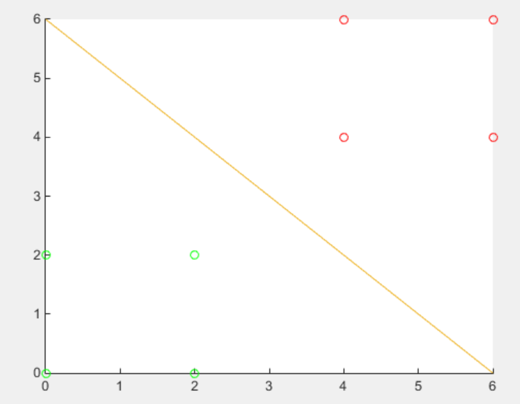

设以下模式类别具有正态概率密度函数：
$$
\begin{align}
&\omega_1:{(0\quad0)^T,(2\quad0)^T,(2\quad2)^T,(0\quad2)^T}\\
&\omega_2:{(4\quad4)^T,(6\quad4)^T,(6\quad6)^T,(4\quad6)^T}
\end{align}
$$
(1) 设$P(\omega_1)=P(\omega_2)=1/2$，求这两类模式之间的贝叶斯判别界面的方程。

均值：

$m_1=\frac{1}{4}\sum_{i=1}^{4}x_i=(1\quad1)^T$

$m_2=\frac{1}{4}\sum_{i=1}^4x_i=(5\quad 5)^T$

协方差：

$C_1=\frac{1}{4}\sum_{i=1}^4(x_i-m_i)(x_i-m_i)^T=\begin{pmatrix}4\quad0\\0\quad 4\end{pmatrix}$

$C_2=\frac{1}{4}\sum_{i=1}^4(x_i-m_i)(x_i-m_i)^T=\begin{pmatrix}4\quad0\\0\quad 4\end{pmatrix}$

判别界面方程为：
$$
\begin{align}
d_1(x)-d_2(x)&=(m_1-m_2)^TC^{-1}x-\frac{1
}{2}m_1^TC^{-1}m_1+\frac{1}{2}m_2^TC^{-1}m_2\\
&=-x_1-x_2+6=0
\end{align}
$$
(2)绘出判别界面



(3)编程进行判别

```matlab
clear all;
% 初始两类的概率
p=[1/2 1/2];
% 初始两类的坐标
x1=[0 2 2 0;
    0 0 2 2];
x2=[4 6 6 4;
    4 4 6 6];
% 计算判别平面
% 1.求均值
min_x1=sum(x1,2)/size(x1,2);
min_x2=sum(x2,2)/size(x2,2);
% 2.求协方差
sum1=zeros(2,2);
for i=1:size(x1,2)
   sum1=sum1+(x1(:,i)-min_x1)*(x1(:,i)-min_x1)'; 
end
sum1=sum1/size(x1,2);
sum2=zeros(2,2);
for i=1:size(x2,2)
   sum2=sum2+(x2(:,i)-min_x2)*(x2(:,i)-min_x2)'; 
end
sum2=sum2/size(x2,2);
% 3. 求判别界面
x=0:0.1:6;
y=6-x;

% 画图
hold;
scatter(x1(1,:),x1(2,:),'g');
scatter(x2(1,:),x2(2,:),'r');
plot(x,y);
% 判别
data=[3;4]
out=data(1,1)+data(2,1)-6;
scatter(data(1,1),data(2,1),'b');

```

