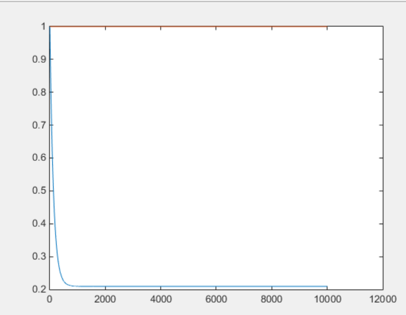
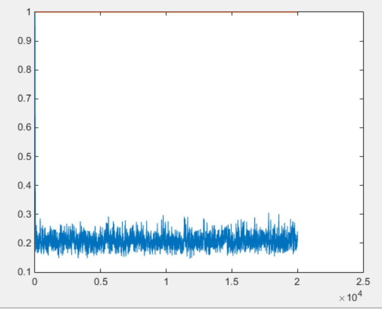

### 一. BGD

```matlab
clear all;
w=[1;1];
%X=[1 2 5 4;
%   2 5 1 2];
%Y=[19 26 19 20];

X = textread('d:/ml/q2x.dat')';
X = [X;zeros(1,size(X,2))];
Y = textread('d:/ml/q2y.dat')';
a=0.000001;
W=[1;1];
for i =1:10000
    total=[0;0];
    for j=1:1:size(X,2)
        x_=X(:,j);
        total=total + (w'* x_-Y(1,j))*x_;
    end
    w=w-2*a*total;
    W=[W w];
end
plot(1:1:size(W,2),W(1,:));
hold
plot(1:1:size(W,2),W(2,:));
%scatter(X(1,:),Y(1,:));

```




### 二. SGD

```matlab
clear all;
w=[1;1];
%X=[1 2 5 4;
%   2 5 1 2];
%Y=[19 26 19 20];


X = textread('d:/ml/q2x.dat')';
X = [X;zeros(1,size(X,2))];
Y = textread('d:/ml/q2y.dat')';
a=0.001;
W=[1;1];
for i =1:20000
    j=randperm(size(X,2),1);
    x_=X(:,j);
    total=(w'* x_-Y(1,j))*x_;
    w=w-2*a*total;
    W=[W w];
end
plot(1:1:size(W,2),W(1,:));
hold
plot(1:1:size(W,2),W(2,:));

```

