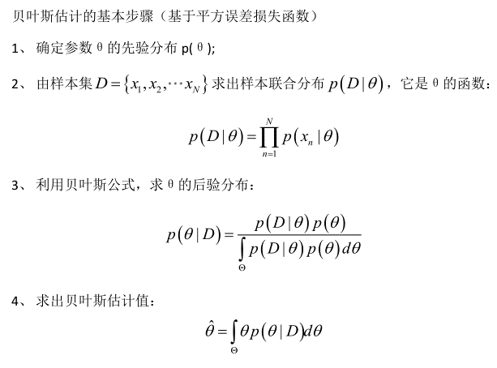
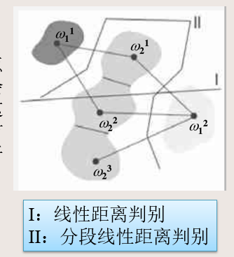

## 第二章 统计判别

### 2.1 作为统计判别问题的模式分类

+ 模式识别的目的就是要确定某一个给定的模式样本属于哪一类

#### 2.1.1贝叶斯判别原则

 根据贝叶斯判别规则，有：

+ 若$P(\omega_1|x)>P(\omega_2|x),则x\in \omega_1$
+ 若$P(\omega_2|x)>P(\omega_1|x),则x\in \omega_2$

由贝叶斯定理，后验概率$P(\omega_i|x)$可由类别$\omega_i$的先验概率$P(\omega_i)$和$x$的条件概率密度$p(x|\omega_i)$来计算，即：
$$
p(\omega_i|x)=\frac{p(x|\omega_i)p(\omega_i)}{\sum_{i=1}^{2}p(x|\omega_i)p(\omega_i)}
$$
这里$p(x|\omega_i)$也叫似然函数。

将该式带入上述判别式，有：

+ 若$p(x|\omega1)p(\omega_1)>p(x|\omega_2)p(\omega_2),则x\in \omega_1$
+ 若$p(x|\omega2)p(\omega_2)>p(x|\omega_1)p(\omega_1),则x\in \omega_2$

或

+ $若l_{12}(x)=\frac{p(x|\omega_1)}{p(x|\omega_2)}>\frac{p(\omega_2)}{p(\omega_1)},则x\in \omega_1$
+ $若l_{12}(x)=\frac{p(x|\omega_1)}{p(x|\omega_2)}<\frac{p(\omega_2)}{p(\omega_1)},则x\in \omega_2$

其中，$l_{12}$称为似然比，$\frac{P(\omega_2)}{P(\omega_1)}=\theta_{21}$称为似然比的判决阈值。

#### 2.1.2 贝叶斯判别的推广

+ 允许使用多于一个特征：标量、向量、多种特征向量
+ 允许多于两种类别状态的情形
+ 允许有其他行为而不是仅仅是判定类别：如后验概率接近的情况下，拒绝做判决。
+ 通过引入一个更一般的损失函数来代替`误差概率`:损失函数精确阐述了每种行为所付出的代价的大小，分类错误 代价相等是最简单的情况。

#### 2.1.3 贝叶斯最小风险判别（条件平均风险）

​	M类分类问题的条件平均风险$r_j(x)$

+ 对M类问题，如果观察样本被判定属于$\omega_j$类，则条件平均风险为：$r_{ij}(x)=\sum_{i=1}^{M}L_{ij}P(\omega_i|x)$
+ $L_{ij}$称为将本应属于$\omega_i$类的模式判别成属于$\omega_j$类的是非代价

   最小平均条件风险分类器

+ 分类器对每一个模式x有M中可能的类别可供选择
+ 若对每一个x计算出全部类别的平均风险值$r_1(x),r_2(x),...,r_M(x)$,并且将x指定为具有最小风险值的那一类，则这种分类器称为最小平均条件风险分类器。

> 按贝叶斯公式，最小平均条件风险可写成：
>
> $r_j(x)=\frac{1}{p(x)}\sum_{i=1}^ML_{ij}p(x|\omega_i)p(\omega_i)$
>
> 因为1/p(x)是公共项，可舍去，因此可简化为：
>
> $r_j(x)=\sum_{i=1}^ML_{ij}p(x|\omega_i)p(\omega_i)$
>
> 这就是贝叶斯分类器，只是它的判别方法不是按错误概率最小作为标准，而是按平均条件风险作为标准。

> 两类(M=2)情况的贝叶斯最小风险判别：
>
> 当分类器将x判别为$w_1$时：$r_1(x)=L_{11}p(x|\omega_1)p(\omega_1)+L_{21}p(x|\omega_2)p(\omega_2)$
>
> 当分类器将x判别为$\omega_2$时：$r_2(x)=L_{12}p(x|\omega_1)p(\omega_1)+L_{22}p(x|\omega_2)p(\omega_2)$
>
> 若$r_1(x)<r_2(x)$,则x被判定为属于$\omega_1$，此时：
>
> $L_{11}p(x|\omega_1)p(\omega_1)+L_{21}p(x|\omega_2)p(\omega_2)<L_{12}p(x|\omega_1)p(\omega_1)+L_{22}p(x|\omega_2)p(\omega_2)$
>
> 即$(L_{21}-L_{22})p(x|\omega_2)p(\omega_2)<(L_{12}-L_{11})p(x|\omega_1)p(\omega_1)$
>
> 通常取$L_{ij}>L_{ii}$,有：
>
> ​	当$\frac{p(x|\omega_1)}{p(x|\omega_2)}>\frac{p(\omega_2)}{p(\omega_1)}\frac{L_{21}-L_{22}}{L_{12}-L_{11}}$时，$x\in \omega_1$
>
> 该式左边为似然比，右边为阈值。
>
> 故得两类模式得贝叶斯判别条件为：
>
> 1. $若l_{12}(x)>\theta_{21},则x\in \omega_1$
> 2. $若l_{12}(x)<\theta_{21},则x\in \omega_2$
> 3. $若l_{12}(x)=\theta_{21},则可做任意判别$
>
> 通常，当判别正确时，不失分；判别错误时，失分为1.

> 多类（M类）情况的贝叶斯最小风险判别：
>
> 对于M类的情况，若$r_i(x)<r_j(x),j=1,2,...,M,j\neq i,则x\in \omega_i$
>
> L可如下取值(仍按判对失分为0，判错失分为1记)：$L_{ij}=\begin{cases}0\quad when\,i=j\\1\quad when \, i\neq j \end{cases}$
>
> 则条件平均风险可写成：
> $$
> \begin{align}
> r_j(x)=&\sum_{i=1}^ML_{ij}p(x|\omega_i)p(\omega_i)\\
> =&L_{1j}p(x|\omega_1)p(\omega_1)+...+L_{jj}p(x|\omega_j)p(\omega_j)+...+L_{Mj}p(x|\omega_M)p(\omega_M)\\
> =&\sum_{i=1}^Mp(x|\omega_i)p(\omega_i)-p(x|\omega_j)p(\omega_j)\\
> =&p(x)-p(x|\omega_j)p(\omega_j)
> \end{align}
> $$
> ​	由$r_i(x)<r_j(x)$，有当$p(x|\omega_i)p(\omega_i)>p(x|\omega_j)p(\omega_j)$时，$x\in \omega_i$

### 2.2 正态分布模式的贝叶斯分类器

​	M种模式类别的多变量正态类密度函数

+ 判别函数是一个超二次曲面
+ 对于正态分布模式的贝叶斯分类器，两个模式类别之间用一个二次判别界面分开，就可以求得最优得分类效果。

​	两类问题且其类模式都是正态分布得特殊情况

+ 当$C_1\neq C_2$时得情况
  + 显然，判别界面$d_1(x)-d_2(x)=0$是x的二次型方程，即$\omega_1和\omega_2$两类模式可用二次判别界面分开
  + 当x是二维模式时，判别界面为二次曲线，如椭圆、圆、抛物线或双曲线等。
+ 当$C_1=C_2=C时的情况$
  + 判别界面为x的线性函数，为一超平面
  + 当x是二维时，判别界面为一直线

$$
\begin{align}
&多变量正态类密度函数：\\
&p(x|\omega_i)=\frac{1}{(2\pi)^{n/2}|C_i|^{1/2}}exp\{-\frac{1}{2}(x-m_i)^TC_i^{-1}(x-m_i)\},i=1,2,...,M\\
&已知类别\omega_i的判别函数可写成如下形式：\\
&d_i(x)=p(x|\omega_i)p(\omega_i),i=1,2,...,M\\
&d_i(x)=lnp(x|\omega_i)+lnP(\omega_i),i=1,2,...,M\\
&d_i(x)=lnP(\omega_i)-\frac{n}{2}ln(2\pi)-\frac{1}{2}ln|C_i|-\frac{1}{2}(x-m_i)C_i^{-1}(x-m_i),i=1,2,...,M
\end{align}
$$

### 2.3 均值向量和协方差矩阵的参数估计

#### 2.3.1参数估计两种方式

+ 一种是将参数作为非随机变量来处理，例如矩估计

+ 另一种是随机参数的估计，即把这些参数看成是随机变量，例如贝叶斯参数估计。

#### 2.3.2 均值向量和协方差矩阵的非随机参数的估计

1. 估计量定义

   均值向量：$m=E(x)=\int_x xp(x)dx$

   均值估计量：$\hat m=\frac{1}{N}\sum_{j=1}^Nx_j$

   协方差矩阵向量形式：$C=E\{(x-m)(x-m)^T\}=E\{xx^T\}-mm^T$

   协方差矩阵的估计量：$\hat C\approx \frac{1}{N}\sum_{k=1}^N(x_k-\hat m)(x_k-\hat m)^T$

2. 均值和协方差估计量的迭代运算
   $$
   \begin{align}
   & 均值：\\
   & \hat m(N+1)=\frac{1}{N+1}\sum_{j=1}^{N+1}x_j=\frac{1}{N+1}[\sum_{j=1}^{N}x_j+x_{N+1}]=\frac{1}{N+1}[N\hat m(N)+x_{N+1}]\\
   & 协方差:\\
   &\hat C(N+1)=\frac{1}{N+1}\sum_{j=1}^{N+1}x_jx_j^T-\hat m(N+1)\hat m^T(N+1)\\
   &=\frac{1}{N+1}[\sum_{j=1}^Nx_jx_j^T+x_{N+1}x_{N+1}^T]-\hat m(N+1)\hat m^T(N+1)\\
   &=\frac{1}{N+1}[N\hat C(N)+N\hat m(N)\hat m^T(N)+x_{N+1}x_{N+1}^T]-\frac{1}{(N+1)^2}[N\hat m(N)+x_{N+1}][N\hat m(N)+x_{N+1}]^T
   
   
   
   \end{align}
   $$

3. 贝叶斯参数估计

   

4. 

## 第三章 判别函数

### 3.1 线性判别函数

#### 3.1.1 用判别函数分类的概念

1. 两类问题的判别函数

> 若x是二维模式样本$x=(x_1,x_2)^T$，用$x_1和x_2$作为坐标分量，得到模式的平面图：这时，若这些分属于$\omega_1和\omega_2$两类的模式可用一个直线方程d(x)=0来划分$d(x)=w_1x_1+w_2x_2+w_3=0$,其中$x_1、x_2为坐标变量，w_1、w_2、w_3$为参数方程，则将一个不知类别的模式代入d(x),有
>
> + 若d(x)>0,则$x\in \omega_1$
> + 若d(x)<0,则$x\in \omega_2$
>
> 此时，d(x)=0称为决策面方程。

2. 用判别函数进行模式分类依赖的两个因素

   1). 判别函数的几何性质：线性和非线性的函数

   + 线性的是一条直线
   + 非线性的可以是曲线、折线等
   + 线性判别函数建立起来比较简单（实际应用较多）
   + 非线性判别函数建立起来比较复杂

   2). 判别函数的系数：判别函数的形式确定后，主要就是确定判别函数的系数问题

   + 只要被研究的模式是可分的，就能用给定的模式样本集来确定判别函数的系数

#### 3.1.2 线性判别函数

1. n维线性判别函数的一般形式
   + 权向量
   + 增广模式向量
   + 增广权向量

>   n维线性判别函数的一般形式：
>
> $d(x)=w_1x_1+w_2x_2+...+w_nx_n+w_{n+1}=w_0^Tx+w_{n+1}$
>
> 其中$w_0=(w_1,w_2,...,w_n)^T$称为权向量(或参数向量),$x=(x_1,x_2,...,x_n)^T$
>
> d(x)也可以表示为：$d(x)=w^Tx$
>
> 其中，$x=(x_1,x_2,...,x_n,1)^T$称为增广模式向量，$w=(w_1,w_2,...,w_{n+1})$称为增广权向量。

2. 分类问题

   + 两类情况：判别函数

   + 多类情况：设模式可分成$\omega_1、\omega_2,...,\omega_M$共M类，则有三种划分方法

     1. 多类情况1($\omega_i/\overline \omega_i$两分法)

     > 用线性判别函数将属于$\omega_i$类的模式与不属于$\omega_i$类的模式分开，其判别函数为：
     >
     > $d_i(x)=w^Tx=\begin{cases}>0\quad if\, x\in \omega_i\\\leq 0\quad if \,x\not \in \omega_i\end{cases},i=1,2,...,M$
     >
     > 把M类多类问题分成M个两类问题，因此共有M个判别函数。
     >
     > `不确定区域：`若对某一模式区域，$d_i(x)>0$的条件超过一个，或者全部$d_i(x)<0$，则分类失败，这种区域称为不确定区域(IR)

     1. 多类情况2($\omega_i/\omega_j$两分法)

     > 采用每对划分，即$\omega_i/\omega_j$两分类法，此时一个判别界面只能分开两种类别，但不能把它与其余所有的界面分开。
     >
     > 要分开M类模式，共需M(M-1)/2个判别函数。
     >
     > `不确定区域：`若所有d(x)，找不到d(x)>0的情况。

     1. 多类情况3(没有不确定区域的$\omega_i/\omega_j$两分法)

     > 假若多类情况2中的$d_{ij}$可分解成：$d_{ij}(x)=d_i(x)-d_j(x)=(w_i-w_j)^Tx$,则$d_{ij}(x)>0相当于d_i(x)>d_j(x)$,这时不存在不确定区域。
     >
     > 此时，对M类情况应有M个判别函数：
     >
     > 若$d_i(x)=max\{d_k(x),k=1,2,...,M\},则x\in \omega_i$
     >
     > 

3. 小结：线性可分

   + 模式分类若可用任一个线性函数来划分，则这些模式就称为线性可分的，否则就是非线性可分的。
   + 一旦线性函数的系数$w_k$被确定，这些函数就可用作模式分类的基础

   

### 3.2 广义线性判别函数

1. 出发点

   + 线性判别函数简单，容易实现
   + 非线性判别函数复杂，不容易实现
   + 若能将非线性判别函数转换为线性判别函数，则有利于模式分类的实现

2. 基本思想

   设有一个训练用的模式集{x},在模式空间x钟线性不可分，但在模式空间$x^*$中线性可分，其中$x^*$的各个分量是x的单值实函数，$x^*的维数高于x的维数n,即若取$$x^*=(f_1(x),f_2(x),...,f_k(x)),k>n$

   则分类界面在$x^*$中是线性的，在x中是非线性的，此时只要将模式x进行非线性变换，使之变换后得到维数更高的模式$x^*$，就可以用线性判别函数来进行分类。

3. 广义线性判别函数的意义

   + 线性判别函数

   + $f_i(x)$使用二次多项式函数

     1. x是二维的情况

        $d(x)=w_{11}x_1^2+w_{12}x_1x_2+w_{22}x_2^2+w_1x_1+w_2x_2+w_3$

        $x^*=(x_1^2,x_1x_2,x_2^2,x_1,x_2,1)^T$

     2. x是n维的情况
        $$
        d(x)=\sum_{j=1}^nw_{jj}x_j^2+\sum_{j=1}^{n-1}\sum_{k=j+1}^nw_{jk}x_jx_k+\sum_{j=1}^nw_jx_j+w_{n+1}
        $$
        

   + $f_i(x)$使用r次多项式函数，x使n维的情况

     1. d(x)的总项数=$C_{n+r}^r$
     2. 说明
        + d(x)的项数随r和n的增加会迅速增大，即使原来模式x的维数不高，若采用次数r较高的多项式来变换，也会使得变换后的模式的维数很高，给分类带来很大困难
        + 实际情况可只取r=2,或只选多项式的一部分，例如r=2时，只取二次项，略去一次项，以减少$x^*$的维数

### 3.3 分段线性判别函数

1. 出发点

   + 线性判别函数在进行分类决策时是最简单有效的，但在实际应用钟，常常会出现不能用线性判别函数直接进行分类的情况。
   + 采用广义线性判别函数的概念，可以通过增加维数来得到线性判别，但维数的大量增加会使在低维空间里在解析和计算上行得通的方法在高维空间遇到困难，增加计算的复杂性
   + 引入分段线性判别函数的判别过程，**它比一般的线性判别函数的错误率小，但又比非线性判别函数简单**

2. 分段线性判别函数的设计

   + 最小距离分类

   > 设$\mu_1和\mu_2$为两个模式类$\omega_1、\omega_2$的聚类中心，定义决策规则：
   >
   > $||x-\mu_1||^2-||x-\mu_2||^2=\begin{cases}<0\quad x\in\omega_1\\>0\quad x\in \omega_2\end{cases}$
   >
   > 这时的决策面是两类期望连线的垂直平分面，这样的分类器称为`最小距离分类器`
   >
   > 这种方法只有在类别密集分布在其均值附近时才有效。

   + 聚类方法

   > 对于各类交错分布的情况，若再用每类一个均值代表点产生最小距离分类器，就会产生很明显的错误率。在这种情况下，可以运用聚类方法将一些类分解成若干个子类，再用最小距离分类。
   >
   > 

   

   + 寻找交遇区——找到互为最小距离的原型对，组成交遇区
   + 用局部训练模式产生分段线性判别函数并迭代优化决策面
   + 撤走已分类正确的样本，从剩下的样本集合中，寻找交遇区，产生分段线性判别函数

### 3.4 模式空间和权空间

1. 模式空间

+ 对一个线性方程$w_1x_1+w_2x_2+w_3x_3=0$,它在三维空间$(x_1，x_2,x_3)$中是一个平面方程式，$w=(w_1,w_2,w_3)^T$是方程的系数。

+ 把w向量作为该平面的法线向量，则该线性方程决定的平面通过原点且与w垂直。

+ 若x是二维的增广向量，此时$x_3=1$,则在非增广的模式空间中即为$\{x_1,x_2\}$二维坐标，判别函数是下列联立方程的解:

  $\begin{cases}w_1x_1+w_2x_2+w_3=0\\x_3=1\end{cases}$

  即为这两个平面相交的直线AB。

  此时，$w=(w_1,w_2)^T$为非增广的权向量，它与直线AB垂直；AB将平面分为正、负两侧，w离开直线的一侧为正，w射向直线的一侧为负。

+ 增广向量决定平面，非增广向量决定直线

1. 权空间

+ 若将方程$x_1w_1+x_2w_2+w_3=0$绘在权向量$w=(w_1,w_2,w_3)^T$的三维空间中，则$x=(x_1,x_2,1)^T$为方程的系数。
+ 若以x向量作为法线向量，则该线性方程所决定的平面为通过原点且与法线向量垂直的平面，它同样将权空间划分为正、负两边。

### 3.5 Fisher线性判别

1. 出发点

   应用统计方法解决模式识别问题时，一再碰到的问题之一就是维数问题。

   在低维空间里解析上或计算上行得通的方法，在高维空间里往往行不通。

   因此，降低维数有时就会成为处理实际问题的关键。

2. 问题描述

   考虑将d维空间的样本投影到一条直线上，形成一维空间，即把维数压缩到一维。

   然而，即使样本在d维空间里形成若干紧凑的互相分得开的集群，当把它们投影到一条直线上时，也可能会是几类样本混在一起而变得无法识别。

   但是，在一般情况下，总可以找到某个方向，使在这个方向的直线上，样本的投影能分得开。

   **如何根据实际情况找到一条最好的、最易于分类的投影线，就是Fisher判别方法所要解决的基本问题**

3. 从d维空间到一维空间的一般数学变换方法

   $y_n=w^Tx_n,n=1,2,...,N$

   实际上，|w|的值是无关紧要的，它仅是y乘上一个比例因子，重要的是选择w的方向。w的方向不同，将使样本投影后的可分离程度不同，从而直接影响分类效果。

4. Fisher准则函数的定义

   4.1 Fisher 准则函数中的基本参量

   + 在d维X空间

     各类样本的均值向量$m_i=\frac{1}{N_i}\sum_{x\in \Gamma_i}x,i=1,2,..$

     样本类内离散度矩阵$S_i=\sum_{x\in \Gamma_i}(x-m_i)(x-m_i)^T,i=1,2,...$

     总样本类内离散度矩阵$S_w=S_1+S_2$

     样本类间离散度矩阵$S_b=(m_1-m_2)(m_1-m_2)^T$

   4.2 Fisher准则函数定义
   $$
   J_F(w)=\frac{(\tilde m_1-\tilde m_2)^2}{\tilde S_1^2+\tilde S_2^2}=\frac{w^TS_bw}{w^TS_ww}
   $$
   由各类样本的均值可推出：$\tilde m_i=\frac{1}{N_i}\sum_{x\in \Gamma_i}w^Tx=w^Tm_i$
   $$
   \begin{align}
   (\tilde m_1-\tilde m_2)^2&=(w^Tm_1-w^Tm_2)^2\\
   &=w^T(m_1-m_2)(m_1-m_2)^Tw\\
   &=w^TS_bw\\\\
   \tilde S_i^2&=\sum_{y\in \Gamma_i}(y-\tilde m_i)^2\\
   &=\sum_{x\in \Gamma_i}(w^Tx-w^tm_i)^2\\
   &=w^TS_iw
   \end{align}
   $$
   

5. 最佳变换向量$w^*$的求取(拉格朗日乘子法)

   $w^*=S_w^{-1}(m_1-m_2)$

6. 多类情形

   + K个投影向量$w=[w_1,w_2,...,w_K]$,样本点投影后结果为$y=[y_1,y_2,...,y_k]^T$

     $y=W^Tx$

   + 类内离散度矩阵：现在度量的是每类均值点相对于样本中心的散列情况

     $S_b=\sum_{j=1}^cN_j(m_j-m)(m_j-m)^T$

   + 与两类情形一样推导

     $S_w^{-1}S_bW^*=\lambda W^*$

### 3.6 感知器算法

1. 出发点
   + 在模式识别中，系数确定的一个主要方法，就是通过对已知样本的训练和学习来得到。
   + 感知器算法就是通过训练样本模式的迭代和学习，产生线性可分的模式判别函数。
2. 基本思想
   + 采用感知器算法能通过对训练模式样本集的学习得到判别函数的系数
3. 感知器训练算法

> 已知两个训练模式集分别属于$\omega_1和\omega_2$类，权向量的初始值为w(1),可任意取值。
>
> 若$x_k\in \omega_1,w^T(k)x_k>0$，若$x_k\in \omega_2,w^T(k)x_k\leq 0$,则在用全部训练模式集进行迭代训练时，第k次的训练步骤为：
>
> + 若$x_k\in \omega_1且w^T(k)x_k\leq 0$，则分类器对第k个模式$x_k$做了错误分类，此时应校正权向量，使得w(k+1)=w(k)+C($x_k$),其中C为一校正增量
> + 若$x_k\in \omega_2且w^T(k)x_k>0$,同样分类器分类错误，则权向量应校正如下：$w(k+1)=w(k)-C$$x_k$
> + 若以上情况不符合，则表明该模式样本在第k次中分类正确，因此权向量不变，即：w(k+1)=w(k)
>
> 若对$x_k\in \omega_2$的模式样本乘以(-1),则有：
>
> $w(k+1)=\begin{cases}w(k),if\,w^t(k)x_k>0\\w(k)+Cx_k,if\,w^T(k)x_k\leq 0\end{cases}$

4. 感知器算法的收敛性

### 3.7 采用感知器算法的多模式的分类

> 多类情况3：
>
> 设有M中模式类别$\omega_1,\omega_2,...,\omega_M$,若在训练过程的第k次迭代时，一个属于$\omega_i$类的模式样本x送入分类器，则应先计算出M个判别函数：
>
> $d_j(k)=w_j(k)x,j=1,2,...,M$
>
> 若$d_i(k)>d_j(k),j=1,2,...,M,\forall j\neq i$的条件成立，则权向量不变。
>
> 否则，更新权向量
>
> 

### 3.8 可训练的确定性多分类器的迭代算法

1. 梯度法
2. 固定增量的逐次调整算法
3. 最小平方误差(LMSE)算法

### 3.9 势函数法-一种确定性的非线性分类算法

1. 目的

   用势函数概念来确定判别函数和划分类别界面

2. 基本思想

   

3. 判别函数的产生

4. 势函数的选择

### 3.10 决策树简介

+ 决策树，或称多级分类器，是模式识别中进行分类的一种有效方法，对于多类或多峰分布问题，这种方法尤为方便。
+ 利用树分类器可以把一个复杂的多类别分类问题，转化为若干个简单的分类问题来解决。

## 第四章 特征选择和提取

1. 特征选择和提取是模式识别中的一个关键问题

2. 为了设计出效果好的分类器，通常需要对原始的测量值集合进行分析，经过选择或变换处理，组成有效的识别特征；

3. 在保证一定分类精度的前提下，减少特征维数，即进行降维处理，是分类器实现快速、准确和高效的分类

4. **特征选择**就是从n个度量值集合$\{x_1,x_2,...,x_n\}$中，按某一准则选取出供分类用的子集，作为降维的分类特征；

5. **特征提取**就是使$(x_1,x_2,...,x_n)$通过某种变换，产生m个特征$(y_1,y_2,...,y_m)$,作为新的分类特征

6. 距离与散布矩阵

   1. 点到点之间的距离

      在n维空间中，a与b两点之间的欧氏距离为：$D(a,b)=||a-b||$

      写成距离平方为：$D^2(a,b)=(a-b)^T(a-b)=\sum_{k=1}^n(a_k-b_k)^2$

   2. 点到点集之间的距离
      $$
      \overline {D^2(x,a^{(i)})}=\frac{1}{K}\sum_{i=1}^KD^2(x,a^{(i)})
      $$
      

   3. 类内距离
      $$
      \overline{D^2(\{a^{(j)}\},\{a^{(i)}\})}=\frac{1}{K}\sum_{j=1}^K[\frac{1}{K-1}\sum_{i=1,i\neq j}^{K}\sum_{k=1}^n(a_k^{(j)}-a_k^{(i)})^2]\\
      可证明：\overline {D^2}=2\sum_{k=1}^n\sigma_k^2,\sigma_k^2为\{a^{(i)}\}在第k个分量上的无偏方差。
      $$
      

   4. 类内散布矩阵
      $$
      S=\sum_{i=1}^K\{(a^{(i)}-m)(a^{(i)}-m)^T\}\\
      m=\frac{1}{K}\sum_{i=1}^Ka^{(i)}
      $$
      

   5. 类间距离、类间散布矩阵

      $\overline{D^2(\{a^{(i)}\},\{b^{(j)}\})},i=1,2,...,K_a,j=1,2,...,K_b$

      为简化起见，常用两类样本各自质心间的距离作为类间距离，并假设两类样本出现的概率相等，则：$D^2=\sum_{k=1}^n(m_{1k}-m_{2k})^2$

      两类模式的类间散布矩阵：

      ​			$S_b=(m_1-m_2)(m_1-m_2)^T$

      对三个以上的类别，散布矩阵常写为：

      ​		   $S_b=\sum_{i=1}^cP(\omega_i)(m_i-m_0)(m_i-m_0)^T$,$m_0$为多类模式分布的总体均值向量

   6. 多类模式集散布矩阵

      多类模式类内散布矩阵：

      ​	$S_w=\sum_{i=1}^cP(\omega_i)E\{(x-m_i)(x-m_i)^T |\omega_i\}$

      ​	各类的类内散布矩阵的先验概率加权和

      多类模式总体散布矩阵：

      ​	$S_t=E\{(x-m_0)(x-m_0)^T\}$

      

      可以证明：$S_t=S_w+S_b$

      ​	

7. 对于独立特征的选择准则

   + 不同类别模式特征的均值向量之间的距离应最大，而属于同一类的模式特征，其方差之和应最小
   + 假设各原始特征测量值是统计独立的，此时，只需对训练样本的n个测量值独立地进行分析，从中选出m个最好的作为分类特征即可。

   > 对于$\omega_i和\omega_j$两类训练样本，假设其均值向量为$m_i和m_j$,其k维方向的分量为$m_{ik}和m_{jk}$,方差为$\sigma_{ik}^2和\sigma_{jk}^2$，定义可分性准则函数：
   > $$
   > G_k=\frac{(m_{ik}-m_{jk})^2}{\sigma_{ik}^2+\sigma_{jk}^2},k=1,2,...,n
   > $$
   > $G_k$值越大，表示测度值的第k个分量对分离$\omega_i和\omega_j$两类越有效。

8. 一般特征的散布矩阵准则

   > 类内：$S_w=\sum_{i=1}^cP(\omega_i)E\{(x-m_i)(x-m_i)^T|\omega_i \}$
   >
   > 类间：$S_b=\sum_{i=1}^cP(\omega_i)(m_i-m_0)(m_i-m_0)^T$
   >
   > 直观上，类间离散度越大且类内离散度越小，则可分性越好。
   >
   > 由此，可推导出散布矩阵准则采用如下形式:
   >
   > 行列式形式：$J_1=det(S_w^{-1}S_b)=\prod_i\lambda_i$
   >
   > 迹形式：$J_2=tr(S_w^{-1}S_b)=\sum_i\lambda_i$
   >
   > 使$J_1或J_2$最大的子集可作为选择的分类特征。

9. 离散K-L变换（卡洛南-洛伊变换）

   + 如果将原来的特征做正交变换，获得的每个数据都是原来n个数据的线性组合，然后从新的数据中选出少数几个，使其尽可能多地反映各类模式之间的差异，而这些特征间又尽可能相互独立，则比单纯的选择方法更灵活、更有效
   + K-L变换就是一种适用于任意概率密度函数的正交变换

   9.1  展开式的形式

   > 设一连续的随机实函数x(t),$T_1\leq t\leq T_2$,则x(t)可用已知的正交函数集$\{\phi_j(t),j=1,2,... \}$  的线性组合来展开，即：
   > $$
   > \begin{align}
   > x(t)&=a_1\phi_1(t)+a_2\phi_1(2)+...+a_j\phi_j(t)\\
   >     &=\sum_{j=1}^{\infin}a_j\phi_j(t)
   > \end{align}
   > $$
   > 式中,$a_j$为展开式的随机系数,$\phi_j(t)$为一连续的正交函数,它应满足：
   > $$
   > \int_{T_1}^{T_2}\phi_n^{(t)}\widetilde{\phi_m}(t)dt=
   > \begin{cases}
   > 1,\quad if \,m=n\\
   > 0,\quad if \,m\neq n
   > \end{cases}\\
   > 其中\widetilde{\phi_m}(t)为\phi_m(t)的共轭复数式
   > $$
   > 将上式写成离散的正交函数形式：
   >
   > $x=(x(1),x(2),...,x(n))^T=\sum_{j=1}^{n}a_j\phi_j(t)=\Phi a$
   >
   > $\phi_j=(\phi_j(1),\phi_j(2),...,\phi_j(n))$
   >
   > 其中，a为展开式中随机系数的向量形式，即：$a=(a_1,a_2,...,a_n)^T$
   >
   > $\Phi$为nxn维矩阵，即：
   > $$
   > \Phi=(\phi_1,\phi_2,...,\phi_n)=
   > \begin{bmatrix}
   > \phi_1(1)\quad\phi_2(1)\quad ...\quad \phi_n(1)\\
   > \phi_1(2)\quad\phi_2(2)\quad ...\quad \phi_n(2)\\
   > ...\quad ...\quad ...\quad...\\
   > \phi_1(n)\quad\phi_2(n)\quad ...\quad \phi_n(n)\\
   > \end{bmatrix}
   > $$
   > 

   9.2  K-L展开式的性质

   + K-L展开式的根本性质是将随机向量x展开为另一组正交向量$\varphi_j$的线性和，且其展开式系数$a_j$具有不同的性质。

   9.3 K-L展开式系数的计算 步骤

   1. 求随机向量x的自相关矩阵：$R=E\{xx^T\}$
   2. 求矩阵R的特征值$\lambda_j$和对应的特征向量$\phi_j,j=1,2,...,n$得矩阵：$\Phi=(\phi_1,\phi_2,...,\phi_n)$
   3. 计算展开式系数：$a=\Phi^Tx$

   9.3 按K-L展开式选择特征

   + K-L展开式用于特征选择相当于一种线性变换
   + 若从n个特征向量中取出m个组成变换矩阵$\Phi$,经过$\Phi^Tx$变换，即得到降维为m的新向量
   + 从K-L展开式的性质和按最小均方差的准则来选择特征，应先将其均值作为新坐标轴的原点，采用协方差矩阵C或自相关矩阵R来计算特征值
   + K-L变换是在均方误差最小的意义下获得数据压缩的最佳变换，且不受模式分布的限制。对于一种类别的模式特征提取，它不存在特征分类问题，只是实现用低维的m个特征来表示原来高维的n个特征，使其误差最小，亦即使整个模式分布结构尽可能保持不变

10. 