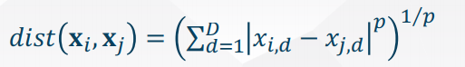
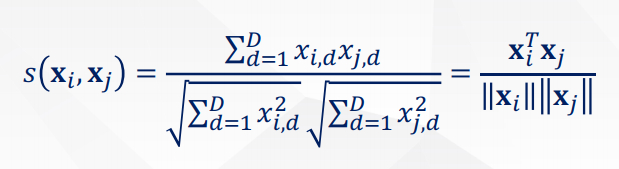
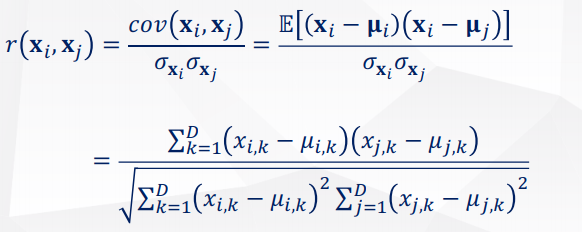
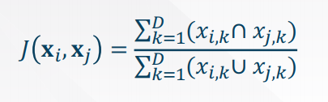
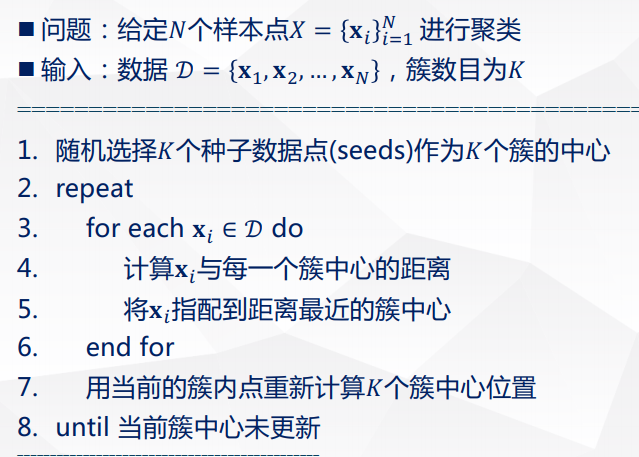
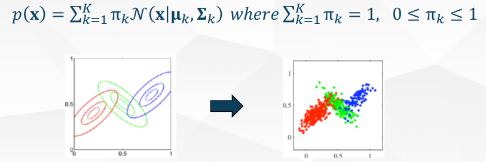
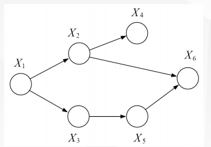
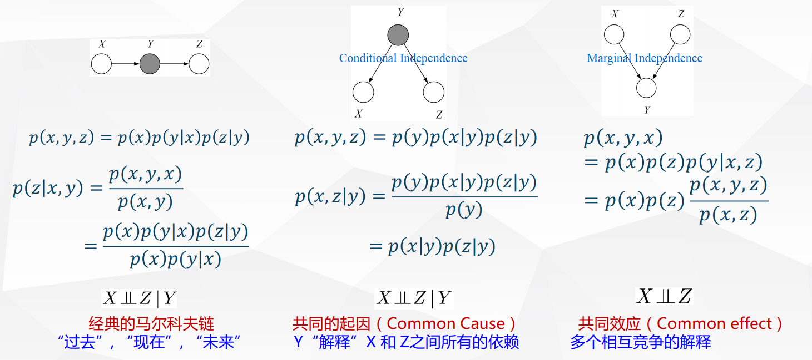
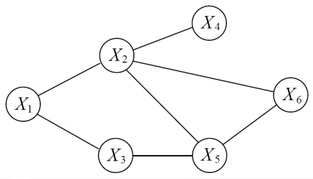

## 第五章 统计机器学习

### 1. 机器学习简介

机器学习更强调面向算法，而统计学更偏重于面向模型。换而言之，机器学习强调算法的结果要好，所以机器学习很关注损失函数。而统计学要先扔出一大堆模型假设，然后站在模型上面通过严格的数学推导给出结果。

机器学习分类：

+ 监督学习
+ 非监督学习
+ 半监督学习
+ 强化学习
+ 迁移学习
+ 多任务学习
+ 主动学习

 ### 2.统计机器学习

统计机器学习：是基于数据构建概率统计模型并运用模型对数据进行预测分析的一门学科。

统计机器学习框架：

1. 输入：n个独立同分布的训练样本(x,y)
2. 目标函数：$f\in F$
3. 损失函数：L(f;x,y)
4. 期望风险：$\int L(f;x,y)dP(x,y)$

回归问题学习框架：

1. 输入：n个独立同分布训练样本(x,y)
2. 目标函数：$f\in F$
3. 损失函数：$L(f;x,y)=(f(x)-y)^2$
4. 期望风险：$\int (f(x)-y)^2dP(x,y)$

分类问题学习框架：

1. 输入：n个独立同分布训练样本(x,y)
2. 目标函数：$f\in F$
3. 损失函数：$L(f;x,y)=I_{\{f(x)\neq y\}}$
4. 期望风险：$\int I_{\{f(x)\neq y\}}dP(x,y)=P{f(x)\neq y}$

多项式曲线拟合

+ 多项式函数
  $$
  f(x;\overrightarrow w)=w_0+w_1x+w_2x^2+...+w_Mx^M=\sum_{i=0}^{M}w_ix^i
  $$

+ 如何选择M

> 令
> $$
> W=\begin{bmatrix}
> w_0\\
> w_1\\
> .\\
> .\\
> .\\
> w_m
> \end{bmatrix}
> ,
> X=\begin{bmatrix}
> 1 & x_1 & x_1^2 &... & x_1^m\\
> 1 & x_2 & x_2^2 &... & x_2^m\\
> .&.&.&.&.\\
> 1 & x_n & x_n^2 &... & x_n^m\\
> \end{bmatrix}\\
> E(W)=\frac{1}{2}\sum_{n=1}^N(f(x_n,W)-y_n)^2=\frac{1}{2}(XW-T)^T(XW-T)\\
> 求导得：\\
> \frac{\partial E(W)}{\partial W}=X^TXW-X^TT\\
> 令导数等于0，得：\\
> W=(X^TX)^{-1}X^TT$$

经验风险最小化和结构风险最小化

+ Empirical Risk Minimization(ERM)
  $$
  R_{emp}=\frac{1}{n}\sum_{i=1}^nL(f;x_i,y_i)
  $$

+ Structual Risk Minimization(SRM)
  $$
  \begin{align}
  R_{srm}&=\frac{1}{n}\sum_{i=1}^nL(f;x_i,y_i)+\lambda J(f)\\
  
  L1&=||\overrightarrow w||^2=\overrightarrow w^T\overrightarrow w\\
  L2&=|\overrightarrow w|_1
  \end{align}
$$

偏差方差分解

> 偏差方差分解是统计学派看待模型复杂度的观点。
>
> 它将一种学习算法的期望误差分解为三个非负项的和：
>
> 1. 噪声：样本真实噪声是任何学习算法在该学习目标上的期望误差下界；（任何方法都克服不了的误差）
>
> 2. 偏差：度量了某种算法的平均估计结果所能逼近学习目标的程度；
>
>    （独立于训练样本的误差，刻画了匹配的准确性和质量；一个高的偏差意味着一个坏的匹配）
>
> 3. 方差：度量了在面对同样规模的不同训练集时，学习算法估计程度发生变动的程度。
>
>    （相关于观测样本的误差，刻画了一个学习算法的精确性和特定性；一个高的方差意味着一个不稳定的匹配）
>
> `偏差`度量了学习算法期望预测与真实结果的偏离程度，即刻画了学习算法本身的**拟合能力**；`方差`度量了同样大小的训练集的变动所导致的学习性能的变化，即刻画了**数据扰动所造成的影响**；`噪声`表达了在当前任务上任何学习算法所能达到的期望泛化误差的下界，即刻画了**学习问题本身的难度**。
>
> 泛化性能是由学习算法的能力、数据的充分性以及学习任务本身的难度所共同决定的。
>
> $expected loss = bias^2+ variance+noise$
>
> $对测试样本x,令y_d为x在数据集中的标记，y为真实标记，f(x;D)为在训练集D上学得模型f在x上得预测输出。$
> $$
> \begin{align}
> E(f;D)&=E_D[{f(x;D)-y_d}^2]\\
> &=E_D[\{f(x;D)-\bar f(x)+\bar f(x)-y_d\}^2]\\
> &=E_D[\{f(x;D)-\bar f(x)\}^2]+E_D[\{\bar f(x)-y_d\}^2]+2E_D[\{(f(x;D)-\bar f(x))*(\bar f(x)-y_d)\}]\\
> &=E_D[\{f(x;D)-\bar f(x)\}^2]+E_D[\{\bar f(x)-y_d\}^2]\\
> &=E_D[\{f(x;D)-\bar f(x)\}^2]+E_D[\{\bar f(x)-y+y-y_d\}^2]\\
> &=E_D[\{f(x;D)-\bar f(x)\}^2]+E_D[\{\bar f(x)-y\}^2]+E_D[\{y-y_d\}^2]+2E_D[\{\bar f(x)-y\}\{y-y_d\}]\\
> &=E_D[\{f(x;D)-\bar f(x)\}^2]+\{\bar f(x)-y\}^2
> +E_D[\{y-y_d\}^2]\\
> &=Variance+Bias+Noise
> 
> \end{align}
> $$
>
> $$
> \begin{align}
> &\quad E_D[\{(f(x;D)-\bar f(x))*(\bar f(x)-y_d)\}]\\
> &=E_D[f(x;D)\bar f(x)-f(x;D)y_d-\bar f(x)\bar f(x)+\bar f(x)y_d]\\
> &=E_D[\bar f(x)\{f(x;D)-\bar f(x)\}]-E_D[y_d\{f(x;D)-\bar f(x)\}]\\
> &=E_D[\bar f(x)\{f(x;D)-\bar f(x)\}]-\iint y_d\{f(x;D)-\bar f(x)\}p(x,y_d)dxdy\\
> &=E_D[\bar f(x)\{f(x;D)-\bar f(x)\}]-\iint \{f(x;D)-\bar f(x)\}*y_d*p(x,y_d)dxdy\\
> &=E_D[\bar f(x)\{f(x;D)-\bar f(x)\}]-\int \{f(x;D)-\bar f(x)\}E_D[y_d|x;D]p(x)dx\\
> &=E_D[\bar f(x)\{f(x;D)-\bar f(x)\}]-E_D[E_D[y_d|x;D]\{f(x;D)-\bar f(x)\}]\\
> &=0\\
> &\bar f(x)=E_D[y_d|x;D]
> \end{align}
> $$
>
> 
>
> 

## 第六章 有监督学习方法

### 6.1 线性回归

+ Linear Function

  $f(x)=w_0+w_1x_1+w_2x_2+...+w_nx_n=\overrightarrow W^{T}x$

+ loss function
  $$
  min_{\overrightarrow w}J(\overrightarrow w)=\sum_{i=1}^n(\overrightarrow w^Tx^{(i)}-y^{(i)})^2
  $$

+ gradient
  $$
  \frac{\partial J(\overrightarrow w)}{\partial w}=\sum_{i=1}^n2(\overrightarrow w^Tx^{(i)}-y^{(i)})x^{(j)}=0
  $$

+ 解
  $$
  \overrightarrow w^*=(X^TX)^{-1}X^Ty
  $$

+ 更新规则（梯度下降法）

  1. BGD (Batch Gradient Descent)

     $w_j:=w_j-2\alpha\sum_{i=1}^n(w^Tx^{(i)}-y^{(i)})x_j^{(i)}$

  2. SGD (Stochastic Gradient Descent)

     $w_j:=w_j-2\alpha(w^Tx^{(i)}-y^{(i)})x_j^{(i)}$

+ 线性回归与非线性基函数

  $f(w,x)=w_0+\sum_{j=1}^Mw_j\phi_j(x)=w^T\phi(x),\phi=(1,\phi_1,...,\phi_M)$

  常见基函数：

  1. $\phi(x)=(1,x,x^2,...,x^M)$,多项式基函数
  2. $\phi_j(x)=exp(-\frac{(x-\mu_j)^2}{2s^2})$,高斯基函数
  3. $\phi_j(x)=\sigma(\frac{x-\mu_j}{s}),\sigma(a)=\frac{1}{1+exp(-a)}$,sigmoid基函数

+ 极大似然估计MLE

  似然函数：$\prod_{i=1}^n N(y^{(i)}|w^Tx^{(i)},\beta^{-1})$

  对数似然函数：$\sum_{i=1}^n lnN(y^{(i)}|w^Tx^{(i)},\beta^{-1})=\frac{N}{2}ln\beta-\frac{N}{2}ln{2\pi}-2\beta J(\overrightarrow w),J(\overrightarrow w)=\sum_{i=1}^n( \overrightarrow wx^{(i)}-y^{(i)})^2$

+ 

### 6.2 分类方法

1. 感知器算法

2. 逻辑回归

   $p(y=1|x)=f(x,\overrightarrow w)=g(\overrightarrow w^T x)=\frac{1}{1+exp(-\overrightarrow w^Tx)}$

##  第七章 支持向量机

## 第八章 非监督学习

降维：降维和嵌入是指将原始的高维数据映射到低维空间。

实质想法：高度冗余的数据通常是可以被压缩的，即高维复杂的数据其内在的维度可能比较小，或者和任务相关的维度较小。

降维方法：

1. 维度选择：选择已有维度的一个子集
2. 维度抽取：通过组合已有的维度构建新的维度

### 8.1 维度选择

1. 采样：从D维中随机选择D‘维

   简单、流行、具有较好的泛化性能

   没有精度保证。

2. 手工：手工移除特征

   冗余的、不相关、质量差的特征（特征缺失比例超过50%）、方差过小的特征

3. 监督方法

   + 过滤式选择：通过设计一个相关统计量来度量特征的重要性

     统计量：

     1. 相关系数：单个特征与标签y之间的相关系数（回归问题）
     2. 互信息：单个特征和分类标签y的互信息（y为离散值）
     3. $\mathcal{X^2}$统计量：单个特征和分类标签y之间的相关性

     过滤式维度选择根据单个特征与目标之间统计分数选择特征，速度块，但缺点是没有考虑到特征之间的关联作用。

   + 包裹式选择

     用最终要用的学习器的性能评价特征的重要性。

     搜索有用的特征子集：

     + 前向
       + 从零个开始
       + 一遍式或迭代式地选择
     + 后向（更常用，递归特征删除）
       + 用所有特征训练一个模型，得到特征重要性
       + 根据特征重要性，每次删除最不重要的一些特征

     是否删除/增加特征，需要进行模型性能监控（如校验集上的性能）

   + 嵌入式选择

     嵌入式维度选择与模型训练一起完成

     基于L1正则的特征选择

     + L1正则得到的系数可能是稀疏的，选择非0系数即可实现特征选择

       Lasso,Logistic回归（L1），SVM（L1正则）

     基于树模型的特征选择

     + 在基于树的模型（CART、随机森林、GBDT等）中，树中从根节点到叶子节点的路径上的特征，为模型选择的特征，不在树中出现的特征没有被模型选中。

### 8.2 维度抽取

>  特征值分解：$A=V\Lambda V^{-1}$
>
> 奇异值分解：$A=U\Sigma V^T$
>
> 特征值或奇异值的物理意义：
>
> + 从统计的角度：方差
> + 从物理的角度：能量	

#### 1. 线性模型

1. 多维缩放(Multiple Dimensional Scaling,MDS)

   1. 问题形式化：
      + 给定空间中任意两个点的距离,点的精确坐标和维度是未知的。
      + 我们希望将这些点嵌入到一个低维的空间内中，使得新的空间中点对之间的距离和原始空间中的距离尽可能接近。
   2. 

2. 主成分分析(PCA)

    1. 目标函数1：最小重建误差

    2. 目标函数2：最大投影后方差

    3. 求解PCA

       > 输入：X={$x_1,x_2,...,x_N$}
       >
       > ​			低维空间的维度：D’
       >
       > 算法过程：
       >
       > + $x_i=x_i-\frac{1}{N}\sum_{j=1}^Nx_j$
       > + 计算$S=XX^T$
       > + 对S做特征分解
       > + D‘最大特征值对应的特征向量：$w_1,w_2,...,w_{D'}$
       >
       > 输出：W=$(w_1,w_2,...,w_{D'})$

       

       > 输入：X={$x_1,x_2,...,x_N$}
       >
       > ​			低维空间的维度：D’
       >
       > 算法过程：
       >
       > + $x_i=x_i-\frac{1}{N}\sum_{j=1}^Nx_j$
       > + 奇异值分解X=$U_{D\times D}\Sigma_{D\times N}V_{N\times N}^T$
       > + D'个奇异值对应的左奇异向量：$u_1,u_2,...,u_{D'}$
       >
       > 输出：U=$(u_1,u_2,...,u_{D'})$

   	4.	PCA总结

       优点：特征向量方法、没有额外要调节的参数、没有迭代、没有局部最小值

       弱点：只使用二路二阶统计量，不能处理高阶依赖，受限于线性投影

#### 2.非线性模型

1. KPCA
2. 流形学习
   + 流形是一个局部具有欧氏距离性质的拓扑空间
   + 流形能近似好地任意高维度空间的子空间

### 8.3 聚类

#### 1. 简介

1. 为什么要非监督学习

   + 原始数据容易获得，但标注数据昂贵
   + 降低存储/计算
   + 对高维数据降噪
   + 对数据进行探索性分析（可视化）
   + 非监督学习通常可作为监督学习的预处理步骤

2. 聚类

   + 发现数据中分组聚集的结构：根据数据中样本与样本之间的距离或相似度，将样本划分为若干组/类/簇
   + 划分的原则：簇内样本相似、簇间样本不相似

3. 聚类的类型

   + 聚类的结果是产生一个簇的集合

   + 基于划分的聚类（无嵌套）

     将所有样本划分到若干不重叠的子集，且使得每一个样本仅属于一个子集。

   + 层次聚类（嵌套）

     树形聚类结构，在不同层次对数据集进行划分，簇之间存在嵌套

4. 簇的类型

   + 基于中心的簇
     + 簇内的点和其“中心”较为相近，和其他簇的“中心”较远，这样的一组样本形成的簇
     + 簇的中心常用质心表示，即簇内所有点的平均，或用中心点表示，即簇内最有代表性的点
   + 基于邻接（连续性）的簇
     + 相比其他任何簇的点，每个点都至少和所属簇的某一个点更近
   + 基于密度的簇
     + 簇是由高密度的区域形成的，簇之间是一些低密度的区域
   + 基于概念的簇
     + 同一个簇共享某种性质，这个性质是从整个结合推导出来的

5. 聚类分析“三要素”

   + 如何定义样本点 之间的远近
   + 如何评价聚类出来的簇的质量
   + 如何获得聚类的簇

#### 2. 距离度量函数

1. 闵可夫斯基距离：

   

   + 这类距离函数对特征的旋转和平移变换不敏感，对数据尺度敏感
   + 如果样本特征值尺度不一致，将数据标准化

   

2. 数据预处理

   + StandardScaler（标准化，去量纲）

     对特征矩阵的列，将特征值取值范围标准化（0均值，1方差）

   + MinMaxScaler（区间缩放，去量纲）

     对特征矩阵的列，将特征值缩放到[0,1]区间

   + Normalizer（归一化）

     对特征矩阵的行，将样本向量转为“单位向量”（模长为1）

3. 余弦相似度

   

4. 相关系数

   相关系数（亦称Pearson系数）经常用来度量变量间的相似性

   

   当对数据做中心化后，相关系数等于余弦相似度

5. 杰卡德相似系数（Jaccard,交比并）

   

#### 3. 聚类性能评价指标

1. 聚类性能评价方法：
   + 外部评价法：聚类结果与参考结果有多相近
   + 内部评价法：聚类的本质特点（无参考结果）
     + 簇内相似度越高，聚类质量越好
     + 簇间相似度越低，聚类质量越好
     + 簇内相似度：平均距离、最大距离、簇的半径
     + 簇间相似度：最小距离、类中心之间的距离

#### 4.聚类算法

1. K均值聚类

   

   + K-means的优点
     1. 一种经典的聚类算法，简单、快速
     2. 能处理大规模数据，可扩展性好
     3. 当簇接近高斯分布时，效果较好
   + K-means的缺点
     1. 硬划分数据点到簇，当数据上出现一些小的扰动，可能导致一个点划分到另外的簇
     2. 假定簇为球形且每个簇的概率相等

2. 高斯混合模型（GMM）

   + 概率解释：假设有K个簇，每一个簇服从高斯分布，以概率$\pi_k$随机选择一个簇k，从其分布中采样处一个样本点，如此得到观测数据。

   + 概率密度函数

     

3. 层次聚类

   + 自底向上（凝聚式）：递归的合并相似度最高/距离最近的两个簇
   + 自顶向下（分裂式）：递归地分裂最不一致的簇

   + 层次聚类的限制
     + 贪心：一旦被合并或者拆分，过程不可逆
     + 没有优化一个全局的目标函数
     + 不同方法存在一个或多个以下问题
       + 对噪声和离群点敏感
       + 比较难处理不同尺寸的簇和凸的簇
       + 成链，误把大簇分裂

4. 基于密度的聚类-DBSCAN

   density-based spatial clustering of application with Noise

   密度density=给定半径内点的个数

   核心点：指定半径内多有指定数量个点

   边界点：半径内有少于指定数量的点，但在某个核心点的邻域内

   噪声点：核心点和边界点之外的点

   优势：

   + 不需要明确簇的数量
   + 任意形状的簇
   + 对离群点较为鲁棒

   劣势：

   + 参数选择比较困难
   + 不适合密度差异较大的数据集
   + 需要计算每个样本的邻居点，操作耗时

## 第九章 半监督学习

### 9.1 简介

#### 1.1 半监督学习

​	通用想法：同时利用有标注数据和无标注数据学习。

#### 1.2 归纳学习vs直推学习

#### 1.3 假设

1. 平滑假设

   如果高密度空间中两个点X距离较近，那么对应的输出Y也应该接近

2. 聚类假设

   如果点在同一个簇，那么他们很有可能属于同一个类

3. 流形假设

   + 高维数据大致会分布在一个低维的流形上
   + 邻近的样本拥有相似的输出
   + 邻近的程度常用“相似”程度刻画

### 9.2. 半监督学习算法

#### 2.1 自学习算法

+ 假设

  输出高度置信的预测式正确的

+ 自学习算法

  + 从（X,y）中学习f
  + 对$X\in D_u$,计算预测结果f(X)
  + 把(x,f(x))加入到标注数据
  + 重复上述过程

#### 2.2 多视角学习（协同训练）

+ 协同训练的想法
  + 训练一个图像分类和一个文本分类器
  + 两个分类器互相教对方
+ 协同训练算法：
  + 训练两个分类器：从$(X_L^{(1)},y_L)$学习$f^{(1)}$,从$(X_L^{(2)},y_L)$学习$f^{(2)}$
  + 用$f^{(1)}$和$f^{(2)}$分别对$D_u$分类
  + 把$f^{(1)}$的k个置信度最高的预测结果当作$f^{(2)}$的标注数据
  + 把$f^{(2)}$的k个置信度最高的预测结果当作$f^{(1)}$的标注数据
  + 重复上述过程

#### 2.3 生成模型

+ 高斯混合模型GMM
  + 图像分类
  + EM
+ 混合多项分布（朴素贝叶斯）
  + 文本归类
  + EM
+ 隐马尔可夫模型（HMM）
  + 语音识别
  + Baum-Velch算法

#### 2.4 半监督支持向量机（S3VMs）

+ 基本假设
  + 来自不同类别的无标记数据之间会被较大的间隔隔开
+ S3VMs的基本思想
  + 遍历所有$2^U$种可能的标注$X_U$
  + 为每一种标注构建一个标准的SVM
  + 选择间隔最大的SVM

#### 2.5 基于图的算法

#### 2.6 半监督聚类

## 第十章 概率图模型

### 10.1 概率图模型简介

#### 1. 概率图模型

+ 结点表示随机变量/状态，边表示概率关系
+ 类型
  + 有向概率模型或贝叶斯网络：因果关系
  + 无向图模型或马尔可夫随机场：关联关系

#### 2. 两类概率图模型

+ 有向概率图模型

  + 定义：有向图G=（V,E）包含一个节点集合V和一个边的集合E，其中每条边为有序点对。

  

  + 三种经典图：

  

  + 解释消除

    对于一个多因一果的问题，假设各种因之间都是相互独立的，如果已经确定了是因为其中一种原因导致了结果，那么因为其他原因导致了该结果的概率就会下降。

  + 条件独立

    + 贝叶斯球算法：假设在贝叶斯网络种有一个按一定规则运动的球。已知中间节点Z（或节点集合），如果球不能由结点X出发到达结点Y，则称X和Y关于Z独立。
      + 通过、反弹、截止
      + 规则：
        + 未知节点：总能使贝叶斯球通过，同时反弹从其子节点过来的球
        + 已知节点：反弹从其父节点过来的球，截止从子节点过来球。

+ 无向概率图模型

  + 定义：一个无向图G=（V,E）包含节点集合V和边集E，边由点对组成

    

## 第十一章 集成学习

### 11.1 简介

集成学习：用很少量的工作，组合多个基模型，使得系统性能提高

### 11.2 模型性能评价

+ NFL：没有一个学习算法可以在任何领域总是产生最准确的学习器。

+ 奥卡姆剃刀原理：如无必要，勿增实体

+ 过于简单的模型会导致欠拟合，过于复杂的模型会导致过拟合

+ 从误差分解的角度看，欠拟合模型的偏差较大，过拟合模型的方差较大

+ 欠拟合

  + 增加模型的迭代次数
  + 更多特征
  + 降低模型正则化水平

+ 过拟合

  + 及早停止迭代
  + 扩大训练集
  + 减少特征数量
  + 提高模型正则化水平

  

### 11.3 Bagging

+ Bagging

  1. 对给定有N个样本的数据集D进行Bootstrap采样，得到D’，在D‘上训练模型f1

  2. 上述过程重复M次，得到M个模型，则M个模型的平均（回归）投票（分类）为

     $f_{avg}(x)=\frac{1}{M}\sum_{m=1}^Mf_m(x)$

  3. 可以证明：Bagging可以降低模型的方差。

+ 随机森林

  1. 随机选择一部分特征
  2. 随机选择一部分样本

### 11.4 Boosting

+ Boosting

  将弱学习器组合成强学习器，弱学习器是按顺序进行学习的

+ AdaBoost的基本思想

### 11.5 Stacking

