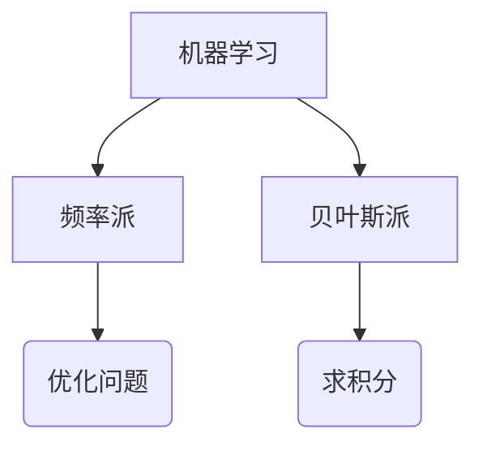
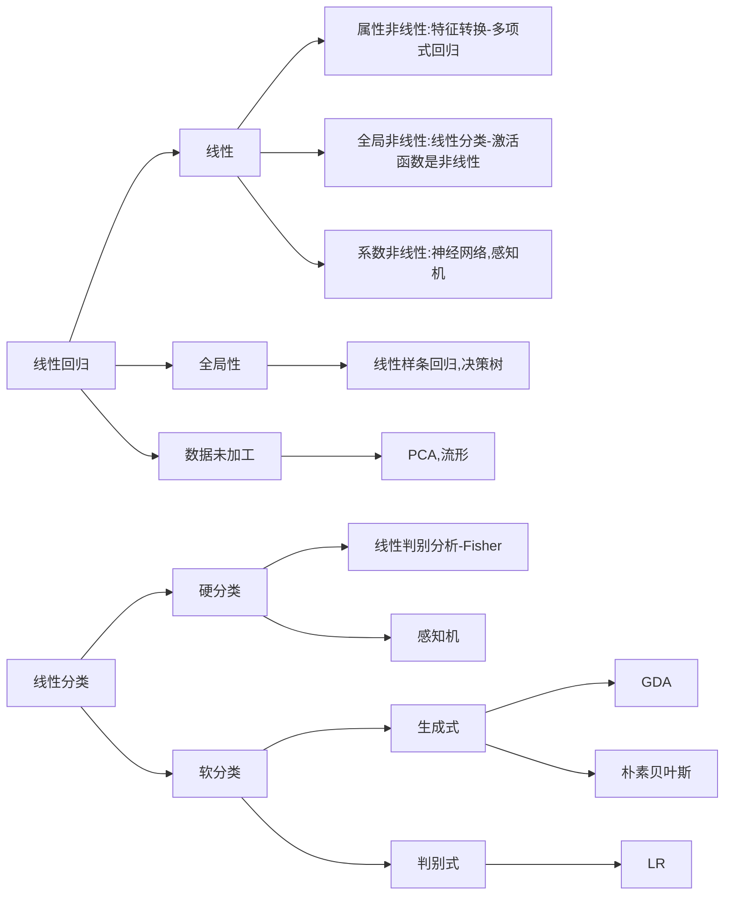

+ 李航《统计学习方法》 感K朴决逻，支提E隐条

+ PRML 回分神核稀，图混近采连，顺组
+ MLAPP 百科全书
+ ESL
+ Deep leaning
+ 台大 林轩田 机器学习基石、技法
+ 台大 李宏毅  ML，MLDS
+ 张志华 机器学习导论、统计机器学习
+ 吴恩达 CS229
+ 徐亦达 概率模型 

## 0.矩阵伪逆

> 当m>=n时，列满秩，矩阵$A_{m\times n}$有左逆矩阵，$A^L=(A^TA)^{-1}A^T$
>
> 当m<=n时，行满秩，矩阵$A_{m\times n}$有右逆矩阵，$A^R=A^T(AA^T)^{-1}$
>
> 当  m=n时，非满秩，对A进行奇异值分解，$A=U\Sigma V^T$,A得伪逆矩阵为$A^{-1}=V\Sigma^{-1}U^T$

## 1. 频率派与贝叶斯派

> X: 数据 $X=(x_1,x_2,...,x_N)^T$
>
> $\theta$: 参数

> 频率派：$\theta$未知参数；X为随机变量
>
> 极大似然估计：$\theta_{MLE}=argmax_{\theta} \quad logP(X|\theta)$

> 贝叶斯派：$\theta$随机变量，$\theta \sim p(\theta)$;
> $$
> p(\theta|X)=\frac{p(X|\theta)p(\theta)}{p(X)}
> $$
> 最大后验概率(MAP)：$argmax_\theta p(\theta|X)$

## 2. 高斯分布

> 高维高斯分布:
> $$
> \frac{1}{(2\pi)^{\frac{p}{2}}|\Sigma|^{\frac{1}{2}}}exp\{-\frac{1}{2}(x-\mu)^T\Sigma^{-1}(x-\mu)\}\\
> \Sigma:协方差矩阵
> $$
> 
>
> 

## 4. EM算法

> **期望最大化算法**是在概率模型中寻找参数最大似然估计或最大后验估计的算法，其中概率模型依赖于无法观测的隐性变量。
>
> **期望最大化算法**经过两个步骤交替进行计算，
>
> + 第一步是计算期望E，利用隐变量的现有估计值，计算其最大似然估计值；
> + 第二步是最大化M，最大化在E步上求得的最大似然值来计算参数的值；
> + M步上找到的参数估计值被用于下一个E步计算中，这个过程不断交替进行。··
>
> 
>
> **算法**（EM算法）
>
> 输入：观测变量数据Y，隐变量数据Z，联合分布$P(Y,Z|\theta)$,条件分布$P(Z|Y,\theta)$;
>
> 输出：模型参数$\theta$.
>
> 1. 选择参数初值$\theta^{(0)}$,开始迭代；
>
> 2. E步：记$\theta^{(i)}$为第$i$次迭代参数$\theta$的估计值，在第$i+1$次迭代的E步，计算
>    $$
>    \begin{align}
>    Q(\theta,\theta^{(i)})&=E_Z[logP(Y,Z|\theta)P(Z|Y,\theta^{(i)})]\\
>    &=\sum_Z log P(Y,Z|\theta)P(Z|Y,\theta^{(i)})
>    \end{align}
>    $$
>    这里，$P(Z|Y,\theta^{(i)})$是在给定观测数据$Y$和当前的参数估计$\theta^{(i)}$下隐变量数据$Z$的条件概率分布。
>
> 3. M步：求使$Q(\theta|\theta^{(i)})$极大化的$\theta$,确定第$i+1$次迭代时的参数的估计值$\theta^{(i+1)}$
>    $$
>    \theta^{(i+1)}={argmax}_{\theta}\quad Q(\theta,\theta^{(i)})
>    $$
>    
>
> 4. 重复第2步和第3步，直到收敛。
>
> 
>
> **定义** ($Q$函数)
>
> ​	完全数据的对数似然函数$logP(Y,Z|\theta)$关于在给定观测数据$Y$和当前参数$\theta^{(i)}$下对未观测数据Z的条件概率分布$P(Z|Y,\theta^{(i)})$的期望为$Q$函数，即
> $$
> Q(\theta,\theta^{(i)})=E_Z[logP(Y,Z|\theta)P(Z|Y,\theta^{(i)})]
> $$

>**例** (三硬币模型) 假设又3枚硬币，分别记作A,B,C. 这些硬币正面出现的概率分别是$\pi,p,q$.进行如下掷硬币试验：先掷硬币A，根据其结果选出硬币B或硬币C。然后掷选出硬币，掷硬币结果，出现正面记作1，出现反面记作0；独立地重复n次试验，观测结果如下：1，1，0，1，0，0，1，0，1，1。
>
>假设只能观测到掷硬币的结果，不能观测掷硬币的过程。问如何估计三枚硬币正面出现的概率，即三硬币模型的参数。
>
>三硬币模型可以写作：
>$$
>\begin{align}
>P(y|\theta)&=\sum_ZP(y,z|\theta)=\sum_ZP(z|\theta)P(y|z,\theta)\\
>&=\pi p^y(1-p)^{1-y}+(1-\pi)q^y(1-q)^{1-y}
>\end{align}
>$$
>将观测数据表示为$Y=(Y_1,Y_2,...,Y_n)^T$,未观测数据表示为$Z=(Z_1,Z_2,...,Z_n)^T$,则观测数据的似然函数为：$P(Y|\theta)=P(Z|\theta)P(Y|Z,\theta)$即
>$$
>P(Y|\theta)=\prod_{j=1}^n[\pi p^y(1-p_j)^{1-y_j}+(1-\pi)q^y_j(1-q)^{1-y_j}]
>$$
>E步：计算模型在参数$\pi^{(i)},p^{(i)},q^{(i)}$下观测数据$y_j$来自掷硬币B的概率
>$$
>\mu^{i+1}=\frac{\pi^{(i)}(p^{(i)})^{y_j}(1-p^{(i)})^{(1-y_j)}}{\pi^{(i)}(p^{(i)})^{y_j}(1-p^{(i)})^{(1-y_j)}+(1-\pi^{(i)})(q^{(i)})^{y_j}(1-q^{(i)})^{(1-y_j)}}
>$$
>M步：计算模型参数的新估计值
>$$
>\begin{align}
>\pi^{(i+1)}&=\frac{1}{n}\sum_{j=1}^n\mu_j^{(i+1)}\\\\
>p^{(i+1)}&=\frac{\sum_{j=1}^n\mu_j^{(i+1)}y_j}{\sum_{j=1}^n\mu_j^{(i+1)}}\\\\
>q^{(i+1)}&=\frac{\sum_{j=1}^n(1-\mu_j^{(i+1)})y_j}{\sum_{j=1}^n(1-\mu_j^{(i+1)})}
>\end{align}
>$$
>

>**例** （高斯混合模型 GMM）
>
>高斯混合模型是指具有如下形式的概率分布模型：$P(y|\theta)=\sum_{k=1}^K\alpha_k\phi(y|\theta_k)$
>
>其中，$\alpha_k是系数，\alpha_k\geq 0,\sum_{k=1}^K\alpha_k=1$;$\phi(y|\theta_k)$是高斯分布密度，$\theta_k=(\mu_k,\sigma_k^2)$.
>
>E步：依据当前的模型参数，计算分模型k对观测数据$y_j$的响应度：
>$$
>\hat \gamma_{jk}=\frac{\alpha_k\phi(y_j|\theta_k)}{\sum_{k=1}^K\alpha_k\phi(y_j|\theta_k)}\qquad k=1,2,...,K;j=1,2,...,N;
>$$
>M步：计算新一轮迭代的模型参数：
>$$
>\begin{align}
>\hat \mu_k&=\frac{\sum_{j=1}^N\hat \gamma_{jk}y_j}{\sum_{j=1}^N\hat \gamma_{jk}}\qquad k=1,2,...,K\\\\
>\hat \sigma_k^2&=\frac{\sum_{j=1}^N\hat \gamma_{jk}(y_j-\mu_k)^2}{\sum_{j=1}^N\hat \gamma_{jk}}\qquad k=1,2,...,K \\\\
>\alpha_k&=\frac{\sum_{j=1}^N\hat \gamma_{jk}}{N}\qquad k=1,2,...,K
>\end{align}
>$$
>

## 5. 感知机算法

> **方式一**
>
> 给定一个训练数据集，$T=\{(x_1,y_1),(x_2,y_2),...,(x_N,y_N)\}$ 其中，$x_i\in \mathcal{X}=R^n,y_i\in\mathcal{Y}=\{-1,1\},i=1,2,...,N$,求参数$w,b$,使得其为以下损失函数极小化问题的解
> $$
> \begin{align}
> min_{w,b}L(w,b)&=-\sum_{x_i\in M}y_i(w\cdot x_i+b)\\\\
> \nabla_wL(w,b)&=-\sum_{x_i\in M}y_ix_i \\\\
> \nabla_bL(w,b)&=-\sum_{x_i\in M}y_i
> \end{align}
> $$
> 随机选取一个错误点$(x_i,y_i)$，对$w,b$进行更新：
>
> $w\leftarrow w+\eta y_ix_i $
>
> $b\leftarrow b+\eta y_i$

> **方式二**
>
> 如果$y_i(w(k)\cdot x_i)\leq 0$,则 $w(k+1)=w(k)+cx_i$

## 6. Fisher线性判别

> 特征归一化的意义：
>
> + 提升模型的收敛速度
> + 提升模型的精度

> Fisher的基本思想：
>
> 训练时，将训练样本投影到某条直线上，这条直线可以使得同类型的样本投影点尽可能接近，而异类型的样本的投影点尽可能远。
>
> 类内小，类间大

> 将数据投影到直线上，则：
>
> + 两类样本的中心在直线上的投影分别是：$w^T\mu_0和w^T\mu_1$.
> + 两类样本的投影方差分别是：$w^T\Sigma_0w和w^T\Sigma_1w$.
>
> 最大化目标为：
> $$
> \begin{align}
> J(w)&=\frac{||w^T\mu_0-w^T\mu_1||^2_2}{w^T\Sigma_0w+w^T\Sigma_1w} \\
> &=\frac{w^T(\mu_0-\mu_1)(\mu_0-\mu_1)^Tw}{w^T(\Sigma_0+\Sigma_1)w}
> \end{align}
> $$
> 定义类内散度矩阵：
> $$
> \begin{align}
> S_w&=\Sigma_0+\Sigma_1\\
> &=\sum_{i=0}^{N_0}(x_i-\mu_0)(x_i-\mu_0)^T+\sum_{i=0}^{N_1}(x_i-\mu_1)(x_i-\mu_1)^T
> \end{align}
> $$
> 定义类间散度矩阵：
> $$
> S_b=(\mu_0-\mu_1)(\mu_0-\mu_1)^T
> $$
> **综上，解得：**
>
> $w^*=S_w^{-1}(\mu_0-\mu_1)$
>
> 

## 7. 主成分分析(PCA)

> PCA的主要思想：
>
> 将n维特征映射到K维上，这K维是全新的正交特征也被称为主成分，是在原有n维特征的基础上重新构造出来的k维特征。
>
> 最大方差，最小化降维损失
>
> 如何计算特征方向：
>
> 通过计算数据矩阵的协方差矩阵，然后得到协方差矩阵的特征值和特征向量，选择特征值最大的k个特征向量组成的矩阵。

> 计算步骤：
>
> 1. 中心化，即每一位特征减去各自的平均值
> 2. 计算协方差矩阵$XX^T$(每行为一条数据)
> 3. 计算协方差矩阵的特征值、特征向量
> 4. 选择特征值大的特征向量构成特征向量矩阵。

## 8. 多元线性回归

> 多元线性回归的本质就是**最小二乘**
> $$
> J(w)=\frac{1}{2}\sum_{i=1}^N(w^T\cdot x_i-y_i)^2
> $$
> 

## 9. 逻辑回归

> $$
> g(z)=\frac{1}{1+e^{w^Tx}}
> $$
>
> 它输出的结果不再是预测结果，而是一个值预测为正例的概率，预测为负例的概率就是1-g(z)
>
> **极大似然估计**：
>
> ​	P(y=1|x)=g(z)
>
> ​	P(y=0|x)=1-g(z)
> $$
> \begin{align}
> L(w)&=\prod_{i=1}^Ng(z)^{y_i}(1-g(z))^{1-y_i}\\
> logL(w)&=\sum_{i=1}^Ny_ilogg(z)+(1-y_i)log(1-g(z))\\
> \end{align}
> $$
> **交叉熵损失函数**：
> $$
> J_{log}(w)=-\sum_{i=1}^Ny_ilogg(z)-(1-y_i)log(1-g(z))
> $$
> 逻辑回归的损失函数，我们就叫它交叉熵损失函数。
>
> **求解**：
>
> 梯度下降、牛顿法

## 10. 支持向量机SVM

> 最大间隔分离超平面问题可表述如下：
> $$
> max_{w,b}\qquad \gamma \\
> s.t. \qquad y_i(\frac{w}{||w||}\cdot x_i+\frac{b}{||w||})\geq \gamma,i=1,2,...N
> $$
> 这个问题可改写为：
> $$
> max_{w,b}\qquad \frac{\hat \gamma}{||w||}\\
> s.t. \qquad y_i(w\cdot x_i+b)\geq \hat\gamma,i=1,2,...,N
> $$
> 令$\hat\gamma=1$
> $$
> min_{w,b}\qquad \frac{1}{2}w^Tw\\
> s.t. \qquad y_i(w\cdot x_i+b)\geq1
> $$
> **求解**
>
> 1. 使用拉格朗日乘子法
>    $$
>    L(w,b)=\frac{1}{2}w^Tw-\sum_{i=1}^N\alpha_iy_i(w^T\cdot x_i+b)+\sum_{i=1}^N\alpha_i \qquad \alpha_i\geq 0
>    $$
>
> 2. 转为拉格朗日对偶问题
>    $$
>    max_\alpha min_{w,b} L(w,b)
>    $$
>
> 3. 求导
>    $$
>    \begin{align}
>    \frac{\partial L}{\partial w}&=w-\sum_{i=1}^N\alpha_iy_ix_i=0\\
>    \frac{\partial L}{\partial b}&=-\sum_{i=1}^N\alpha_iy_i=0\\
>    解得：\\
>    w&=\sum_{i=1}^N\alpha_iy_ix_i\\
>    \sum_{i=1}^N\alpha_iy_i&=0
>    \end{align}
>    $$
>
> 4. 带入L（w，b）问题转化为
>    $$
>    \begin{align}
>    min_\alpha&\qquad \frac{1}{2}\sum_{i=1}^N\sum_{j=1}^N\alpha_i\alpha_jy_iy_j(x_i\cdot x_j)-\sum_{i=1}^N\alpha_i\\
>    s.t.& \qquad \sum_{i=1}^N\alpha_iy_i=0\\
>    &\qquad \alpha_i\geq 0, i=1,2,...,N
>    \end{align}
>    $$
>    
>
> 5. 求得w,b
>    $$
>    \begin{align}
>    w^*&=\sum_{i=1}^N\alpha_i^*y_ix_i\\
>    b^*&=y_j-\sum_{i=1}^N\alpha_i^*y_i(x_i\cdot x_j)\\
>    &选择(x_j,y_j)时选择\alpha不为0的点
>    \end{align}
>    $$

> 
>
> 软间隔：
> $$
> \begin{align}
> min_w& \qquad \frac{1}{2}w^Tw+C\sum_{i=1}^N\xi_i\\
> s.t.& \qquad y_i(w^Tx_i+b)\geq 1-\xi_i  
> \end{align}
> $$
> 

> 非线性支持向量机：
> $$
> \begin{align}
> min_\alpha&\qquad \frac{1}{2}\sum_{i=1}^N\sum_{j=1}^N\alpha_i\alpha_jy_iy_jK(x_i,x_j)-\sum_{i=1}^N\alpha_i\\
> s.t.& \qquad \sum_{i=1}^N\alpha_iy_i=0\\
> &\qquad C\geq \alpha_i\geq 0, i=1,2,...,N
> \end{align}
> $$
> 常用核函数：
>
> 1. 多项式核函数
>
>    $K(x,z)=(x\cdot z +1)^p$
>
> 2. 高斯核函数
>
>    $K(x,z)=exp(-\frac{||x-z||^2}{2\sigma^2})$
>
> 3. 字符串核函数

## 11. 提升方法（Adaboost）

> **算法** （Adaboost）
>
> 输入： 训练数据集$T=\{(x_1,y_1),(x_2,y_2),...,(x_N,y_N)\}$;
>
> ​             弱学习算法；
>
> 输出：最终分类器G(x).
>
> 1. 初始化训练数据的权值分布
>
>    $D_1=(w_{11},w_{12},...,w_{1N}),w_{1i}=\frac{1}{N}$
>
> 2. 对m=1,2,...,M
>
>    1. 使用具有权值分布$D_m$的训练数据集学习，得到基分类器
>
>        $G_m(x):\mathcal{X}\rightarrow \{-1,+1\}$
>
>    2. 计算$G_m(x)$在训练数据集上的分类错误率
>
>       $e_m=P(G_m(x)\neq y_i)=\sum_{i=1}^Nw_{mi}I(G_m(x)\neq y_i)$
>
>    3. 计算$G_m(x)$的系数
>
>       $\alpha_m=\frac{1}{2}log\frac{1-e_m}{e_m}$
>
>    4. 更新训练数据集的权值分布
>
>       $D_{m+1}=(w_{m+1,1},w_{m+1,2},...,w_{m+1,N})$
>
>    $$
>    w_{m+1,i}=\frac{w_{mi}exp\{-\alpha_iy_iG_m(x_i)\}}{\sum_{i=1}^Nw_{mi}exp\{-\alpha_iy_iG_m(x_i)\}}
>    $$
>
>    
>
> 3. 构建基本分类器的线性组合
>    $$
>    f(x)=\sum_{m=1}^M\alpha_mG_m(x)
>    $$
>    得到最终分类器
>    $$
>    G(x)=sign(f(x))
>    $$
>    

## 12. 高斯判别分析（GDA）

>Y服从伯努利分布$\phi$
>
>X|Y=1服从$N(\mu_1,\Sigma)$
>
>X|Y=0服从$N(\mu_0,\Sigma)$
>
>**参数**
>$$
>\begin{align}
>\phi&=\frac{1}{N}\sum_{i=1}^Ny_i \\
>\mu_0&=\frac{\sum_{i=1}^Ny_ix_i}{\sum_{i=1}^Ny_i}\\
>\mu_1&=\frac{\sum_{i=1}^N(1-y_i)x_i}{\sum_{i=1}^N(1-y_i)}\\\\
>\Sigma&=\frac{1}{N}\sum_{i=1}^N(x_i-u_{y_i})(x_i-u_{y_i})^T
>
>\end{align}
>$$

## 13. 决策树

> **信息增益**
>
> $g(D,A)=H(D)-H(D|A)$
> $$
> \begin{align}
> H(D)&=-\sum_{k=1}^K\frac{|C_k|}{|D|}log_2\frac{|C_k|}{|D|}\\\\
> H(D|A)&=-\sum_{i=1}^n\frac{|D_i|}{|D|}H(D_i)\\
> &=-\sum_{i=1}^n\frac{|D_k|}{|D|}\sum_{k=1}^K\frac{|D_{ik}|}{|D_i|}log_2\frac{|D_{ik}|}{|D_i|}
> \end{align}
> $$
> 

## 14. 隐马尔可夫模型 

> **定义** (隐马尔可夫模型)
>
> 隐马尔可夫模型是关于时序的概率模型，描述由一个隐藏的马尔可夫链随机生成不可观测的状态随机序列，再由各个状态生成一个观测而产生观测序列的过程。 
>
> **组成**
>
> + 初始概率分布
> + 状态转移概率分布
> + 观测概率分布
>
> **基本假设**
>
> + 齐次马尔可夫性假设
> + 观测独立性假设
>
> **基本问题**
>
> + 概率计算
> + 学习问题
> + 预测问题

>  **概率计算**（前向算法）
>
> **定义**（前向概率）
>
> 给定隐马尔可夫模型$\lambda$,定义到时刻$t$部分观测序列为$o_1,o_2,...,o_t$且状态为$q_i$的概率为前向概率，记作：$\alpha_t(i)=P(o_1,o_2,...,o_t,i_t=q_i|\lambda)$
>
> **算法**（观测序列概率的前向算法）
>
> 输入：隐马尔可夫模型$\lambda$,观测序列O；
>
> 输出：观测序列概率$P(O|\lambda)$.
>
> 1. 初值
>
>    $\alpha_1(i)=\pi_ib_i(o_i),\quad i=1,2,...,N$
>
> 2. 递推 对$t=1,2,..,T-1$,
>    $$
>    \alpha_{t+1}(i)=[\sum_{j=1}^N\alpha_t(j)a_{ji}]b_{i}(o_{t+1,,}),\quad i=1,2,...,N
>    $$
>
> 3. 终止
>    $$
>    P(O|\lambda)=\sum_{i=1}^{N}\alpha_T(i)
>    $$

> **概率计算**（后向算法）
>
> **定义**（后向概率）
>
> 给定隐马尔可夫模型$\lambda$,定义在时刻$t$状态为$q_i$的条件下，从$t+1$到T的部分观测序列为$o_{t+1},o_{t+2},...,o_T$的概率为后向概率，记作：
> $$
> \beta_t(i)=P(o_{t+1},o_{t+2},...,o_T|i_t=q_i,\lambda)
> $$
> **算法 **  (观测序列概率的后向算法)
>
> 输入：隐马尔可夫模型$\lambda$,观测序列$O$;
>
> 输出：观测序列概率$P(O|\lambda)$.
>
> 1. $\beta_T(i)=1,\quad i=1,2,...,N$
>
> 2. 对$t=T-1,T-2,...,1$
>    $$
>    \beta_t(i)=\sum_{j=1}^Na_{ij}b_j(o_{t+1})\beta_{t+1}(j),i=1,2,...,N
>    $$
>
> 3. $$
>    P(O|\lambda)=\sum_{i=1}^N\pi_ib_i(o_1)\beta_1(i)
>    $$
>
>    

## 15. 降维

> **维度选择**
>
> + 采样：从D维中随机选择D‘维
> + 手工：手工移除特征
> + 监督方法：
>   + 过滤式选择：设计一个统计量来度量特征的重要性（相关系数、互信息、）
>   + 包裹式选择：用最终要用的学习器的性能评价特征的重要性
>   + 嵌入式选择：维度选择与模型训练一起完成
>     + 基于L1正则的特征选择：选择非0系数
>     + 基于树模型的特征选择：CART、GBDT、随机森林

> **维度抽取**
>
> + 线性降维
>   + MDS
>   + PCA
> + 非线性降维
>   + 核PCA
>   + 流行学习
>     + 全局距离保持：ISOMAP
>     + 局部距离保持：LLE、Laplacian Eigenmaps
>     + 局部优先，兼顾全局特征保存：T-NSE(进行可视化)

## 16.半监督学习

> 1. 自我训练——自学习算法
> 2. 多视角学习——协同训练
> 3. 生成模型——GMM、混合多项分布、HMM
> 4. 半支持向量机——S3VM
> 5. 基于图的半监督算法——

## 17. 聚类

> **距离度量**
>
> 1. 闵可夫斯基距离
>
> 2. 余弦相似度
>
> 3. 相关系数
>
> 4. 杰卡德相似系数
>
>    $J(x_i,x_j)=\frac{\sum_{k=1}^D(x_{i,k}\cap x_{j,k} )}{\sum_{k=1}^D(x_{i,k}\cup x_{j,k} )}$

> **性能评价指标**
>
> + 外部评价法：聚类结果与参考结果有多相近
> + 内部评价法：聚类的本质特点

> **聚类算法**
>
> 1. K均值聚类
> 2. 高斯混合模型
> 3. 层次聚类
>    + 自底向上（凝聚式）
>    + 自顶向下（分裂式）
> 4. 基于密度的聚类
>    + DBSCAN
>      + 核心点：指定半径$\epsilon$内多于指定数量MinPts个点
>      + 边界点：半径$\epsilon$内有少于MinPts个点，但在某个核心点的邻域内
>      + 噪声点：核心点和边界点之外的点

> **卷积神经网络**
>
> 1. 基本结构
>    + 卷积层
>      + 稀疏连接
>      + 参数共享
>      + 核的大小、滤波器的数量、步幅都是开发者需要确定的参数
>      + 作用：提取特征
>    + 激活层
>    + 池化层
> 2. 