## 第一章 复杂性分析初步

> 程序的性能一般指程序的`空间复杂性`和`时间复杂性`。
>
> 性能评估主要包含两个方面，即性能分析与性能测量

### 第一节 空间复杂性

>程序所需的空间主要包括：指令空间、数据空间、环境栈空间

### 第二节 时间复杂度

> 时间复杂度的构成: 一个程序所占时间=编译时间+运行时间
>
> 复杂性函数，当以一个多项式函数为上界时，可视为一个好算法(有效算法)
>
> 平均时间复杂度、概率时间复杂度、最坏时间复杂度

### 第三节 渐进符号

> 渐进符号O的定义：$f(n)=O(g(n))当且仅当存在正常数c和n_0,使得对于n\geq n_0,有f(n)\leq cg(n).此时，称g(n)是f(n)的一个上界。$
>
> 符号$\Omega$的定义：$f(n)=\Omega(g(n))当且仅当存在正的常数c和n_0,使得对于所有的n\geq n_0,有f(n)\geq cg(n).此时，称g(n)是f(n)的一个渐进下界。$
>
> 符号$\Theta$的定定义:$f(n)=\Theta(g(n))当且仅当存在正的常数c_1,c_2和n_0,使得对于所有的n\geq n_0,有c_1(g(n))\leq f(n)\leq c_2(g(n)).此时，称f(n)与g(n)同阶。$
>
> 斐波那契数列：$F(n)=F(n-1)+F(n-2)\Rightarrow 特征方程: x^2=x+1$

## 第二章 图与遍历算法

### 第一节 图的基本概念和术语

> `无向图:`简称图，是一个用线连接在一起的节点的集合。
>
> 没有重复边的图称为`简单图`,`n阶完全图`是指具有n个顶点而且每两个顶点之间都有边连接的简单图。
>
> `k-部图：`是指图的顶点集被分成k个部分，同部分的顶点之间不相邻。
>
> 图的表示：`邻接矩阵`、`关联矩阵`
>
> 路径：`途径`,`迹`,`路`
>
> `途径`：顶点与边交叉出现的序列，
>
> `迹`：是指边不重复的途径，
>
> `路`：是指顶点不重复的途径。
>
> 起点和终点重合的途径称为`闭途径`，起点和终点重合的迹称为`闭迹`，顶点不重复的闭迹称为`圈`,没有圈的图称为`森林`

### 第二节 图的遍历搜索算法

> 二叉树的搜索算法：
>
> + 树的先根次序遍历算法
> + 树的后根次序遍历算法
>
> 一般图的遍历：
>
> + 宽度优先搜索算法（BFS）
> + 深度优先搜索算法（DFS）
>   + 深度优先算法能产生一棵生成树，称为深度优先搜索树

### 第三节 双连通与网络可靠性

> 连通无向图G中的顶点v称为`割点`，如果G中去掉v及其关联的边，剩下的图就不再连通。
>
> 当采用深度优先遍历算法时，顶点v被访问的序数称为v的`深索数`，记作DFN(v)

> 添加边的算法：
>
> ```c
> for 每个割点u do
>     设B1，B2,...,BK,是包含割点u的全部2-连通分支
>     设Vi是Bi的一个顶点，且Vi不等于u,1<=i<=k.
>     将边(vi,vi+1)添加到G，i<=i<=k-1
> endfor
> ```
>
> 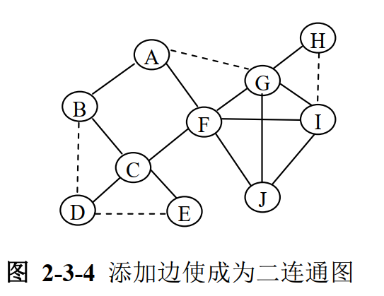


> **定义** 顶点u的最低深索数L(u)定义为
>
> ​    L(u):=min{DFN(u),min{DFN(x)|(u,x)是T的余边},min{L(w)|w是u的子节点}}
>
> (当前节点的DFN,通过余边与当前节点相连的DFN,子节点的最小深索数)
>
> 可见，如果L(u)$\neq$DFN(u),则必定L(u)<DFN(u),此时,L(u)是通过一条子孙路径所可能到达的顶点的最低深索数。
>
> **结论** 如果u不是深度优先搜索树的根，则u是图G的割点当且仅当u有某个子节点w,w的最低深索数不小于u的深索数，即L(w)$\geq$DFN(u),for some son w of u
>
> 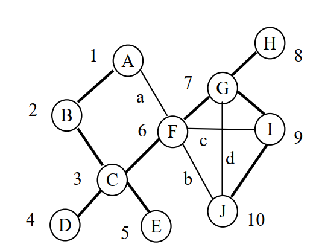
>
> 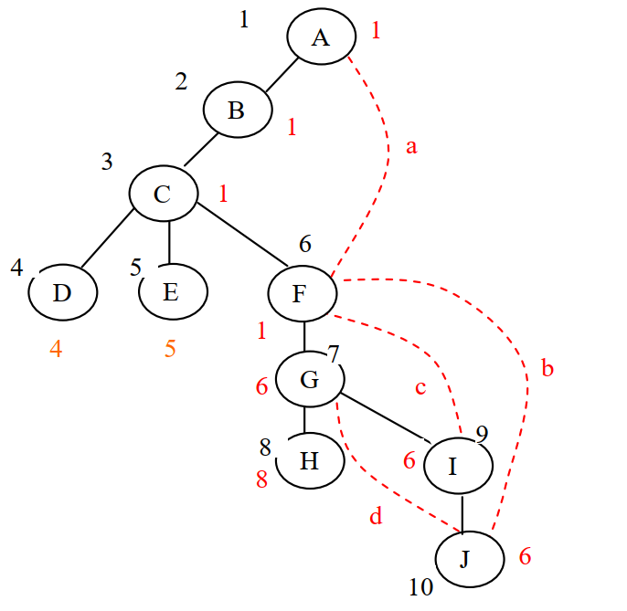

<span style='color:red'>判断顶点是否为割点?</span>

### 第四节 对策树

> 取火柴
>
> 

## 第三章 分治算法

### 第一节 算法基本思想

> `分治法:`将整个问题分解为若干个小问题来处理
>
> 递归求最大最小值算法 MaxMin(i,j,fmax,fmin)
>
> 折半搜索       O(logN)

### 第二节 排序算法

> + 归并排序算法          最坏 O(NlogN) 平均 O(NlogN)
> + 快速排序算法           最坏O(N2)        平均O(NlogN)

### 第三节 选择问题

> + 已知n元数组A[1..n],试确定其中第k小的元素。O(nlogn)->O(n)
> + 采用划分的选择算法

###  第四节 关于矩阵乘法

> 分块矩阵

### 第五节 快速Fourier变换

### 第六章 最接近点对问题

## 第四章 贪心算法

### 第一节 贪心算法基本思想

> `贪心算法:`在决策中总是做出在当前看来是最好的选择
>
> 背包问题

### 第二节 调度问题

> 调度问题
>
> + 活动安排问题
>
>   基本思路：安排时应该将结束时间早的活动尽量往前安排，好给后面的活动安排留出更多的时间，从而达到安排最多活动的目的。
>
>   开始时间和结束时间分别用两个数组s和f存储，并使得数组种元素按结束时间非降排列。（$s_i>f_j$）
>
> + 带期限的单机作业调度问题
>
>   贪心准则：尽量选取效益值大的作业安排
>
>   第k项作业要求在时刻$f_k$之前完成，而且完成这项作业将获益$p_k$。
>
>   相容性要求：作业i可以加入J只要当前解集J种期限值不大于$f_i$的作业少于$f_i$个。
>
>   
>
> + 多机调度问题
>
>   贪心准则：需要长时间处理的作业优先处理。

### 第三节 最优生成树问题

> Prim算法
>
> 1. 选择图G的一条权值最小的边e,形成一棵两点一边的子树
> 2. 假设G的一棵子树T已经确定
> 3. 选择G的不在T中的具有最小权值的边e,使得T$\bigcup${e}仍是G的一棵子树
>
> Kruskal算法
>
> 1. 选择图G中的一条权值最小的边e
> 2. 假设已经选好G的一组边L={e,e,...}
> 3. 选择G的不在L中的具有最小权值的边e,使得L$\bigcup${e}诱导出的G的子图不含G的圈。

### 第四节 单点源最短路径问题

> Dijkstra最短路径算法
>
> ​	贪心准则：迄今已生成的所有路径长度之和最小

### 第五节 Huffman编码

### 第六节 贪心算法优性理论

> 一般问题模型： 赋权拟阵的最优化问题
>
> 遗传、交换性

## 第五章 动态规划算法

最优性原理：

多阶段决策过程的最优决策序列具有这样的性质：不论初始状态和初始决策如何，对于前面决策所造成的某一状态而言，其后各阶段的决策序列必须构成最优策略。

### 第一节 动态规划算法的基本思想

> 无论过程的初始状态和初始决策是什么，其余的决策都必须相对于初始决策所产生的状态构成一个最优决策序列。
>
> 动态规划算法采用最优性原则来建立递归关系式，在求解问题时有必要验证该递归关系式是否保持最优化原则。
>
> 在使用动态规划算法自顶而下求解时，每次产生的子问题并不总是 新问题，有些子问题反复计算多次，动态规划算法正是利用了这种子问题重叠性，对每一个子问题只计算一次，将其保存在一个表格中，备用。
>
> `最优子结构性质`和`子问题重叠性质`是计算模型采用动态规划算法求解的两个基本要素。
>
> `动态规划算法的基本步骤:`
>
> 1. 分析最优解的结构
> 2. 建立递推关系
> 3. 计算最优值
> 4. 构造最优解

> 多段图问题、0/1背包问题、矩阵连乘问题、

### 第零节 矩阵连乘

​		m[i] [j]=A(i...j)运算次数

​		s[i] [j]=矩阵连乘断开位置

> 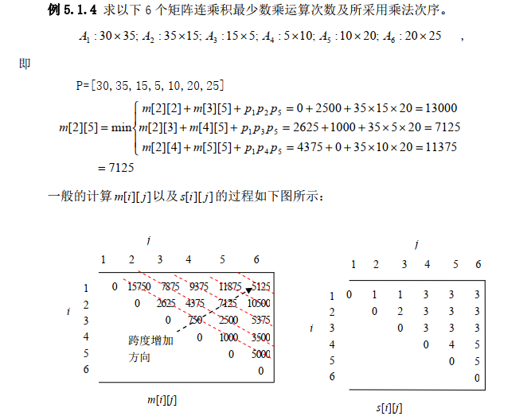

### 第二节 多段图问题

> $COST(i,j)=min \quad {c(j,l)+COST(i+1,l)}$

### 第三节 0/1背包问题

> $$
> m[k][X]=max\{m[k-1][X],m[k-1][X-w_k]+p_k\}
> $$
>
> 

### 第四节 流水作业调度问题

> 流水作业调度问题一定存在满足Johnson法则的最优调度，且容易由下面的算法确定：
>
> 流水作业调度问题的Johnson算法：
>
> 1. 令$N_1=\{i|a_i<b_i\},N_2=\{i|a_i\geq b_i\}$
>
> 2. 将$N_1$中作业依$a_i$的非递减序排序；将$N_2$中作业依$b_i$的非递增序排列序；
>
> 3. $N_1$中作业接$N_2$中作业构成满足Johnson法则的最优调度
>
>    
>
>    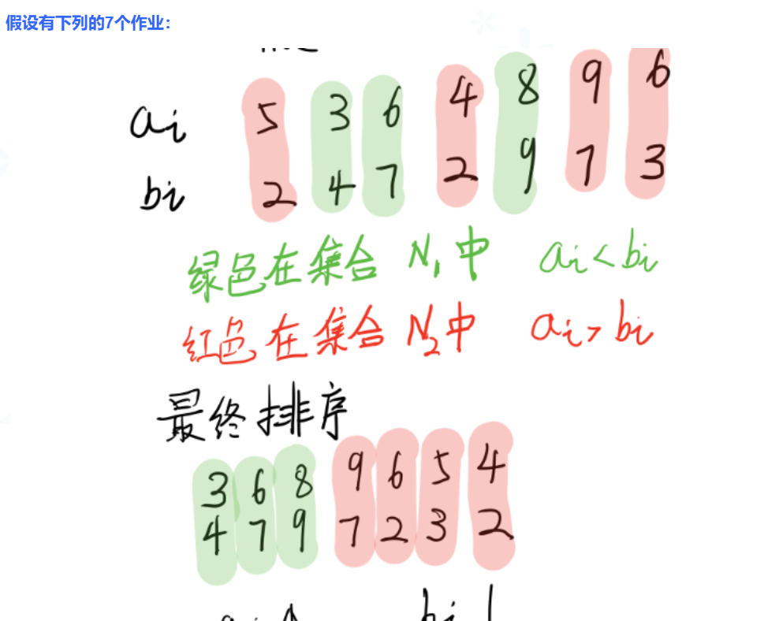

### 第五节 最优二叉搜索树

>
>
>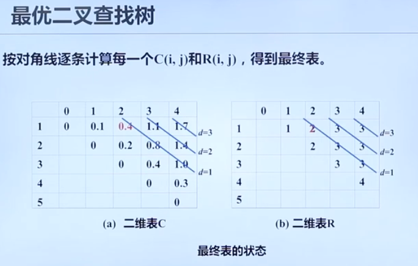

## 第六章 回溯算法

### 第一节 回溯法的基本思想

> 回溯法有‘通用的解题法’之称。应用回溯法求解问题时，首先应明确问题的解空间。一个复杂问题的解决往往由多部分构成，即，一个大的解决方案可以看作是由若干个小的决策组成。很多时候他们构成一个决策序列。
>
> 问题：
>
> + 旅行商问题
> + 定和子集问题
> + n皇后问题
>
> 回溯法解题步骤:
>
> 1. 针对所给的问题，确定问题的解空间；
> 2. 确定易于搜索的解空间结构——状态空间树；
> 3. 以深度优先的方式搜索状态空间树，并且在搜索过程中用剪枝函数避免无效的搜索。

### 第二节 定和子集问题和0/1背包问题

> ​	定和子集问题
>
> 剪枝法：
> $$
> \sum_{1\leq i\leq k}w_ix_i+\sum_{k+1\leq i\leq n}w_i < M

> $$
> 
>
> 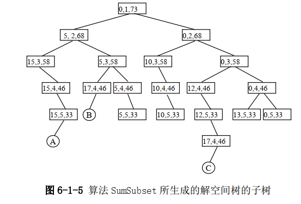

> ​	0/1背包问题
>
>  0/1 背包问题： n=8， M=110， W=[1， 11， 21， 23， 33， 43， 45，
> 55]， P=[11， 21， 31， 33， 43， 53， 55， 65]。
>
> 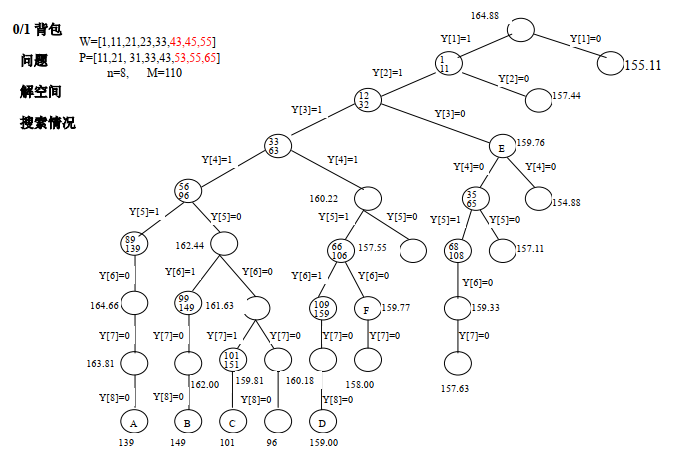  

### 第三节 n皇后问题和旅行商问题

> n皇后问题
>
> 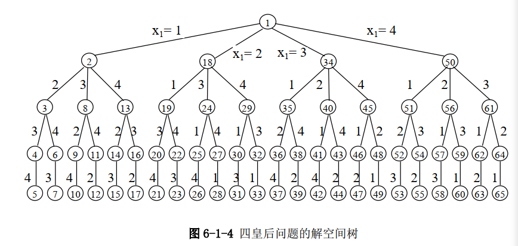

> ​	旅行商问题
> $$
> cl=\sum_{1\leq i\leq k-2}w(x_i,x_{i+1})\\
> cl+w(x_{k-1}，x_{k}) > fl 剪枝
> $$
> 
>
> 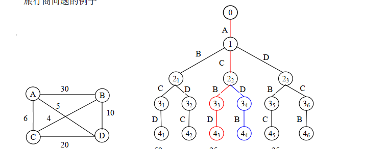

### 第四节 图的着色问题

> ​	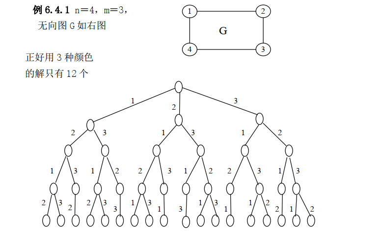

### 第五节 回溯法的效率问题


## 第七章 分枝-限界算法

### 第一节 算法基本思想

> 回溯法采用深度优先的方式，分枝限界采用宽度优先的方式。
>
> 分枝限界策略：在扩展节点处，首先生成其所有的儿子节点，将那些导致不可行解或者非最优解的儿子节点舍弃，其余儿子节点加入活节点 表中。然后，从活节点表中取出一个节点作为当前扩展节点，重复上述节点扩展过程。
>
> 活节点表中选择扩展节点方式：
>
> 1. 队列式
>
>    这种方式是将活节点表组织成一个队列或者一个栈，并按队列的`先进先出`或`后入先出`原则选取下一个节点作为当前扩展节点。
>
> 2. 优先队列式
>
>    这种方式是将活节点表组织成一个优先队列，并按优先队列给出节点规定的优先级选取优先级最高的下一个节点作为当前扩展节点。
>
> `对于最大值优化问题:`常引用一个可能获得的目标函数值得一个上界CUB(经此节点可能达到的最大‘效益值’)。如果当前扩展节点的儿子节点处的动态上界CUB小于目前所获得的目标函数值prev,则该儿子节点不被放入活节点表。实际上相当于剪掉了状态空间树中以该节点为根的子树。
>
> `对于最小值优化问题：`常引用一个可能出现的目标函数值的一个动态下界CLB(经此节点可能付出的最小‘成本’)，如果当前扩展节点的儿子节点处的动态下界CLB大于目前所获得的目标函数值prev，则该节点不被放入活动节点队列。
>
> `对于只是找可行解的问题:`我们可以考虑如何降低搜索成本。常引用一个可能需要的成本的动态下界CLB，如果当前扩展节点的儿子节点处的动态下界CLB大于目前所知道的到达最小成本答案节点所需要的成本prev，则该节点不放入活节点表。 

### 第二节 0/1背包问题的分枝-限界法

​	LUBound: 计算Pvu,Pvl{	

​		Pvu:=Pvl+rw*P[i]/W[i]  

​		Pvl:=Pvl+P[j]	

​	}

> 例   n=4, P=(10,10,12,18), W=(2,4,6,9), M=15  
>
> 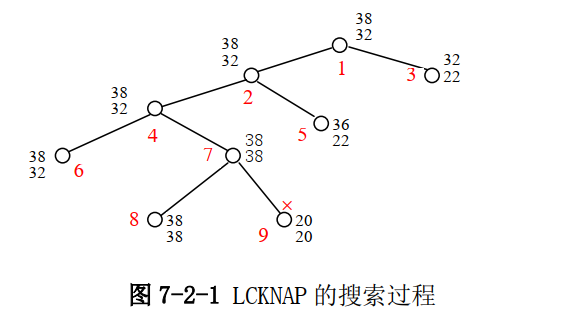

### 第三节 电路板布线问题

> ​	采用队列式(FIFO)分枝限界法解此问题，它的状态空间树是一个多叉树。首先节点a作为第一个扩展点。与该扩展点相邻并且可达的方格成为可行节点被加入到活节点队列，这些节点被加入队列的顺序是：右、下、左、上。将这些方格标记为1，它表示从起始方格a到这些方格的距离为1.接着从活动节点队列中取出队首节点作为当前扩展节点，并将与扩展节点相邻且未标记过的方格标记为2，并以右、下、左、上的顺序将这些节点存到活节点队列中。这个过程一直持续到算法搜索到目标方格b或者活节点队列为空时停止。
>
> 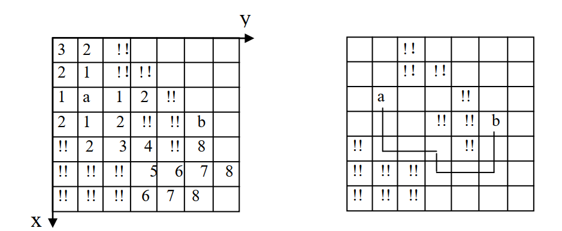

### 第四节 优先级的确定与LC-检索

> 成本估计函数：$\hat{c} (X)=f(X)+g(X)$
>
> ​		f(X):状态空间树的根节点到X的搜索成本。
>
> ​		g(X):由X到答案节点的搜索成本。

### 第五节 旅行商问题

> ​	实际上，我们可以用简约成本矩阵获得更好的$\hat{c}(x)$,它满足$\hat{c}(x)\leq C(x)$,并且在X是叶节点时，$\hat{c}(X)=C(X)$.矩阵A称为简约的，如果它的每个元素都是非负的，而且它的每一行（列）都至少有一个元素是0.我们可以将旅行商问题的成本矩阵约化为简约矩阵：
>
> 先将矩阵的每一行各元素减去该行的最小元素，再将所得得矩阵得每一列各元素减去该列得最小元素。因为有向图的一条有向hamilton回路含有每个顶点i的恰好一条出边（i，j）和一条入边（k,i），从成本矩阵的一列或者一行的每一个项减去一个常数t，就会使的每条回路成本正好减去t。这不改变最低成本回路，即最小成本回路仍然是最小成本回路。如果i行使用的减数是$r_i$,j列使用的减数是$c_j$，则旅行商问题的最小回路成本不会低于这些数的和：$\hat{c}=\sum_{i=1}^nr_i+\sum_{j=1}^nc_j$
>
> 从根节点作为可扩展节点开始，依次产生节点2，3，4，5.对应这些节点的简约矩阵分别是A(i),i=2,3,4,5。例如，简约矩阵A(3)对应的路径是有向图的顶点1到顶点3，该矩阵是这样获得的：将矩阵A(1)的第1行、第3列所有项及(3,1)项都置为$\infin$,这样得到的矩阵不是简约的，但只有第1列没有零，将第1列的每项都减去11，得到简约矩阵A(3).此时，$\hat c(3)=25+17+11$
>
> 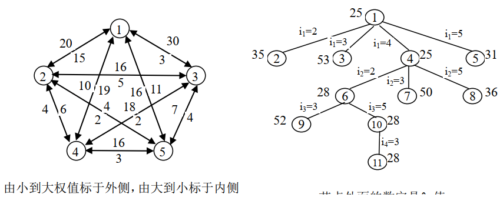
>
> 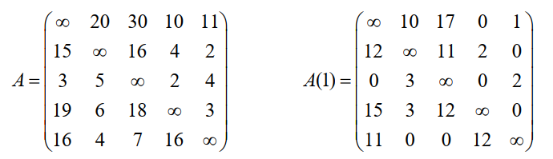
>
> 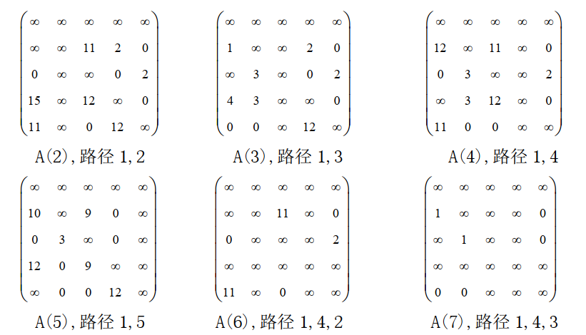

## 第八章 NP-完全问题

### 第一节 关于问题及算法的描述

> 为了应用算法复杂性理论，首先要对问题、问题的一般描述、计算模型、算法、算法的复杂性给出严格的定义。
>
> 所谓一个问题是指一个有待回答、通常含有几个取值还未确定的自由变量的一个一般性提问。它由两部分组成：
>
> 1. 对其关于参数的一般性描述；
> 2. 对该问题的答案所应满足的某些特性的说明。
>
> 目前广泛采用的描述问题的方法主要有两种：
>
> 1. 将任一问题转化为所谓的可行性检验问题。
> 2. 把问题转化为判定问题。
>
> 几乎所有的问题都可以直接或间接地转述为判定问题。


> `算法`是指用来求解某一问题的、带有一般性的一步一步的过程。
>
> 算法的描述有三种不同的层次：
>
> 1. 形式描述，即详尽地写出图灵机的状态、转移函数等等，这是最底层也是最详细的描述
> 2. 实现描述，使用日常语言来描述图灵机的运行，如怎样移动读写头，怎样在带上存储数据等，但是不给出状态和转移函数的细节
> 3. 高层描述，它也使用日常语言描述算法，但是忽略实现的模型，这种描述不需要提及机器是怎样管理它的带子或读写头的。

> 语言：
>
> 设$\sum$是一个字符集，用$\sum^*$表示由$\sum$上的字符组成的所有有限长字符串的集合。$\sum^*$的任何非空子集L都称为$\sum$上的一个语言。
>
> 判定问题与语言的对应关系是通过编码策略来实现的。

### 第二节 图灵机与确定性算法

> 图灵机本质上是一个具有存储载体的，按照具体的指令可以完成向左或向右移动、放置标记、抹去标记以及在计算终止时停机等四种基本操作的、用于描述算法的语言。
>
> **确定性单带自动机(DTM)** 由一个有限状态控制器、一个读写头和一条双向的具有有限多个格的线性带所组成。
>
> 1. 带中所用字符的一个有限集合$\Gamma$,它应包含输入字符表$\Sigma \sub \Gamma$和一个特别的空白符号$b\in \Gamma - \Sigma$
> 2. 一个有限状态集Q，它包含初始状态$q_0$和两个特有的停机状态$q_Y和q_N$
> 3. 一个转移函数$\delta:(Q-\{q_Y,q_N\})\quad X \quad \Gamma\rightarrow Q\quad X\quad\Gamma\quad X\quad\{l,r\}$$\\(q,s)\mapsto(q\prime,s\prime,\Delta)$
>
> 当前状态、带格中的内容以及读写头所在的位置是图灵机的要素，这三者的整体称为一个格局，图灵机的运行就是根据转移函数发出的指令从一个格局转移到另一个格局。
>
> 只有当一个DTM程序对定义于其输入字符表上的所有可能字符串均（在有限步内）停机时，才称其为一个算法。
>
> 如果存在一个多项式时间DTM程序，它在编码策略e之下求解$\Pi$，即$L(\Pi,e)\in P$,则称该判定问题$\Pi$属于P。

### 第三节 NP类问题

> **非确定性单带自动机(NDTM)** 是一种假想的机器。通常有两种方式描述它：多值模型和猜想模块模型。
>
> 1. 带中字符集$\Gamma$,使得$\Sigma\sub\Gamma$,且$b\in\Gamma-\Sigma$
> 2. 有限状态集$Q\supseteq\{q_Y,q_N,q_0\}$
> 3. 多值转移函数$\hat\delta:(Q-\{q_Y,q_N\})\quad X\quad \Gamma\to2^{Qx\Gamma x\{l,r\}}\\(q,s)\mapsto S \sube Qx\Gamma x\{l,r\}$
>
> “多值模型：”
>
> 确定性图灵机在任一状态下只能完成一种运算，而非确定性图灵机可以被想象为在同一时刻能够独立、并行地完成多种运算(表项在转移函数的多值性)，这显然不现实。
>
> 通过允许作不受限制的并行计算可以对不确定性算法做出明确的解释。每当要作出某种选择时，算法就好像给自己复制了若干副本，每种可能的选择有一个副本，于是，许多副本同时被执行。第一个获得成功的副本将引起其它副本计算的结束。如果一个副本获得不成功的完成则只该副本终止。
>
> “猜想模块模型：”
>
> 可将NDTM描述为：除多了一个猜想模块外，NDTM与DTM有着完全相同的结构，而这个猜想模块带有自己的仅可对带进行写操作的猜想头，它提供写下猜想的方法，仅此而已 。
>
> 若存在多项式p,使得对所有的$n\geq 1$有$T_M(n)\leq p(n)$,则称NDTM程序M为一个多项式时间NDTM程序。并称$NP=\{L|存在一个多项式时间NDTM程序M，使得L_M=L\}$为NP语言。

### 第四节 NP完全问题

> 研究P=NP问题的两条基本思路：
>
> 1. 证明NP类中的某些问题是难解的，从而得到NP$\neq$P。但是要证明这一点几乎同证明P=NP一样困难。
> 2. 考察NP类中问题之间的关系，从中找到一些具有特殊性质的问题。沿着这一路线人们已经证明了在NP类中存在被称为NP-完全的子类，简称NPC问题，并由此发展了一套著名的NP完全理论。
>
> `定义1` 所谓从一个语言$L_1\sube \Sigma_1^*$到另一个语言$L_2\sube\Sigma_2^*$的多项式变换是指满足下面两个条件的函数$f:\Sigma_1^*\to\Sigma_2^*$
>
> 1. 存在计算f的一个多项式时间DTM程序
> 2. 对于所有的$x\in\Sigma_1^*$有：$x\in L_1$当且仅当$f(x)\in L_2$
>
> 用$L_1\propto L_2$表示存在一个从语言$L_1$到语言$L_2$的多项式变换。
>
> `定义2` 称一个语言L(判定问题$\Pi$)为NP-完全问题(NPC),如果$L\in NP(\Pi \in NP)$且对所有别的语言$L\prime\in NP(判定问题\Pi\prime\in NP)$均有$L\prime\propto L(\Pi\prime\propto\Pi)$
>
> `性质1` $如果L\prime\propto L,则L\in P意味着L\prime\in P$
>
> `性质2` $如果L\prime\propto L而且L\propto L\prime\prime,则L\prime\propto L\prime\prime$
>
> `定理2` $设\Pi是NP完全的，如果P\neq NP,则\Pi \in NP-P$
>
> `定理3` $如果L\prime,L \in NP , L\prime \propto L ,则 L\prime \in NPC \Rightarrow L\in NPC$

> 典型NPC问题：
>
> 1. 三维匹配问题
>
>    例：给定三个互不相交的、均含有q个元素的一个结合W,X,Y，取$M\sube W\times X\times Y$
>
>    问：M包含一个匹配吗？即是说，是否存在一个子集$M\prime\sube M使得|M\prime|=q且M\prime$中任意两个三元组都没有相同的分量
>
> 2. 三元精确覆盖问题
>
>    例：给定有限集合X，|X|=3q,以及X的三元子集族C
>
>    问：C含有X的一个精确覆盖吗？即是说，是否存在一个子族$C\prime\sube C$,使得X的每个元素恰好只出现在$C\prime$的一个三元子集中。
>
> 3. 顶点覆盖问题
>
>    例：给定一个图G(V,E)和一个正整数$K\leq V$
>
>    问：是否存在G的一个顶点数不超过K的覆盖？即是否存在一个顶点子集$V\prime\sube V,|V\prime|\leq K$,使得对于每一条边$\{u,v\}\in E$,u与v中至少有一个属于v
>
> 4. Hamilton回路问题
>
>    例：已知一个图G(V,E)
>
>    问：G含有一个Hamilton回路吗？G的Hamilton回路是指包含图G的所有顶点的简单回路(圈),即是G的顶点的一个排序：$[v_1,v_2,v_3,...,v_n]$,其中n=|V|,使得对所有的$i,1\leq i<n,\{v_i,v_{i+1}\}\in E,\{v_n,v_1\}\in E$
>
> 5. 划分问题
>
>    例：已知一个有限集合A及对于每个$a\in A$的一个权值$s(a)\in Z^+$
>
>    问：是否存在A的一个子集$A\prime \sube A$,使得$\sum_{a\in A\prime}s(a)=\sum_{a\in A-A\prime}s(a)$
>
> 6. 三元可满足性问题3SAT
>
>    例：给定布尔变量的一个有限集合U及定义于其上的子句集$C=\{c_1,c_2,...,c_m\}$，其中|$c_i$|=3,i=1,2,...,m
>
>    问：是否存在U上的一个真赋值，使得C中所有的子句均被满足。

### 第五节 证明新问题是NPC问题的方法

> 证明新问题是NPC问题的一般步骤是:
>
> 1. 证明$\Pi \in NP$
> 2. 选取一个已知的NP完全问题$\Pi\prime$
> 3. 构造一个从$\Pi\prime到\Pi$的变换f
> 4. 证明f为一个多项式变换

> 例一：证明三元可满足性3SAT是NPC问题
>
> k=1，令$c_j=(z_1\cup y_j^1\cup y_j^2)\cap(z_1\cup y_j^1\cup \hat y_j^2)\cap(z_1\cup \hat y_j^1\cup \hat y_j^2)\cap (z_1\cup \hat y_j^1\cup y_j^2)$
>
> k=2,令$c_j=(z_1\cup z_2\cup y_j^1)\cap (z_1\cup z_2\cup \hat y_j^1)$
>
> k=3,
>
> k>3,令$c_j=(z_1\cup z_2\cup y_j^1)\cap \cap(\hat y_j^i\cup z_{i+2}\cup y_j^{i+1})$

> 例二：（团问题）给定一个无向图G(V,E)和一个正整数k.
>
> 问：G是否包含一个k团？即是否存在$V\prime \sube V,|V\prime|=k,且对任意u,v\in V\prime,有(u,v)\in E$
>
> 通过3SAT$\propto$CLIQUE，来证明CLIQUE是NPC的。

> 例三：（顶点覆盖问题）给定无向图G(V,E)和一个正整数k.
>
> 问：G是否有k覆盖，即是否存在$V\prime \sube V,|V\prime|=k$,使得对任意$(u,v)\in E$,有$u\in V\prime \quad or\quad  v\in V\prime$

> 例四：（精确覆盖问题XC）已知有限集合S的子集族C
>
> 问：C是否包含一个精确覆盖，即是否存在$C\prime \sube C$,使得$C\prime$中的元素互不相交，且$\cup_{c\in C\prime} c=S$

> 例五：（定和子集问题DSS）给定非负整数集合S，正整数M
>
> 问：是否存在子集$C\sube S,使得\sum_{c\in C}c=M$

> 例六：（划分问题）
>
>  

> 例七：（0/1背包问题）

> 例八：（区间排序问题）

> 例九：（有向哈密顿圈问题DHC）

> 例十：（三元精确覆盖问题X3C）

> 例十一：（Steiner树问题）
>
> 例：给定图G=(V,E)，对其每条边$e\in E$都有相应的权$w(e)\in Z^+$,另外有G的顶点子集$R\sube V$,某个界$B\in Z^+$
>
> 问：是否存在G的一棵子树$T=(V_1,E_1)$,使$R\sube V_1 \sube V,E_1\sube E$,而且$\sum_{e\in E_1}w(e)\leq B$
>
> X3C证


### 第六节 NP困难问题

> `定义` 对于问题$\Pi$，如果存在一个NP完全问题$\Pi\prime$，使得$\Pi\prime\propto\Pi$,则称问题$\Pi$是NP困难的。
>
> 第k个最重子集问题、对称旅行商问题

## 第九章 约束求解(CSP)

> 一个CSP被看做是一个三元组<V,D,C>
>
> + V是变量的集合
>
> + D是每个变量的值域
>
> + C是一组约束
>
>   问题的目标是：求一个对变量的赋值，该赋值满足C中所有的约束。

> 传播是CSP问题求解的核心技术
>
> 一致性是传播时需要加在CSP问题上的重要性质
>
> 传播的本质是为CSP问题维持某种一致性。

> ***弧一致性：***
>
> 给定约束网络R=(X,D,C),其中$R_{ij}\in C $,变量$x_i$相对于$x_j$是弧一致的当且仅当对于每一个$a_i\in D_i$都存在一个$a_j\in D_j$，使得$(a_ia_j)\in R_{ij}.$$\{x_i,x_j\}$对应的弧是一致的，当且仅当$x_i$相对于$x_j$是弧一致的，且$x_j$相对于$x_i$是弧一致的。如果约束网络中所有的弧都是一致的，则该约束网络是弧一致的。

> **AC-1**
>
> 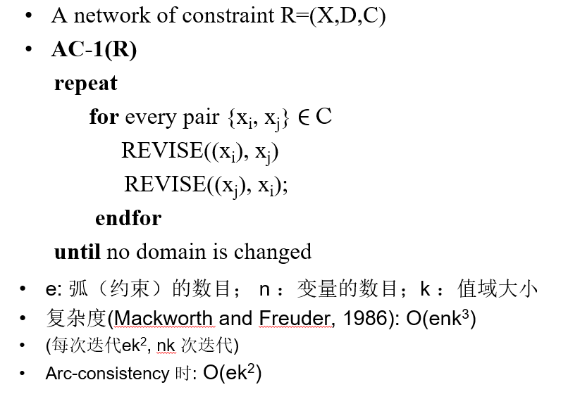
>
> **AC-3**
>
> 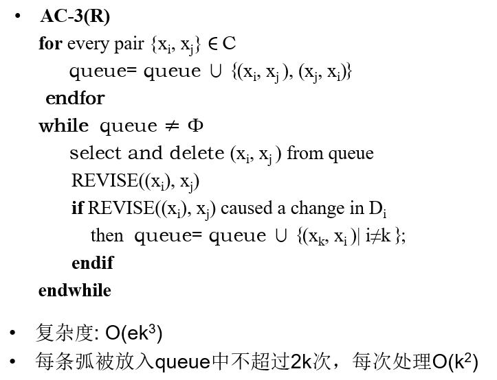
>
> **AC-4**
>
> $count[x_i,v_i,x_j]=|\{v_j\in D(x_j)|(v_i,v_j)\in c_{ij}\}|$
>
> （x为变量，v为变量取值）
>
> 含义：变量取某个值时，影响的其他变量取值的数量。
>
> 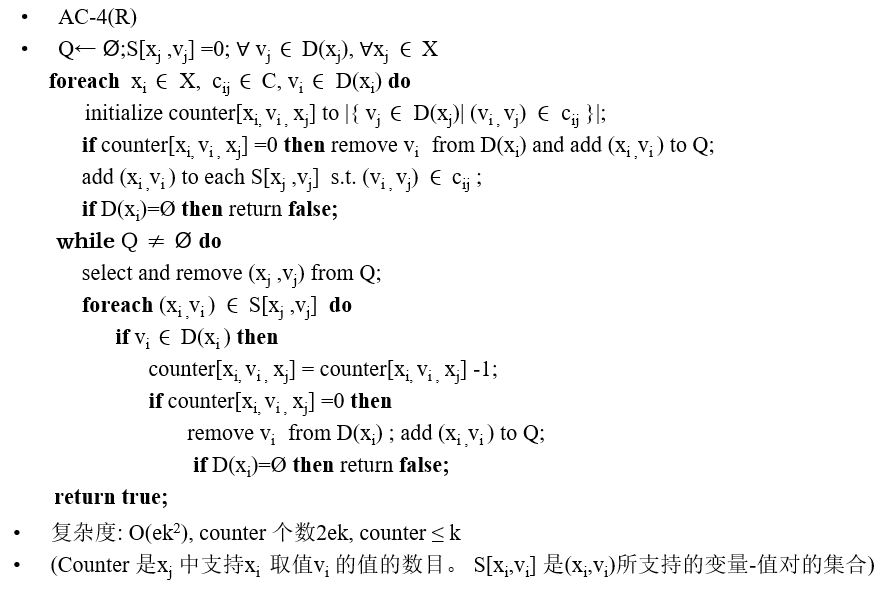
>
> 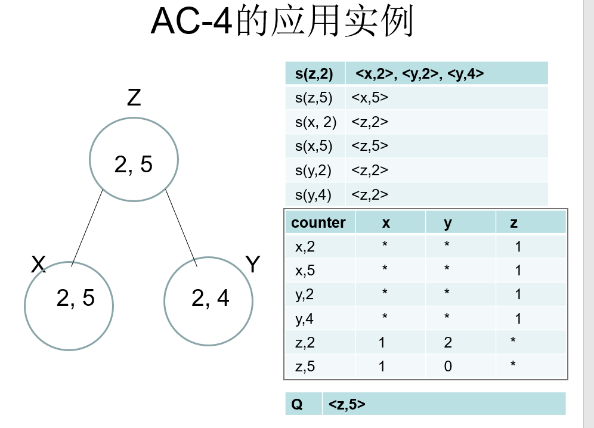
>
> 